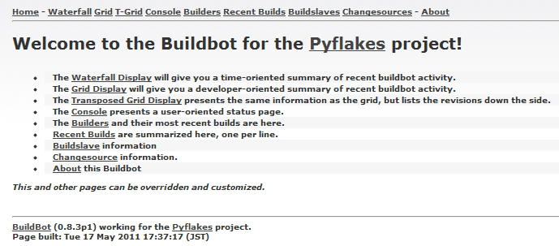
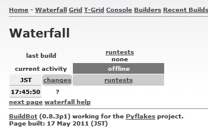
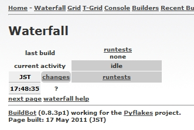
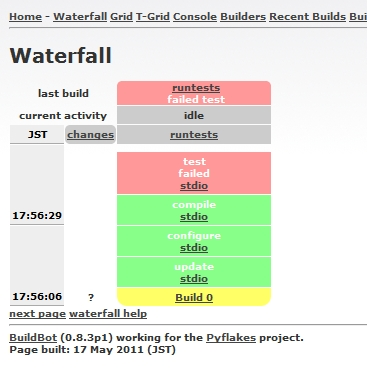

================================
The Buildbot setup on virtualenv
================================

.. contents::
    :depth: 2

Buildbot Master のインストール
-------------------------------

インストール手順
~~~~~~~~~~~~~~~~~~
virtualenv環境を作成してそこにインストールすることにします。

.. code-block:: bash

    $ mkdir /tmp/bbot
    $ cd /tmp/bbot
    $ virtualenv ve
    $ cd ve
    $ source bin/activate
    (ve)$ pip install buildbot
    (ve)$ buildbot --version
    Buildbot version: 0.8.3p1
    Twisted version: 11.0.0

virtualenv環境にbuildbotコマンドが作成されました。
オプションなしで実行するとヘルプが表示されます。

.. code-block:: bash

    (ve)$ buildbot
    /tmp/bbot/ve/bin/buildbot:  must specify a command

    Usage:    buildbot <command> [command options]
    Options:
          --version
          --help     Display this help and exit.
          --verbose
    Commands:
        create-master       新しいビルドマスターディレクトリを作成します
        upgrade-master      既存のビルドマスターディレクトリを現在のbuildbot用に
                            アップグレードします
        start               ビルドマスターを起動します
        stop                ビルドマスターを停止します
        restart             ビルドマスターを再起動します
        reconfig            ビルドマスターにSIGHUPを送信して設定を再読込します
        sighup              ビルドマスターにSIGHUPを送信して設定を再読込します
        sendchange          ビルドマスターに変更を通知します
        debugclient         GUIのデバッグパネルを起動します(要gtk)
        statuslog           現在のビルダーの状態をstdoutに出力します
        statusgui           現在のビルダーの状態をGUIウインドウに表示します
        try                 ローカル環境での変更に対してビルドを行います
        tryserver           buildmaster-side 'try' support function, not for users
        checkconfig         master.cfgの内容が正しいか検証します

buildbot設定作成
~~~~~~~~~~~~~~~~~~
buildbotのcreate-masterコマンドで環境のひな形を作成します。

.. code-block:: bash

    $ buildbot create-master var
    mkdir /tmp/bbot/ve/var
    chdir /tmp/bbot/ve/var
    creating master.cfg.sample
    populating public_html/
    creating Makefile.sample
    creating database
    buildmaster configured in /tmp/bbot/ve/var

    $ ls var
    buildbot.tac  Makefile.sample  master.cfg.sample  public_html  state.sqlite

    $ copy var/master.cfg.sample var/master.cfg

ここでコピーしたmaster.cfgはpyflakesというPythonパッケージをテストするように設定されています。中を見ると、Web表示用に8010番ポートを使用しているようです。試しにこのまま実行してみましょう。

.. code-block:: bash

    $ buildbot start var

ブラウザで http://localhost:8010/ にアクセスしてみてください。
Buildbotのページが表示されたら成功です。

waterfall-view

Buildbot Slave のインストール
-------------------------------

インストール手順
~~~~~~~~~~~~~~~~~~
Masterと同じvirtualenv環境にインストールして動かしてみます。
本来はSlaveからMasterに接続できればどこのサーバーで動作していてもかまいません。

.. code-block:: bash

    $ cd /tmp/bbot/ve
    $ source bin/activate
    (ve)$ pip install buildbot_slave
    (ve)$ buildslave --version
    Buildslave version: 0.8.3
    Twisted version: 11.0.0

virtualenv環境にbuildslaveコマンドが作成されました。
オプションなしで実行するとヘルプが表示されます。

.. code-block:: bash

    (ve)$ buildslave
    /tmp/bbot/ve/bin/buildslave:  must specify a command

    Usage:    buildslave <command> [command options]
    Options:
          --version
          --help     Display this help and exit.
          --verbose
    Commands:
        create-slave       新しいビルドスレーブディレクトリを作成します
        upgrade-slave      既存のビルドスレーブディレクトリを現在のbuildslave用に
                           アップグレードします
        start              ビルドスレーブを起動します
        stop               ビルドスレーブを停止します
        restart            ビルドスレーブを再起動します

buildslave設定作成
~~~~~~~~~~~~~~~~~~
slave環境を作成します。

.. code-block:: bash

    (ve)$ buildslave create-slave
    /tmp/bbot/ve/bin/buildslave:  command needs more arguments

    Usage:    buildslave create-slave [options] <basedir> <master> <name> <passwd>

buildslaveのcreate-slaveコマンドはさらにいくつかオプションが必要です。
var/master.cfg を見て、basedir(slave作成dir名), master(接続用ポート番号), name(認証ID),
passwd(認証passwd) を指定してください。

.. code-block:: bash

    (ve)$ buildslave create-slave var2 localhost:9989 example-slave pass
    (ve)$ ls var2
    buildbot.tac  info

slaveはこれ以上設定する項目はありません。
以下のコマンドで起動します。

.. code-block:: bash

    (ve)$ buildslave start var2
    Following twistd.log until startup finished..
    2011-05-17 16:12:48+0900 [-] Log opened.
    2011-05-17 16:12:48+0900 [-] twistd 11.0.0 (/tmp/bbot/ve/bin/python 2.4.3) starting up.
    2011-05-17 16:12:48+0900 [-] reactor class: twisted.internet.selectreactor.SelectReactor.
    2011-05-17 16:12:48+0900 [-] Starting factory <buildslave.bot.BotFactory instance at 0x851ff38>
    2011-05-17 16:12:48+0900 [-] Connecting to localhost:9989
    2011-05-17 16:12:48+0900 [Broker,client] message from master: attached
    The buildslave appears to have (re)started correctly.

上記のように、最後に ``started correctly`` と表示されていれば起動成功です。
エラーが発生している場合、もうちょっと長い文面が表示されます。

Buildbotページの確認
---------------------

ブラウザで http://localhost:8010/ にアクセスしてみてください。
先ほどと異なり、slaveが追加されているはずです。

Blockdiagをテストしてみる
--------------------------

以下のようにvar/master.cfgを書き換えます。
なお、この例では /home/taka/svn リポジトリに /trunk/blockdiag をコミットしている前提です。

.. code-block:: diff

    --- var/master.cfg.old  2011-05-17 17:43:29.000000000 +0900
    +++ var/master.cfg      2011-05-17 17:44:28.000000000 +0900
    @@ -26,15 +26,10 @@
     # the 'change_source' setting tells the buildmaster how it should find out
     # about source code changes.  Here we point to the buildbot clone of pyflakes.

    -from buildbot.changes.gitpoller import GitPoller
    -c['change_source'] = GitPoller(
    -        'git://github.com/buildbot/pyflakes.git',
    -        branch='master', pollinterval=1200)
    +from buildbot.changes.svnpoller import SVNPoller
    +c['change_source'] = SVNPoller(
    +       svnurl="file:///home/taka/svn/trunk/blockdiag",
    +       pollinterval=60)

     ####### SCHEDULERS

    @@ -54,16 +49,14 @@
     # only take place on one slave.

     from buildbot.process.factory import BuildFactory
    -from buildbot.steps.source import Git
    -from buildbot.steps.shell import ShellCommand
    +from buildbot.steps.source import SVN
    +from buildbot.steps.shell import ShellCommand, Configure, Compile, Test

     factory = BuildFactory()
     # check out the source
    -factory.addStep(Git(repourl='git://github.com/buildbot/pyflakes.git', mode='copy'))
    +factory.addStep(SVN(svnurl='file:///home/taka/svn/trunk/blockdiag'))
     # run the tests (note that this will require that 'trial' is installed)
    -factory.addStep(ShellCommand(command=["trial", "pyflakes"]))
    +factory.addStep(Configure(command=["/usr/bin/python", "bootstrap.py","-d", "init"]))
    +factory.addStep(Compile(command=["bin/buildout", "-v"]))
    +factory.addStep(Test(command=["bin/test"]))

Buildbotを再起動します。

.. code-block:: bash

    $ buildbot restart var

Web上でForce Buildボタンを押すとリビジョン更新が無くてもテストが実行され、以下のように結果が表示されます。

