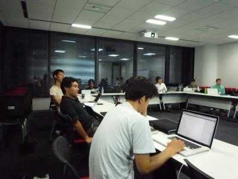

============================
エキPy読書会 18 (2011/9/6)
============================

:日時: 2011/9/6 19:30 - 22:00
:範囲: 第14章(p373～): Pythonのためのデザインパターン

エキスパートPythonプログラミングの読書会18回目。
デザインパターンについて。

会場の様子
============

今回も広い会議室なので14人でもスカスカですね。

質疑応答（覚えてる範囲）
========================

* Q: abc.ABCMeta はインターフェイスと呼んでも良いのか？

   * A: 抽象基底クラスを定義する abc モジュールが Python 2.6 から追加されました。
     インターフェースの別のアプローチでもある。
     基底クラスに必要な機能のドキュメントとしての用途にもなる。
     また抽象メソッドの定義をすると、インスタンスの生成時にエラーを検出できる。

* Q: Proxy パターンとは何ですか？

   * A: インタフェース変えないというのが原則、
     HTTP リクエストのプロキシが分かりやすい例だと思う。
     内部でキャッシュしたり、付加機能があったりして、さらに同じ処理ができる。

* Q: visitor パターンとは何が良いのですか？

   * A: データ構造(ツリー構造が多い？)と振る舞いを分けて実装できる点が良い。
     複雑なデータ構造に対して、ベースクラスでデフォルトの振る舞いを定義していて、
     それぞれのデータ構造に対して定義できる。
     但しデータの種類が増えたときにベースクラスの振る舞いも拡張する必要がある。

* Q: docutils は visitor パターンの知識なくしてコードを理解するのは難しいですか？

   * A: visitor パターンが分かっていないと理解できないです、
     そして分かっていてもコードが読みにくい(@tk0miya)

参考
======

* ATND: http://atnd.org/events/19321
* Togetter: http://togetter.com/li/185939
