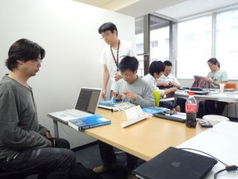
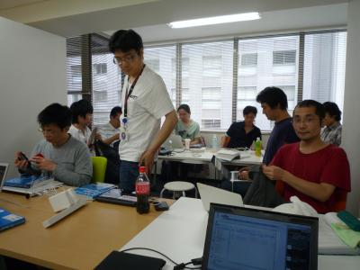

=================================
エキPy読書会 梅py 01 (2011/6/19)
=================================

:日時: 2011/6/19 10:30 - 15:30
:範囲: 第2章, 3章: 構文ベストプラクティス

エキスパートPythonプログラミングの読書会, 大阪出張版 第1回目。

構文ベストプラクティスについてお話ししてきました。
また機会を見つけて大阪でやりたいと思います。

会場の様子
============

参考
======

* ATND: http://atnd.org/events/16731
* Togetter: http://togetter.com/li/151486

