Deliveranceによるデザインカスタマイズ
======================================

プログラム不要・Ploneのサイトデザインの新潮流

.. warning::
    本ドキュメントはオープンソースカンファレンス2009年秋(OSC2009秋)での
    発表資料です。

    xdvがリリースされる前の2009年9月時点のものであり、コードなどは書かれてる
    通りの手順ではうまく動かないと思いますが、概念はxdvと同じです。

.. はじめに
.. ---------
.. 
.. * 今日お伝えしたいこと

はじめに
---------

* 今日お伝えしたいこと

  * Deliverance

.. はじめに
.. ---------
.. 
.. * Deliverance

なにができるの？
-----------------

* Deliverance は、Webデザイナーとプログラマーの役割分担を明確にし、ストレスのない共同作業を可能とします。
    * ..どんなストレスがあるの？

.. よくある話 1: ある日フレームワークが変わった
.. ---------------------------------------------
.. 
.. * プログラマー
.. 
..   * 毎回好きなWebアプリケーション/フレームワークを使いたい！
..   * 前回はSNSサイトだったからOpenPNEを使ってました
..   * 「今回はPloneでサイトを作りたいと思います！」

よくある話 1: ある日フレームワークが変わった
---------------------------------------------

* プログラマー

  * 毎回好きなWebアプリケーション/フレームワークを使いたい！
  * 前回はSNSサイトだったからOpenPNEを使ってました
  * 「今回はPloneでサイトを作りたいと思います！」

* デザイナー

  * 「えっ？テンプレートまた変わるの？PageTemplate？ナニソレ？」

.. よくある話 2: デザインが全体的に微妙に変わる
.. ---------------------------------------------
.. 
.. * デザイナー
.. 
..   * ページのヘッダーとフッターを修正しなきゃ。
..   * あ、ついでにこのページとこのページのレイアウトを修正して...
..   * 「全体的にHTMLを修正したので更新お願いします」

よくある話 2: デザインが全体的に微妙に変わる
---------------------------------------------

* デザイナー

  * ページのヘッダーとフッターを修正しなきゃ。
  * あ、ついでにこのページとこのページのレイアウトを修正して...
  * 「全体的にHTMLを修正したので更新お願いします」

* プログラマー

  * なんか色々変わってる！
  * じゃあヘッダーとメニュー部分を切り出して共通化して...
  * 何回組み込み直せばいいのよ！？

.. よくある話 3: 最適化すると...
.. ------------------------------
.. 
.. * プログラマー
.. 
..   * メニュー部分のHTMLの繰り返しをループ構文に置き換えよう

よくある話 3: 最適化すると...
------------------------------

* プログラマー

  * メニュー部分のHTMLの繰り返しをループ構文に置き換えよう

* デザイナー

  * 「メニューの見た目が単調だったので、行毎にデザインを変えました！」

* プログラマー

  * 「...えっ？」

.. よくある話 4: 確認しながらデザインしたいよね
.. ---------------------------------------------
.. 
.. * デザイナー
.. 
..   * 「実際のサイトを動かしながらHTMLを組みたいんだけどどうすればいい？」

よくある話 4: 確認しながらデザインしたいよね
---------------------------------------------

* デザイナー

  * 「実際のサイトを動かしながらHTMLを組みたいんだけどどうすればいい？」

* プログラマー

  * 「...じゃあまずPloneのデザインの仕組みを説明するので」
  * 「あとPloneをインストールしてくれ」
  * 「あ、組み込むときはHTMLをViewletに分解して、それから....」

よくある話 4: 確認しながらデザインしたいよね
---------------------------------------------

* デザイナー

  * 「実際のサイトを動かしながらHTMLを組みたいんだけどどうすればいい？」

* プログラマー

  * 「...じゃあまずPloneのデザインの仕組みを説明するので」
  * 「あとPloneをインストールしてくれ」
  * 「あ、組み込むときはHTMLをViewletに分解して、それから....」

* デザイナー

  * 「ごめん、俺が悪かった...」

ここで解決したい問題
----------------------

* Webアプリケーションは要件ごとに最適なものを選びたい！
* でもデザイン設定方法がアプリ毎に異なると覚えるのが大変..
* 結局デザインの組み込みはWebデザイナーから受け取ってプログラマーが行う
* 組み込んだ後にデザインが微妙に変わって組み込み直しが起きる
* Webデザイナーとプログラマーの作業が競合してしまい手間が増える..

だって...
-----------

* 組み込まないとわかんない！

そこで！
----------

* Deliveranceですよ！

Deliverance ３つの特徴（デザイナー向け）
----------------------------------------

1. Webアプリのテンプレートを書けなくても大丈夫！

2. Webアプリを自分でセットアップしなくても大丈夫！

3. HTMLを書いて、適用ルールをちょっと書けば、すぐ反映！

サイト作成 1: 動的サイトを用意
-----------------------------------

1. デザインを適用する先の動的サイトを用意します
    * これはプログラマーがやってくれるでしょう

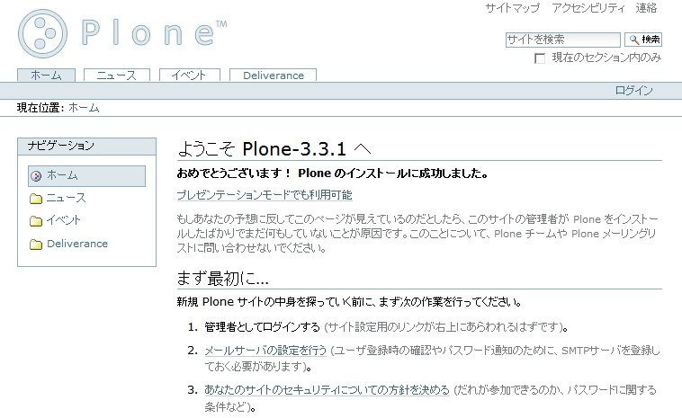

サイト作成 2: Deliverance のセットアップ
---------------------------------------------

2. Deliverance のプログラムをインストールします

   * これもプログラマーが手伝ってくれますよ。
   * インストール先はサーバー、または各自のPC。
   * 開発中はこんな感じで使います

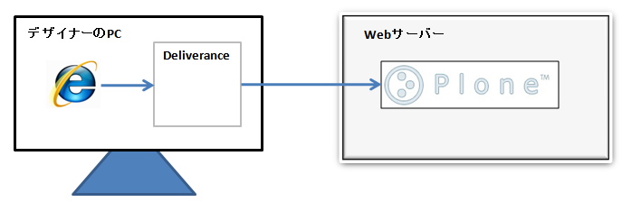

サイト作成 3: HTMLを作成
-----------------------------

3. 好きなツールでサイトをデザインしてHTMLを作成します

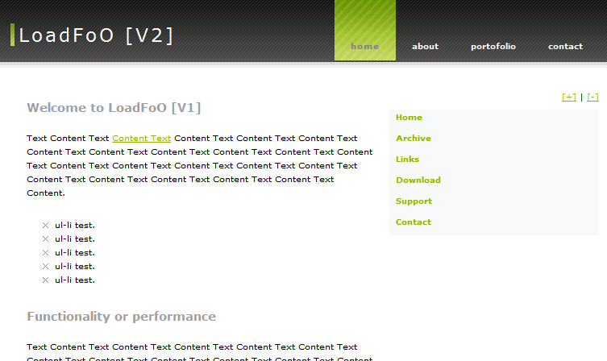

* このデザインは Open Source Web Design http://www.oswd.org/ から取ってきました。

サイト作成 4: Deliverance 設定ルールを書く
-----------------------------------------------

4. 自分が作成したデザインと適用先サイトのデザインを合成する設定を行います

* ちょっとしたXMLを書かないといけないですが、簡単です！

::

  <ruleset>
    <rule>
      <append content="ul.about" theme="children:#about" />
      <append content="div.stats" theme="children:#stats" />
      <append content="#following" theme="children:#following" />
      <replace content="div.section || div#content" theme=".right_content" />
      <append content="h2.thumb img" theme="#about h4" />
      <replace content="children:h2.thumb" theme="children:.block_right" />
    </rule>
  </ruleset>

サイト作成 5: ブラウザでアクセス
-------------------------------------

5. Deliverance 経由でサイトを見るとデザインが適用されています！

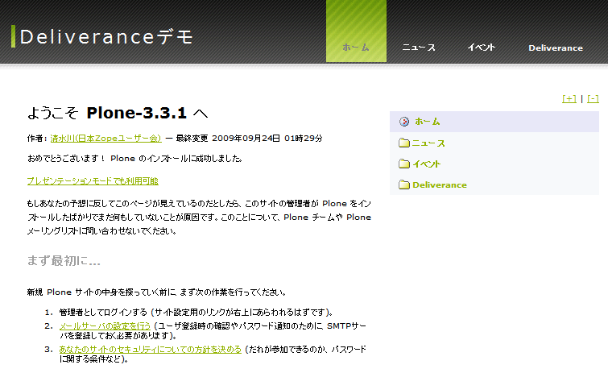

* あとはHTMLと適用ルールを更新してはリロードして即確認！

くらべてみましょう
-------------------

* 元のHTMLと、適用した後の見た目を並べてみました

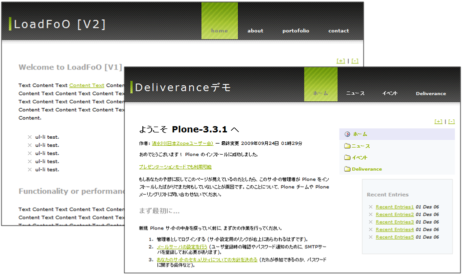

Deliverance がやってること
---------------------------

* Ploneのサイトに一切手を加えずに、別のデザインHTMLを適用することが出来ました！

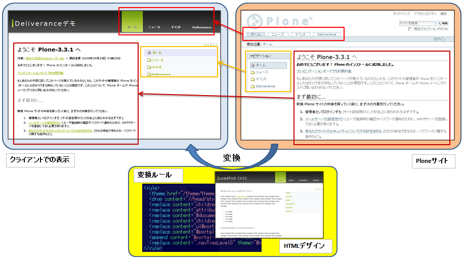

Deliverance を使ってるときの役割分担
-------------------------------------

* プログラマー

  * Webサイトの動的な表示部分の仕組みを作ります
  * HTMLを書きます
  * CSSは書きません
  * Webアプリをセットアップします
  * デザインの組み込みはしません

* デザイナー

  * Fireworks等でデザインを行います
  * デザインを元に、Dreamweaver等でHTMLとCSSを作成します
  * デザインの適用ルールを書きます

デモ
------

* それでは、実際に twitter.com に適用してみます

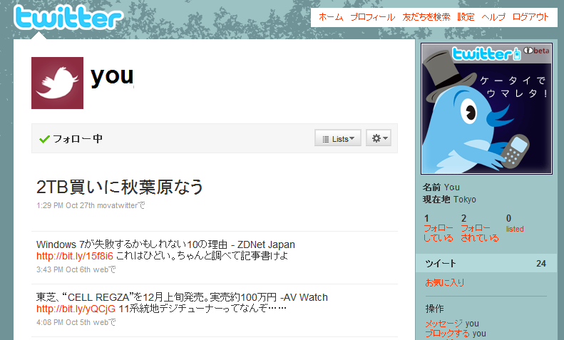

Deliverance 適用ルールの設定方法
----------------------------------

* Deliverance はコンテンツ(対象サイト=Plone)のエレメントをテーマ(静的HTML)に埋め込む
* エレメントの指定は ``CSSセレクタ`` か ``XPath`` で行う
* 動作を決める4つのアクション

  * replace
  * append / prepend
  * drop

replace
--------

* replace はコンテンツ(対象サイト)から取得して、テーマの対象エレメントと ``置き換える``

::

  <replace content="div#content"
           theme=".right_content" />

append / prepend
-----------------

* append はコンテンツ(対象サイト)から取得して、テーマの対象エレメントの ``後に挿入する``
* prepend はコンテンツ(対象サイト)から取得して、テーマの対象エレメントの ``前に挿入する``

::

  <append content="h2.thumb img"
          theme="#about h4" />

drop
-----

* drop は対象エレメントを ``消す``

::

  <drop content="//head/style" />

Deliveranceの動かし方
----------------------

* 動作モードは３つ:

  * Proxy
  * WSGIミドルウェア
  * コマンドラインで静的HTML変換

* 互換実装が１つ:

  * `collective.xdv <http://pypi.python.org/pypi/collective.xdv>`_ (Plone用Product)

Deliveranceの動かし方: Proxy
------------------------------

* ProxyモードならPlone以外のWebアプリケーションサーバーにも使えます
* 複数のURLから１つのページを作ることもできます

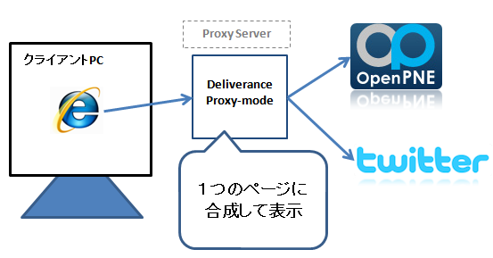

Deliveranceの動かし方: WSGIミドルウェア
----------------------------------------

* Python の WSGI という仕組みに対応しています
* WSGI 対応のアプリケーション/サーバーに組み込んで使えます

  * Django, Pylons, TurboGears2, repoze, Zope3, Tornado, Twisted...

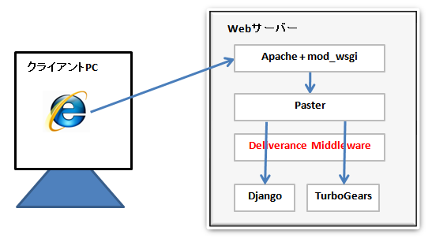

Deliveranceの動かし方: コマンドライン
--------------------------------------

* ローカルPC上で静的HTMLの変換に使えます
* 指定URLのページをPC上のrule.xmlで変換したり

::

  > deliverance-handtransform -r rule.xml http://zope.jp/

* いくつかの変換オプションがあります

::

  > bin/deliverance-handtransform.exe -h
  usage: deliverance-handtransform-script.py [options] <content_url>
  options:
    -h, --help            show this help message and exit
    -t THEME_URL, --theme=THEME_URL
                          url of theme html
    -b BASE_URL, --baseurl=BASE_URL
                          relative urls in the theme will be made absolute
                          relative to this url [default http://www.example.com]
    -r RULES_FILE, --rules=RULES_FILE
                          path to file containing the deliverance rules to apply
    -f BLEND_FILE, --from-file=BLEND_FILE
                          take theme, baseurl and rules parameters from the
                          referenced file
    -R RENDERER_TYPE, --renderer=RENDERER_TYPE
                          (xslt|py) [default xslt]

Deliveranceの動かし方: collective.xdv
--------------------------------------

* collective.xdvはDeliverance互換Productです
* XPathを使います。CSSセレクタは使えません。
* Plone.orgで使用されています

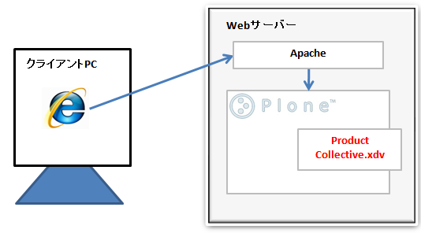

適用事例
--------------------

* Deliverance を使用しているサイト

適用事例: plone.org
--------------------

* http://plone.org/

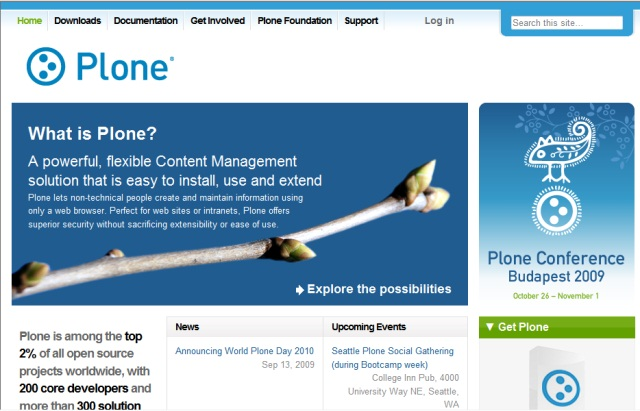

適用事例: repoze.org
---------------------

* http://repoze.org/ 

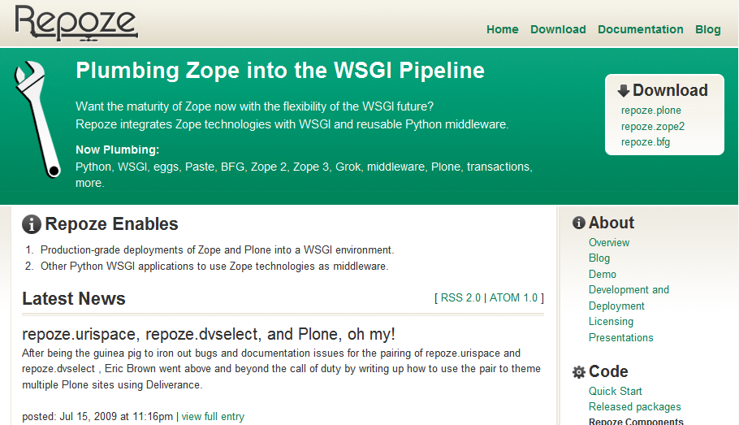

適用事例: blog.repoze.org
---------------------------

* http://blog.repoze.org/ 

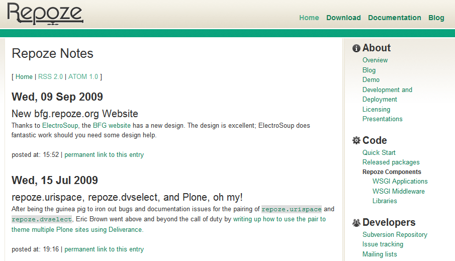

適用事例: bugs.repoze.org
--------------------------

* http://bugs.repoze.org/ 

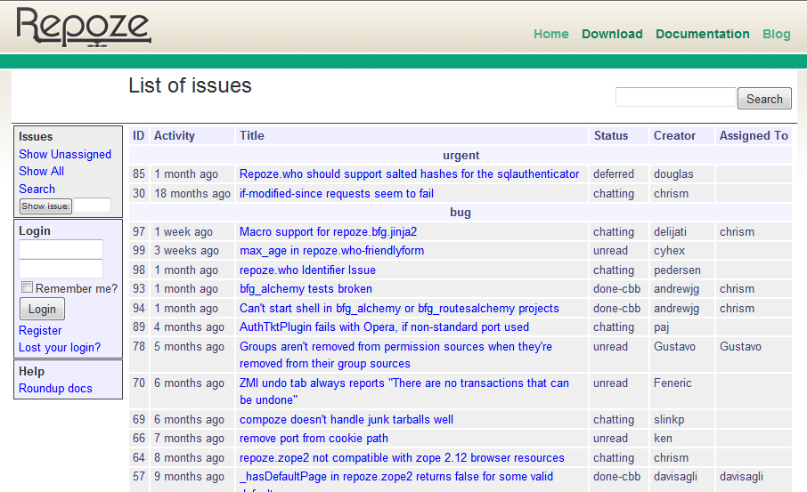

適用事例: lists.repoze.org
--------------------------

* http://lists.repoze.org/ 

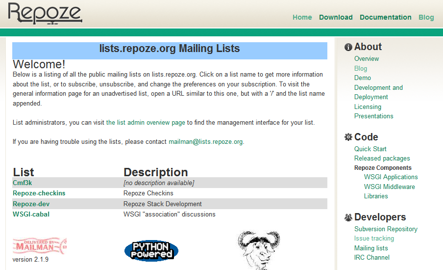

適用事例: afpy.org
--------------------

* http://afpy.org/

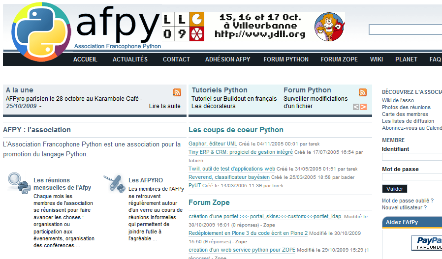

課題
-----
* Proxyモードのスケーラビリティーの必要な本番環境での運用方法

  * Client -- Varnish - Deliverance - Load Barancer - Multiple Zope instances

* WSGI か Plone(collective.xdv) 以外での運用

  * Proxyモードなら利用可能

* 本番での運用ノウハウ

まとめ１
---------
* 出来る事
   * HTMLエレメントの差し替え
   * エレメント属性の差し替え

* 出来ない事
   * loop や if などの制御処理
   * 'よくある話 3' は解決出来ませんでした (;_;

まとめ２
----------

* Deliverance は、Webデザイナーとプログラマーの役割分担を明確にし、 ``ストレスのない共同作業を可能とします`` 。
* デザイナーはWebアプリのテンプレートを ``知らなくてもデザインを適用できます``
* でも事前に ``idやclassの指定はルール化`` しておくと良いと思う

Q&A
----

* Q & A

お知らせ
---------
* 「(第5回)Zope/Plone開発勉強会」を 11/21(土)に行います。
* Deliveranceもやってます(多分)。
* 参加申込みはこちら → http://atnd.org/events/1855

最後に
---------

* Let's Deliverance

おわり
------

* ご静聴ありがとうございました。
    * Japan Zope User Group
    * http://zope.jp/
    * Plone User's Group Japan
    * http://plone.jp/

参考文献
--------
* Deliverance Configuration - Deliverance v0.3 documentation
  http://deliverance.openplans.org/configuration.html

* Getting All Your Web Apps To Wear The Company Brand (JP)
  http://tinyurl.com/deliverance-preso-jp

* DeliveranceでOSWDのデザインをTwitter.comに適用してみた - 清水川Web
  http://www.freia.jp/taka/blog/669

* Python Package Index : collective.xdv 1.0rc3
  http://pypi.python.org/pypi/collective.xdv

* Adding xdv to your Plone instance ? Plone CMS: Open Source Content Management
  http://plone.org/documentation/manual/theming/adding-xdv-to-your-plone-instance

