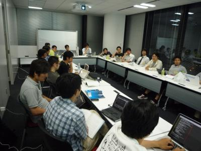

============================
エキPy読書会 14 (2011/7/5)
============================

:日時: 2011/7/5 19:30 - 22:00
:範囲: 第11章(p295～): テスト駆動開発

エキスパートPythonプログラミングの読書会14回目。

テスト駆動開発について。原則とテストの種類、スタブ、モック、ドキュメント駆動開発などについて。

相変わらず本を読まない読書会、どころか、話があちこちに派生したため本とかもうどうで（ｒｙ 次回はモックとかのあたりから続きです。

会場の様子
============

今回は会議室いっぱいに集まりました。

質疑応答（覚えてる範囲）
========================

* Q: テスト自身のバグとかってどう防止するのー?
  テストしやすい切り出し方をして人間の目で判断するのー?
  複雑な入力と出力のテスト対象だと、勘違いすることもあるのでは？

   * Web だと、モデルのテストはがんばるけど、ビューのテストは適当に流すとか。
   * domain specific な部分にバグがあると意味がない。
   * コアの単体テストのテストをしっかりする。
   * ストラテジ/テンプレートパターン的な、きれいな構成だとテストしやすい。
   * 複雑な機能を複雑なままテストするのは不可能じゃないかな。

* Q: テストのリファクタリングはどうするの？
  可読性をあげる、カバレッジをあげる、そんなときにリファクタリングするの？

   * A: 同じようなパターンが増えたら、ループに置き換えるとか、
     テストそのものを生成するようにリファクタリングしたりする by tk0miya

   * A: リファクタリングはしません、データフィクスチャは使わず、
     setUpではなくtest内でデータを作りテスト終了後に破棄する by aodag

   * A: テストに必要な最小のデータフィクスチャ書く
   * テストファイルの先頭にユーティリティ関数を作って、
     パターンを渡すとテストを自動生成するようなものも作る
   * デコレータを利用して、テスト実行前にデータを生成するのもやる by shimizukawa

   * A: テストのリファクタリングは、まだ一般化していない感じに見える by shimizukawa

* Q: テストデータの生成って、どうやって、どのぐらいやってる？

   * A: Haskell で有名な QuickCheck check というテストジェネレーターがある
     http://hackage.haskell.org/packages/archive/QuickCheck/latest/doc/html/Test-QuickCheck.html
     * 型推論によるテストジェネレーターが有効
     * 境界値や特異ケースを探すのに便利、これがパスしなかったらunittestを書く

* Q: TDD で開発している人は本当にいるの？どうやってるの？

   * A: TDD は三角測量のようなもの、入力に対して期待する出力を試す。
     3パターンぐらい書くと、実装の仕様が明確になってくる

   * TDDで作られるテストケースに境界値テストを入れてることが少ない。
   * ある関数の使い方のリファレンスを作るつもりで作成する
   * TDDがテストという言葉で誤解されるためBDD(Behavior)という概念で再定義している集団もある

* Q: TDD やって、実装して、その後でちゃんとしたテストを書くの？
  また TDD のときに書いたテストのリファクタリングって本当にやるの？

   * A: 現場で実際にやっている人がいないから何とも分からない
   * ただ、TDD は QA のテストではないので品質を保証するものではない
   * テストは、後になって無駄なテストも出てくる
   * それはリファクタリングする必要がある
   * テストを書き始めるときと、出来上がったテストをメンテするのと、
     2段階のフェーズでテストを捉えないといけない

* TDD とかテストファーストとか本当に流行ってるの？

   * A: キャズムは超えたと思う
   * 開発部長が用語を知っていればキャズムは超えてる

* Django のテストはどうやってる？

   * 自分が作ったライブラリ、他の人が作ったもの、依存してるものなど、
     何をテストするかを切り分ける必要がある
   * 顧客の意見を聞きながらテストのさじ加減を決めるのは難しい
   * テストのやるやらないを切り分けする人が必要

* Q: nose のテストを探す正規表現 `((?:^|[b_.-])[Tt]est)` の b は何で？

   * A: \\b の誤植、そもそも nose のドキュメントが間違ってる

* Q: どんなテストを書けばよく分からない人はどうしたら良いの？

   * ハンズオンやペアプロのような方式で実践して覚えるのがよい
   * QuickCheck のようなテストジェネレーターを使おう

* Q: 実装した後テストを書いていると意味ないなーと思いつつやっていますが、
  どういう運用がいいのでしょうか?

   * A: 実装後であっても、その後になって仕様変更や機能拡張などで
     後々にテストが役立つときもくるので意味なくはありません。
   * テストは、ないよりあった方が良いの考え方で、
     できる範囲から対応していく形が良いと思います。

* Q: TDDを含めた開発サイクル・環境に興味があります(Pythonとズレてますが)。
  Pythonistaの方々は、テスティングフレームワーク、VCS, CIは何を使われて
  いるのかなぁ？と。

   * A: 私(t2y)は nose, Pikzie, minimock, mercurial を主に使っています。
   * Python のテストツールの用途や機能を体系的にまとめた情報が
     ほしいと私も思っています。

* Q: nose と py.test の比較なんかも知りたいです。

   * A: エキPyにポイントが書かれています。
     py.testのテスト失敗時の表示は一見の価値あり。

* Q: Python ソースコードを静的解析して、型情報を得たり、例外発生条件を
  見つけ出すようなライブラリってありますか? (ややテストとはズレた。)

   * A: pylint, pychecker, pypants, pyflaes, PyCAna, pymetrics, CloneDigger
     http://stackoverflow.com/questions/100298/code-analysis-in-python
     PyCharm: http://www.jetbrains.com/pycharm/quickstart/#CodeAnalyze

   * A: 動的言語に静的解析はとても大変！誰か研究してほしいと言ったら
     cocoatomo が個人的に研究するらしい、がんばって！

参考
======

* ATND: http://atnd.org/events/17248
* Togetter: http://togetter.com/li/158170

