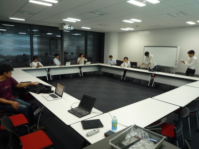

============================
エキPy読書会 17 (2011/8/23)
============================

:日時: 2011/8/23 19:30 - 22:00
:範囲: 第12章(p335～): 最適化：一般原則とプロファイリングテクニック

エキスパートPythonプログラミングの読書会17回目。

最適化のためのプロファイリングについて。

会場の様子
============

今回は初利用の会議室「ハワイ」でした。参加人数は少なめだったのでスカスカですが・・。

質疑応答（覚えてる範囲）
========================

* Q: del 文を使ってオブジェクトの参照を削除した方が良いケースは
  具体的にどんなときですか？

   * A: インポートしたモジュール内のグローバルな名前空間で、例えば、
     設定ファイルを読み込むといった初期化処理を行っている場合、このときの
     一時変数が大きなメモリをつかんでいる可能性などがあります。この領域を
     明示的に del で解放することで、不要なメモリを解放できます。
     また、importしたモジュールは sys.modules などに参照が残り続けるため、
     import先でそのモジュールをdelしても効果が無い場合があります。

* Q: ディクショナリの探索はなぜ O(1) なのでしょうか？

   * A: ディクショナリのキーを線形に探すのではありません。
     hash(キー) で得られた値を使って対象の値が格納されたメモリアドレスを直接
     参照することが出来るためO(1)になります。
     厳密には、ハッシュ値が競合したときに解決する仕組みがあるので、
     一発でアクセスすることは出来ませんが、計算量としてはO(1)です。

* Q: ディクショナリのキーになるのは hash() でハッシュ化できる、
  つまり Immutable なオブジェクトという考え方であってますか？

   * A: はい。ディクショナリのキーは Immutable なオブジェクトであると
     ドキュメントにも記載されています。

* Q: 1つのキューを使って親子プロセス間で通信するのですか？

   * A: プロセス間で通信を行う場合、キューを使ったり、パイプを作ったり、
     いろいろなやり方がありますが、基本的には一方向のみの通信になる
     ケースが多いです。共有メモリを使う Array/Value もあります。

* Q: GIL の良いところは何でしょうか？

   * A: Python 本体の実装をシンプルに保つことができます。
     GIL を取り除くためには技術的な課題を多くクリアする必要があります。

参考
======

* ATND: http://atnd.org/events/18608
* Togetter: http://togetter.com/li/179161

