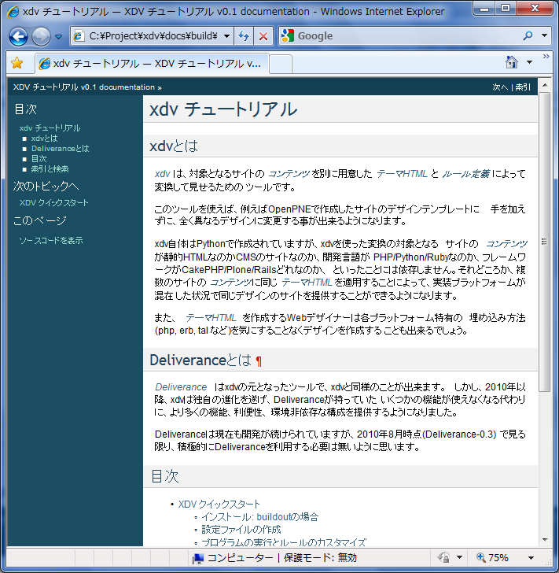
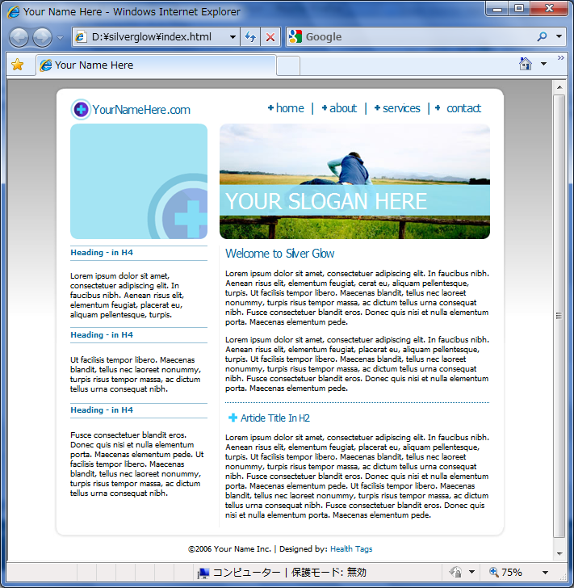
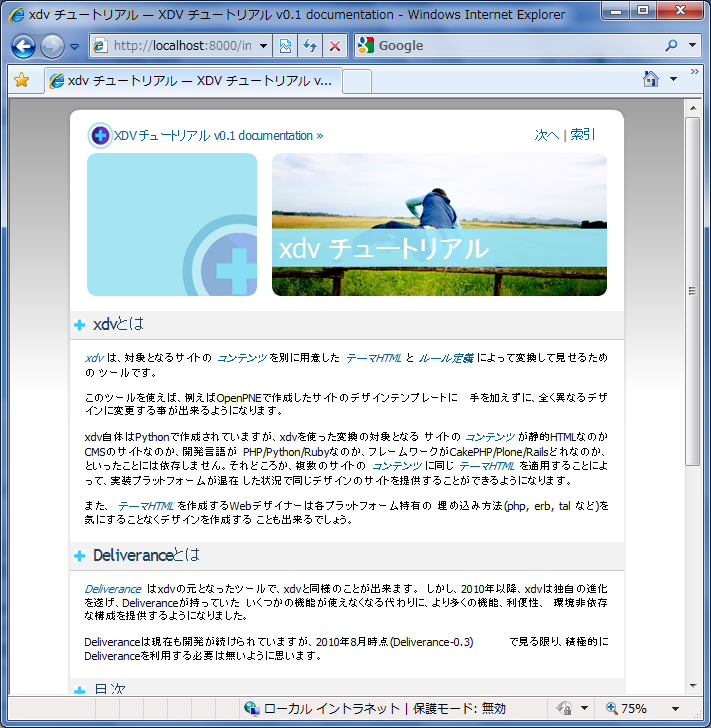

===============================================
Sphinxドキュメントを例にした静的ファイルの変換
===============================================

:doc:`quickstart` ではHTTP-Proxy機能を用いてサイトの変換を行いましたが、
このサンプルではクイックスタートの環境に手を加えて、静的なHTMLを変換する
例を紹介します。クイックスタートでは、変換した結果をWSGIサーバープログラムを
動かしながらブラウザで確認していましたが、ここではさらに静的HTMLファイルの
出力も行います。

ここで用いるパッケージはクイックスタートで使用したものの他に、
:term:`Sphinx` を利用します。

:xdv: ルールコンパイラ
:dv.xdvserver: WSGIフィルタ
:Paster: WSGIサーバー, Proxy
:Sphinx: ドキュメンテーションビルダー

SphinxのHTML出力を用意
-----------------------
:term:`コンテンツ` となる静的HTMLを用意します。
どのようなHTMLファイルでも良いのですが、複数のページにまたがって
統一的なレイアウトフォーマットになっているとxdvのルールをシンプルに記載
することが出来るため、チュートリアルとして :term:`Sphinx` が出力した
HTMLファイルを利用することにします。今回はSphinxの標準テンプレート
に手を加えずに出来る範囲でデザインの変換を行ってみたいと思います。

ここでは、Sphinx-1.0を用い、Sphinxのデフォルトのテーマ
(xdvのテーマHTMLではありません)としてbasicを選択します。

    この :doc:`index` のHTMLファイルです。

テーマHTMLファイルを用意
-------------------------
新しく適用したいデザインを :term:`テーマHTML` として用意するわけですが、
チュートリアルのためには手軽にデザインを用意したいところです。そこで、
`OSWD - Open Source Web Design <http://www.oswd.org/>`_ で公開されている
デザインをダウンロードして :term:`テーマHTML` として利用してみましょう。

テーマHTMLは通常の場合、 **xdvで適用しやすいようなHTML構造とidやclassなどを
備えていることが望ましい** のですが、今回はチュートリアルですので、
OSWDからダウンロードしたテーマHTMLをうまくつかうようにしてみましょう。

ここでは、デザインとして
`silverglow <http://www.oswd.org/design/preview/id/3194>`_ を利用します。
ただし、OSWDで公開されているHTMLのデザインはともかく、HTML的にはなかなか
気になるところが多くあります。また、ほとんどのデザインが固定幅で作成
されているため、liquidデザインを採用したい場合はがんばって探すか、
自分でliquidになるようカスタマイズする必要があります。

    silverglow をIE8で表示したところ。

IE以外では表示がちょっと崩れるので今回使うためにstyle.cssの末尾に以下の行を
追加しました。

.. code-block:: css

    div.header h1 {
        float:left;
    }

環境の構成
-----------

wsgi.iniの変更とコンテンツHTMLの配置
~~~~~~~~~~~~~~~~~~~~~~~~~~~~~~~~~~~~~
:doc:`quickstart` ではWSGIでProxyを設定して外のサイトからコンテンツを
取得していましたが、今回はPCのDISKからHTMLを読み込みます。このため、
wsgi.iniファイルを以下のように変更します。

.. code-block:: diff

    --- C:/Project/xdv/src/quickstart/wsgi.ini	Sat Aug 21 17:29:15 2010
    +++ C:/Project/xdv/src/ex-sphinx/wsgi.ini	Sat Aug 28 22:51:23 2010
    @@ -16,15 +16,16 @@
     pipeline = egg:Paste#cgitb
                egg:Paste#httpexceptions
                xdv.theme
    -           proxy
    +           sphinx.static

     [filter:xdv.theme]
     use = egg:dv.xdvserver#xdv
     theme = %(here)s/static/theme.html
     rules = %(here)s/static/rule.xml
     live = true
    +absolute_prefix = /static/

    -[app:proxy]
    -use = egg:Paste#proxy
    -address = http://www.ruby-lang.org/
    +[app:sphinx.static]
    +use = egg:Paste#static
    +document_root = %(here)s/../../docs/build/html

変更点は3つ。

1. `proxy` という名前が適切でないので `sphinx.static` に変更した。

2. テーマHTMLの中でcssや画像ファイル等への相対パスが含まれているので、
   `absolute_prefix = /static/` という指定を追加し、テーマHTMLが
   正しく関連リソースを読み込めるようにした。

3. `[app:proxy]` を `[app:sphinx.static]` とし、コンテンツHTMLを置いている
   パスを記載した。

詳しくは説明しませんが、だいたい理解できると思います。

テーマHTMLの配置
~~~~~~~~~~~~~~~~~
テーマHTMLにはsilverglowを利用しますが、クイックスタートでの設定に合わせて
index.htmlをtheme.htmlに変更しています。ファイルの置き場所はwsgi.iniの
記載通り、実行環境のstaticディレクトリ以下です。

.. code-block:: ini

     theme = %(here)s/static/theme.html
     rules = %(here)s/static/rule.xml

silverglowをstaticに配置すると、以下のようなファイル構成になると思います::

    static/
       +---images/
       |   +-- xxx.jpg
       |   +-- yyy.gif
       |
       +- rule.xml
       +- style.css
       +- theme.html

ルールの作成と確認
-------------------
これから :term:`ルール定義` を作成していきますが、まずは空のrule.xmlを
用意します。

.. code-block:: xml

    <rules xmlns="http://namespaces.plone.org/xdv"
           xmlns:css="http://namespaces.plone.org/xdv+css">

    </rules>

つぎは確認用にWSGIサーバーを起動しましょう。

デザイン確認用にWSGIサーバーを起動
~~~~~~~~~~~~~~~~~~~~~~~~~~~~~~~~~~~~
``python bootstrap`` や ``bin/buildout`` を実行して環境を構築しておいて
ください。カレントディレクトリはサンプルコードを置いている ex-sphinx
ディレクトリを想定しています。

WSGIサーバーを起動するには以下のコマンドを実行します
（これもクイックスタートと同じ手順です）。

.. code-block:: bash

    $ bin/paster wsgi.ini

ブラウザで http://localhost:8000/ にアクセスしてください。ただし、
まだルール定義が空なので、ブラウザでアクセスしても単にテーマHTMLの内容が
表示されるはずです。

ここから先は、ブラウザをリロードしながらrule.xmlを編集してデザインを
適用していきます。

デザイン適用の進め方の例
~~~~~~~~~~~~~~~~~~~~~~~~~

.. todo:: 後で書く

.. todo:: 本来cssはrule.xmlに書くのではなくテーマHTMLのcssに書くべきです

最終的な画面とrule.xmlの例
~~~~~~~~~~~~~~~~~~~~~~~~~~~
ここまでの作業で最終的にこのような画面になりました。

この画面を表示するためのrule.xmlは以下の内容です。

.. code-block:: xml

    <rules xmlns="http://namespaces.plone.org/xdv"
           xmlns:css="http://namespaces.plone.org/xdv+css">

    <append theme="/html/head" css:content="head > *"/>
    <replace theme="//head/title" content="//head/title"/>

    <append theme="/html/head">
        
    </append>

    <drop css:theme="div.header h1" />
    <copy css:theme="div.block_right" content="//h1/text()"/>
    <replace css:theme="div.right_content" css:content="div.body"/>
    <drop content="//h1"/>
    <drop css:theme=".left_content" />
    <copy css:theme="div.navigation" content="//div[@class='related'][1]" />
    <replace css:theme="div.footer" css:content="div.footer" />

    </rules>

.. **

静的HTMLの出力
---------------
ここまではWSGIサーバーを起動して表示を確認しながらデザインを適用してきました。
しかしSphinxであれば最終成果物は静的HTMLとして出力してほしいところです。

標準では全てのHTMLファイルにテーマを適用して出力する仕組みは、残念ながら
用意されていませんが、複数のコマンドを組み合わせることでhtmlの出力はできます。

1. :command:`xdvcompiler` でrule.xmlとtheme.htmlからtheme.xsltを出力する
2. :command:`xdvrun` でtheme.xsltと :term:`コンテンツ` から変換後の
   HTMLを出力する

上記手順の2を全てのファイルに対して実行すれば、静的HTMLすべてを変換する
ことができます。

これを自動的に行う簡単なスクリプトを作成してみました。外部コマンドとして
:command:`xdvcompiler` 等を呼び出しているためあまり効率は良くありませんが、
一応うまく動作しているようです。

.. literalinclude:: ./src/ex-sphinx/convert.py
    :language: python

実行は以下のように行います。ディレクトリ等は決め打ちで実装しているため、
他のディレクトリでは動作しません。

.. code-block:: bash

    $ cd /path/to/ex-sphinx
    $ bin/py convert.py

うまく動作すれば、outputというディレクトリに変換されたHTMLファイル等が
出力されます。

