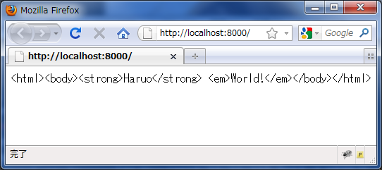
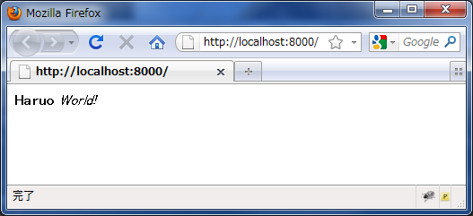
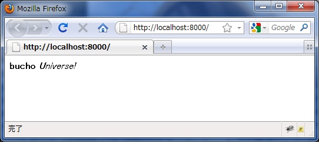
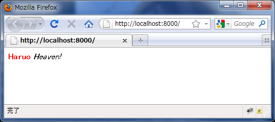
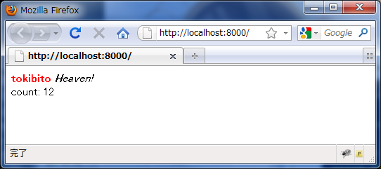

:date: 2010-12-06 23:55:00
:tags: python, web

=========================================================================================================================
Python標準ライブラリだけでWebフレームワークっぽくしてみる - Python Web フレームワーク アドベントカレンダー2010
=========================================================================================================================

`@tokibito`_ から `Python Web フレームワーク アドベントカレンダー2010`_ のバトンを受け取った @shimizukawa です。 `@tokibito`_ には最近仕事中にいつもお世話になっています。Django爆発しろ！現在12/6の22時。あと2時間で持ち時間終わっちゃうじゃん！

まえおき
--------

とりあえずフレームワークとか忘れましょう。Pythonは標準でも色々できます。で、色々やってみて不便だと思ってから自分の目的に向いているフレームワークを探してみると良いんじゃないかな。

と言うことで環境は以下の条件で進めてみたいと思います。

:Python: 2.7.0
:OS: Windows 7 (どこでも大丈夫なはず)

MVC
-----

MVCというのはモデルとビューとコントローラのことらしいです。とりあえず、以下のように読み替えてMVCってことにします。

:Model: データストア
:View: 画面表示
:Controller: 上記２つを繋ぐ部分

とりあえずWebサーバー起動させる
---------------------------------

確認しながら動かした方が分かりやすいので、とりあえずWebサーバーを起動させます。
Webは最近はWSGIで書くと良いらしいので、 `wsgiref - WSGI ユーティリティとリファレンス実装`_
を参考にして（return部分以外コピ...再利用して） server.py というファイル名で保存しました。

.. _`wsgiref - WSGI ユーティリティとリファレンス実装`: http://www.python.jp/doc/nightly/library/wsgiref.html

.. code-block:: python

    # -*- coding: utf-8 -*-
    from wsgiref.util import setup_testing_defaults
    from wsgiref.simple_server import make_server

    def simple_app(environ, start_response):
        setup_testing_defaults(environ)

        status = '200 OK'
        headers = [('Content-type', 'text/plain')]

        start_response(status, headers)

        return 'Haruo World!'

    httpd = make_server('', 8000, simple_app)
    print "Serving on port 8000..."
    httpd.serve_forever()

これをserver.pyとして保存してあとは以下のコマンドで起動します::

    $ python server.py

ブラウザで ``http://localhost:8080/`` にアクセスして ``Haruo World!`` と表示されればとりあえずサーバー起動部分は完成です。

表示作る
---------

表示は既に出来てますね。はい終了ー。現在22時15分。そろそろ家に帰ります。

…

帰り着きました。23時10分です。

さすがに今のままではアレなのでせめてHTMLを表示できるようにしたいと思います。
と言っても、server.pyのコードを見ると分かるように、文字列を返している部分をHTMLにすればHTML表示出来そうです。さっそくserver.pyを以下のように書き換えてみました。
書き換えるのは `simple_app` 関数のreturnの行だけですが、一応全文掲載しておきます。水増しじゃないです。

.. code-block:: python

    # -*- coding: utf-8 -*-
    from wsgiref.util import setup_testing_defaults
    from wsgiref.simple_server import make_server

    def simple_app(environ, start_response):
        setup_testing_defaults(environ)

        status = '200 OK'
        headers = [('Content-type', 'text/plain')]

        start_response(status, headers)

        return '''<html><body><strong>Haruo</strong> <em>World!</em></body></html>'''

    httpd = make_server('', 8000, simple_app)
    print "Serving on port 8000..."
    httpd.serve_forever()

そうそう、さっき `python server.py` で起動したやつは1度Ctrl+Cで止めて再起動してください。実行したままだと書き換えたプログラムは反映されないので。

再起動してブラウザをリロードしたらHTMLがちゃんと表示されましたね！

え、htmlタグとかそのまま表示されちゃダメ？じゃあ'text/plain'という部分を'text/html'に修正しましょう。

.. code-block:: python

    # -*- coding: utf-8 -*-
    from wsgiref.util import setup_testing_defaults
    from wsgiref.simple_server import make_server

    def simple_app(environ, start_response):
        setup_testing_defaults(environ)

        status = '200 OK'
        headers = [('Content-type', 'text/html')]

        start_response(status, headers)

        return '''<html><body><strong>Haruo</strong> <em>World!</em></body></html>'''

    httpd = make_server('', 8000, simple_app)
    print "Serving on port 8000..."
    httpd.serve_forever()

これでHTMLを表示出来るようになりましたね！

……

え、まだだめ？プログラムで指定した値を埋め込みたい？じゃあPythonの ``string.Template`` モジュールを使ってやってみましょう。

.. code-block:: python

    # -*- coding: utf-8 -*-
    from wsgiref.util import setup_testing_defaults
    from wsgiref.simple_server import make_server
    from string import Template
    import random

    def simple_app(environ, start_response):
        setup_testing_defaults(environ)

        status = '200 OK'
        headers = [('Content-type', 'text/html')]

        start_response(status, headers)

        template = Template(
            '''<html><body><strong>$name</strong> <em>$em</em></body></html>''')

        d = {
            'name': random.choice(['Haruo', 'bucho', 'tokibito']),
            'em': random.choice(['World!', 'Universe!', 'Heaven!']),
        }

        return template.substitute(d)

    httpd = make_server('', 8000, simple_app)
    print "Serving on port 8000..."
    httpd.serve_forever()

string.Template を使うと変数部分を ``$name`` という感じで埋め込んで置いて、後から辞書で ``substitute`` 関数に渡すことで文字列を整形してくれます。ついでに変数を使うんだから表示の度に画面が変わる方がいいよね、ということで、 ``random.choice`` を使ってブラウザをリロードするたびに表示が変わるようにしてみました。

これで表示はもういいですかね？ ……え、まだ？HTMLは別のファイルにしたい？そろそろ何かフレームワーク使った方が良いんじゃ…、じゃあ以下のようにHTMLファイルをindex.htmlという名前でserver.pyと同じディレクトリに保存してください。

.. code-block:: xml

    <html>
        <body>
            <strong>$name</strong> <em>$em</em>
        </body>
    </html>

そしてこのindex.htmlファイルを読み込んで表示するようにしましょう。

.. code-block:: python

    # -*- coding: utf-8 -*-
    from wsgiref.util import setup_testing_defaults
    from wsgiref.simple_server import make_server
    from string import Template
    import random
    import os

    BASEDIR = os.path.dirname(os.path.abspath(__file__))
    def get_template(filename):
        path = os.path.join(BASEDIR, filename)
        return Template(open(path, 'r').read())

    def simple_app(environ, start_response):
        setup_testing_defaults(environ)

        status = '200 OK'
        headers = [('Content-type', 'text/html')]

        start_response(status, headers)

        template = get_template('index.html')

        d = {
            'name': random.choice(['Haruo', 'bucho', 'tokibito']),
            'em': random.choice(['World!', 'Universe!', 'Heaven!']),
        }

        return template.substitute(d)

    httpd = make_server('', 8000, simple_app)
    print "Serving on port 8000..."
    httpd.serve_forever()

これでserver.pyを再起動して画面をリロードすると！何も変わらず表示されますね。何か表示が変わってたらおかしいですよ。これだけだと寂しいのでHTMLにcssで装飾を付けてみましょう。

.. code-block:: xml

    <html>
        
        <body>
            <strong>$name</strong> <em>$em</em>
        </body>
    </html>

こんどはserver.pyを再起動せずにブラウザをリロードしてみてください。以下のように表示されました？

ということで、無事にテンプレート対応まで出来ました。

こういったテンプレートの機能はWebフレームワークによってはサーバー機能と一緒に用意していてくれたり(Django, Zope2など)、テンプレートのための個別のフレームワークを使ったり(Jinja2, Genshi, Cheetah など)して実現できます。string.Templateでもここまでできましたが、まあ既存のフレームワーク使った方が最終的には便利です。

データストア作る
------------------

さて、Webフレームワークというからにはデータ保存が出来ないと面白くありません。ということで、またPythonの標準ライブラリを使ってデータ保存するようにしてみましょう。

ここで使うのはPythonのオブジェクトをそのまま保存しておける ``shelve`` モジュールです。まあコード見た方が早いですね。

.. code-block:: python

    # -*- coding: utf-8 -*-
    from wsgiref.util import setup_testing_defaults
    from wsgiref.simple_server import make_server
    from string import Template
    import random
    import os
    import shelve

    BASEDIR = os.path.dirname(os.path.abspath(__file__))
    def get_template(filename):
        path = os.path.join(BASEDIR, filename)
        return Template(open(path, 'r').read())

    def simple_app(environ, start_response):
        setup_testing_defaults(environ)

        status = '200 OK'
        headers = [('Content-type', 'text/html')]

        start_response(status, headers)

        template = get_template('index.html')

        db = shelve.open('shelve.db')
        if 'count' not in db:
            db['count'] = 0
        count = db['count']

        d = {
            'name': random.choice(['Haruo', 'bucho', 'tokibito']),
            'em': random.choice(['World!', 'Universe!', 'Heaven!']),
            'count': count,
        }

        db['count'] = count + 1
        db.close()

        return template.substitute(d)

    httpd = make_server('', 8000, simple_app)
    print "Serving on port 8000..."
    httpd.serve_forever()

dbという変数の部分が増えてますね。あとはcount。このcountをテンプレート側にも表示するように入れておきます。

.. code-block:: xml

    <html>
        
        <body>
            <strong>$name</strong> <em>$em</em>
             
            count: $count
        </body>
    </html>

以下のようにカウントが表示されて、リロードする度に更新されていくと思います。ちなみにカウント数が12なのは tokibito Heaven! が表示されるまでリロードしたからです。

これでだいぶWebフレームワークっぽくなってきましたね！でもこのDBは簡易的なものなので、ちょっとしたことで壊れたりします。同時アクセスとか。この辺も最近のWebフレームワークならSQLAlchemyやZODBなどと連携して、自分で作るよりは簡単に使うことが出来るんじゃないかと思います。

コントローラ作る
----------------

残念！23時59分です。時間が無くなってしまいました。コントローラはまた次の機会にやりたいと思います。

まとめ
--------

1時間でWebフレームワークを作ってみようと思いましたが、やっぱり既存のフレームワーク使った方が楽ですわね。
でもPythonは標準でこれくらいのことは出来るので、標準ライブラリは一通り眺めて置いて損は無いと思いますよ！

ということで、次は 世界のbucho `@torufurukawa`_ さん、お願いします！

.. _`Python Web フレームワーク アドベントカレンダー2010`: http://atnd.org/events/10465
.. _`@tokibito`: http://d.hatena.ne.jp/nullpobug/20101205/1291499395
.. _`@torufurukawa`: http://torufurukawa.blogspot.com/

# typo修正したら更新時刻が日付超えたんですが、まあ気にしない方向で。

.. :extend type: text/x-rst
.. :extend:

