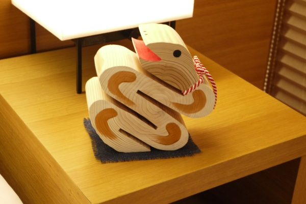
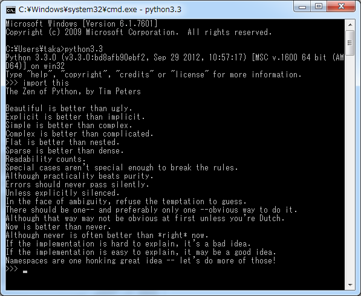

:date: 2013-01-01 10:40
:categories: ['Python']
:body type: text/x-rst

====================================================================
2013/01/01 書き初め
====================================================================

明けましておめでとうございます。

2012年は「何もしない」を目標に、黙々と本でも読んで1年過ごそうと思っていましたが、あまり達成出来なかった気がします。

* 2012/01/16 PyCon JP 2012 の副座長になった
* :doc:`../2012-03-27-python-professional-programming/index`
* :doc:`../taiwan-report-2012/index`
* 2012/09/15 PyCon JP 2012 開催・運営した (`PyCon JP 2012 レポート　～第4回 総括 （1/2）：CodeZine <http://codezine.jp/article/detail/6834>`_)
* 2012/11/01 SphinxのCo-Maintainerになった
* 2012/12/12 Sphinx-users.jpの会長になった (`Sphinx-users.jp 2012年総会(2012/12/12) <http://sphinx-users.jp/event/20121212_general_meeting/index.html>`_)

2012年を振り返ってみると執筆とPyConJPとSphinxとにけっこうな時間を使ってました。あと :doc:`新婚旅行（インドネシア）<../770/index>` 、 :doc:`PyConTW視察（台湾） <../taiwan-report-2012/index>` 、夏休み（ニューヨーク）と海外に3回も行ったのも驚きです。

2013年は、SphinxのCo-Maintainerになり日本ユーザー会の会長になったこともあり、今まで以上にSphinxに多く関わることになりそうです。

それでは、今年もよろしくお願い致します。

   2013年, 初 import this

