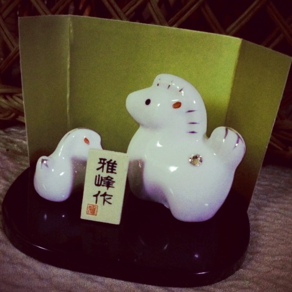

:date: 2014-01-03 21:00
:tags:

====================================================================
書き初め
====================================================================

明けましておめでとうございます。

2013年は、SphinxのCo-Maintainerになり日本ユーザー会の会長になったこともあり、Sphinxに多く関わった年でした。

ということで、2013年の振り返り。

2013年振り返り
==============

PyCon JP(APAC)
---------------

* 会計担当としてまったり運営参加
* PyCon APAC 2日目(9/15)に `「Python2.5から3.3で動作するツールの作り方」`__ の発表した。2.5はつらいのでもう捨てましょう。2.6も捨てましょう。
* PyCon APAC 3日目(9/16)に `Sphinxスプリント`__

.. __: http://apac-2013.pycon.jp/ja/program/sessions.html#session-15-1300-rooma0715-ja1-ja
.. __: http://apac-2013.pycon.jp/ja/program/sprint.html#id6

Sphinx
------

* 3/31 `Sphinx-1.2b1 リリース`__

  2012年末にsphinx co-maintainerになったあとの最初の成果が1.2b1リリースでした。今回は非ASCII文字のファイル・ディレクトリ名を扱えるようにしたこともあり、また、複数人のメンテナが開発に参加することもあり、ベータ版を出して様子を見ることになりました。2012年末から、チケットやメールを英語で書くことが多かったです。日本語で10分でかける内容に1時間以上かかったり。

* 5/25 `PyCon TWでSphinx紹介`__

  Introduction of sphinxという内容で英語で発表してきました。この時に英語で質問を受けたけど、内容を聞き取れなくて答えられませんでした。その後もリスニングはあんまり進歩してないです。

* 9/13 `「Sphinxをはじめよう」`__ 出版

  PyCon TWの後、5末から書き始めていたSphinxの本が9/13に出版されました。
  PyCon APACにGerog（Sphinxのお父さん）が基調講演しに来るのに間に合わせようと思って執筆を進めていましたが、自分の執筆参加が遅れたりしたこともあり、本当に間に合うかどうかという感じでしたが、間に合って良かった。その日のうちにGeorgにそのことを伝えたところ、基調講演でさっそく紹介してくれました。めっちゃ嬉しかったです！

  関係者の皆さん、お疲れ様でした。

* 9/16 `PyCon APAC SprintでSphinxスプリント`__

  Sphinxのお父さん、GeorgがPyCon APAC in Japanに来たので、スプリントデイに一緒に次のリリースに向けてバグ修正しました。チケット見ながら会話するのはまあまあ楽です。あと、APAC前日に出版されたSphinx本の表紙をサイトに掲載してくれた。

* 9/17 `Sphinx-1.2b2 リリース`__

  Sprintの成果がすぐにリリースされました。Georg仕事速い。

* 9/18 `Georg歓迎会`__

  Georgが1週間日本に滞在しているあいだに歓迎会やりました。
  自分を含め、みんなでたどたどしい英語で話してましたが、楽しんでくれたようでよかった。Georg、いい人や。

* 10/3 `Sphinx-1.2b3 リリース`__

  ほぼリリース版のb3リリース。

* 12/10 `Sphinx-1.2リリース`__

  ついに1.2リリース！ですが、リリース直前に不具合修正した変更が原因で別のバグを埋め込んでしまったという問題がありました。やっぱりギリギリで行った変更は良い結果を生まないですね。もうちょっと1つ1つのコミットの純度というか精度というかを上げていきたいですね。

  ところで、同じ日に `Sphinx-users.jpの総会`__ が行われました。
  すごい偶然ですね。
  この総会で2014年の会長の座を `@tcsh`__ に引き継ぎました。

.. __: https://pypi.python.org/pypi/Sphinx/1.2b1
.. __: http://shimizukawa.bitbucket.org/pycontw2013-sphinx-introduction/index.html
.. __: http://www.oreilly.co.jp/books/9784873116488/
.. __: http://apac-2013.pycon.jp/ja/program/sprint.html#id6
.. __: https://pypi.python.org/pypi/Sphinx/1.2b2
.. __: http://connpass.com/event/3489/
.. __: https://pypi.python.org/pypi/Sphinx/1.2b3
.. __: https://pypi.python.org/pypi/Sphinx/1.2
.. __: https://sphinx-users.jp/event/20131210_general_meeting/index.html
.. __: https://twitter.com/tcsh

英語
----

* 仕事で英語を使うプロジェクトに参加して、チャットが基本的に英語な感じです。時々英語で音声チャット。音声チャットはリアルタイムなのでなかなか難易度高いです。
* Sphinx関連は全部英語なので、毎回けっこうな時間かけてメールやIssueコメントを書いてます。始めた頃に比べて1時間かけてた文面を40分くらいで書けるようになった気がします。内容もまあまあ通じてるっぽいけど、だれも添削してくれないので英語力が上がってるのか、それともテキトーになってきてるのかよくわかりません。

車
--

* 2012年末に車買ってた。9年目の外車。買った頃は車を持つことについての知識が全くなかったので、中古車を買うこととか、国産車じゃないこととか、あまり気にしてなかったですが、1年でだいぶ勉強することになりました。
* 2013年末に1年目点検しましたが、不良箇所の修理が大変お高かったです。中古車は車検の直前に売られるので最低限の修理しかしてないんだと思いますが、最初の修理費けっこう見込んでおいたほうがいいみたいです。
* 前のオーナーがタイヤを8年間交換してなかったので、タイヤ交換もしたら大変お高かったです。15インチのタイヤの値段見てたら、自分の車が17インチだったとか1年乗ってから知りました。タイヤの大きな車はランニングコスト大変お高いので維持費に見込んでおいた方がいいみたいです。

2014年のの目標
===============

2013年は特に目標を立てていなかったので、達成できたかとか書けない事に気づきました。2014年は目標設定しておこうと思います。

* New Year's Python Meme 2014 を書く
* 英語リスニング向上のために発音練習する
* Blogエントリを30以上書く
* Chef以外の同様のツールを2つ以上使ってみる

それでは、今年もよろしくお願い致します。

