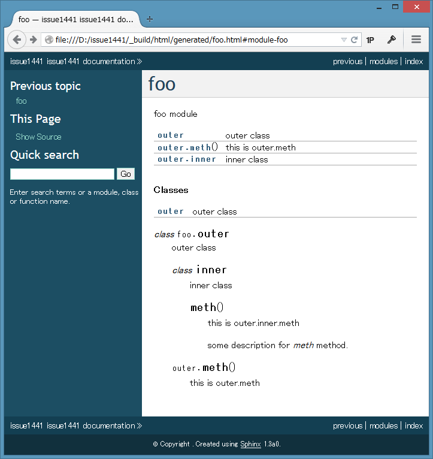

:date: 2014-6-21 19:00
:tags: Python, Sphinx

====================================================
Sphinxメンテナ日記: autosummaryは便利だね
====================================================

前置き: チケット対応した内容のメモです。このエントリを読むと、Sphinxのautosummary機能が便利だと思うかもしれません。前置きおわり。

.. contents::
   :local:

i18nサポートをプロジェクトに追加したらsphinx-buildが壊れた
============================================================

Issue #1434: `sphinx-build breaks after adding i18n support to project`__

.. __: https://bitbucket.org/birkenfeld/sphinx/issue/1229/sphinx-build-breaks-after-adding-i18n

再現せず、保留。

make gettext でエラーが起きるようになったっぽい。チケットには書いてないけど、 pgrouting_ というプロジェクトのドキュメントで :command:`make gettext` したらエラーになったということらしい。Sphinx-1.1.3とPython2.7で動作確認したけど再現しなかった。プロジェクト側で修正したのかな。

せめて、入力したコマンドと、公開プロジェクトならドキュメントのURLなどもらえると解決が早いんじゃ無いかと思いつつ、9ヶ月放置されてたチケットなので申し訳ない気もしつつ。

.. _pgrouting: https://github.com/pgRouting/pgrouting/tree/master/doc

rubricディレクティブがgettextの対象になっていない
==================================================

Issue #1305: `Add .. rubric:: to the list of special cased nodes for gettext.`__

.. __: https://bitbucket.org/birkenfeld/sphinx/issue/1305/add-rubric-to-the-list-of-special-cased

直ってた。pull request もらったのを2013年9月にマージ済みで、2013年12月のSphinx-1.2に修正が含まれてたけど、2014年1月にマイルストーンをSphinx-1.3に設定してた。

マージしたのもマイルストーンを設定したのも自分だというのが泣ける。

autosummaryがネストしたクラスを正しくドキュメント化できない
============================================================

Issue #1441: `Nested classes and autosummary`__

.. __: https://bitbucket.org/birkenfeld/sphinx/issue/1441/nested-classes-and-autosummary

sphinx.ext.autodoc でinner classのドキュメント化に対応してるのに sphinx.ext.autosummary でバグっててinner classをうまく処理出来てない問題。

以前、autosummaryの別のバグ `#1444 autosummary does not create the description for descriptor attributes`__ を修正したのと同様、autodocで出来ていることがautosummaryで出来ていない、という問題だった。autosummaryとautodocで似た別の実装あるのやめて...

.. __: https://bitbucket.org/birkenfeld/sphinx/issue/1444/autosummary-does-not-create-the

ところで、autodocやautosummaryはSphinx内部でreSTファイルを生成しているけど、実際にはファイルに書き出していないものもあるので、デバッグするときは :command:`sphinx-build` に ``-vvv`` オプションを渡すと良い。内部でどんなreSTが生成されているかコマンドラインに表示される。

issue1441の確認のために作ったファイルの場合以下のようになる:

conf.py:
   .. literalinclude:: issue1441/conf.py
      :language: python

index.rst:
   .. literalinclude:: issue1441/index.txt
      :language: rst

foo.py:
   .. literalinclude:: issue1441/foo.py
      :language: python

console:
   ::

      $ sphinx-build -T -vvv  . _build/html
      ...
      [autodoc] => <unbound method outer.meth>
      [app] emitting event: 'autodoc-process-signature' ...
      [app] emitting event: 'autodoc-process-docstring' ...
      [autodoc] output:

      .. py:module:: foo

      foo module

      .. autosummary::

         outer
         outer.meth
         outer.inner

      .. rubric:: Classes

      .. autosummary::

         outer

      .. py:class:: outer
         :module: foo

         outer class

         .. py:class:: outer.inner
            :module: foo

            inner class

            .. py:method:: outer.inner.meth()
               :module: foo

               this is outer.inner.meth

               some description for *meth* method.

         .. py:method:: outer.meth()
            :module: foo

            this is outer.meth

この結果、以下のようなページが生成される:

このへん自動的に生成してくれるautosummary, autodocは便利ですね！

長いモジュール名をautodocで短く表示したい
==========================================

sphinx-users ML: `autodoc option to generate rst files with only module names as section headers`__

.. __: https://groups.google.com/d/msg/sphinx-users/3Uw7W5DrhaE/R2XL58uQ5_8J

**Q.** 深い階層にあるモジュールをautodocでドキュメント化するとセクション名にモジュールのフルパスが入ってサイドバーが大変なんだけど？

**A.** そのreSTファイルはどうやって生成しました？もしautosummary使ってるなら、 `autosummaryのテンプレートカスタマイズ機能`__ で出力される内容をカスタマイズ出来るよ。

.. __: http://sphinx-doc.org/ext/autosummary.html#customizing-templates

手元でちょっと試したところ、長いモジュー名がセクション名に設定されるのはautosummaryを使ったときだと思うんだけど、autosummaryで生成される内容は質問者が例示した内容にはならないんだよね・・・。どうやって生成したか書いてほしいなあ。

まとめ
=======

Sphinxの質問やバグチケットの多くはautodoc/autosummaryまわりとi18n(翻訳機能)。これらの機能はそれだけよく使われているという事だと思う。

