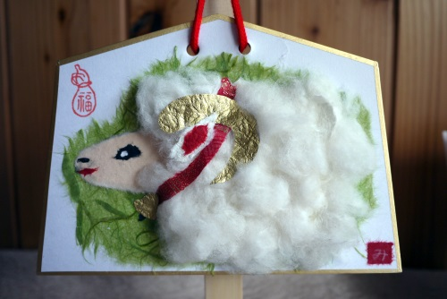

:date: 2015-01-01 16:00
:tags:
:body type: text/x-rst

====================================================================
2015/01/01 書き初め
====================================================================

明けましておめでとうございます。

2014年は、だいたいSphinxの開発してました。2015年も引き続きSphinxやっていきます。

2014年振り返り
==============

PyCon JP 2014
---------------

* 会計担当としてまったり運営参加
* チュートリアルデイ(9/12)に `チュートリアルB(Python基礎研修)`__ ということで、講師をしてきました。これはスタッフとしてではなくビープラウドの業務でした。
* カンファレンスデイ1日目(9/13)に `PyCharm活用術`__ の発表した。PyCharm便利です。
* スプリントデイ(9/15)に `Sphinxスプリント`__ やりました。

.. __: https://pycon.jp/2014/tutorials/#b-python
.. __: https://pycon.jp/2014/schedule/presentation/5/
.. __: http://sphinxjp.connpass.com/event/8090/

Sphinx
------

* 7/23-27 `EuroPython参加 & Sphinx Sprint`__

  EuroPython 行ってきました。
  プレゼンテーションはあまり聞かないつもりで7日間の期間の3日目から参加しました。
  スプリントでSphinxやるよー、というアナウンスをSphinxのMLに流したら2人反応があって、当日は3人でずっと英語で話してました。
  英語苦手だけど、聞き取ってくれようとするし、発言するのを待ってくれたので、技術的な会話はなんとかなる感じ。

* 10/9 `Sphinx-1.3b1 リリース`__

  Python3ネイティブで動作するSphinxの最初のバージョン。
  日本人からのPull-Requestが多く、ありがたかったです。

* 10/26 `SphinxCon JP 2014`__

  開催しました。
  きっかけはPyCon JP 2014にSphinxネタが1つも無かったこと。
  やってみたらPython方面じゃなないドキュメント方面の人が非常に多く参加されて、有意義なイベントになったと思います。

* 12/4 `SphinxJP総会`__

  会長交代。 tcsh -> usaturn。
  当日の議事録をまだサイトに掲載していないなぁ・・。

* 12/5 `Sphinx-1.3b2 リリース`__

  SphinxJP総会までに1.3リリースしたかった。
  大きなバグだけ修正してリリースしました。
  年内に1.3リリースしたいと思ったけど、まだできてないです。

.. __: https://www.barcamptools.eu/europythonsprint2014/sessions
.. __: https://pypi.python.org/pypi/Sphinx/1.3b1
.. __: http://sphinxjp.connpass.com/event/8448/
.. __: http://sphinxjp.connpass.com/event/9205/
.. __: https://pypi.python.org/pypi/Sphinx/1.3b2

Pepper
-------

* 9/20 Pepper TechFes に行ってきました。未来、来てる。
* 10/21 Pepper開発者先行販売に当選！とりあえず先行レンタルに申し込みました。レンタル期間終了後に、「購入努力すること」（必須ではない）と書いてあったので。
* 10/30 先行レンタルPepperが我が家に来ました。ネットを観測した感じだと、かなり早かったんじゃないかな
* 12/13 Pepperが帰って行きました。Pepper、未来詰まってる感じの人型インターフェースなんだけど、その方向に手を出す気にあまりなれなかった。

PepperのプログラミングはChoregrapheでやる分には簡単で、ちょっと教えるとけっこう動かせるので、プログラミング入門に良いですね。画面とかロボットとかをすぐ動かして試せるというのはやっぱり分かりやすい。

英語
----

http://eikaiwa.dmm.com/ でSkypeの英会話始めました。毎日25分できるだけ続けようと思います。先生によって発音指摘がすばらしかったり、話した文章を「英語ではこう言えるね」と素敵な英文に直してくれたり、超適当だったりします。

車
--

人生初の車検、きました。
10年ものの外国車は部品がお高いですね・・・。
10万超え。

病気
------

* 週2,3回、1年間ずっと整体に通いました。背中の1点に謎の痛みが出たり、右肩痛めたり、左足付け根を痛めたり・・1つが良くなっても他のところに症状がでるのがつらい。はやく卒業したい。

* 9/20 Pepper TechFesから帰ってきたら痔が来ました。外側がちょっと出っ張ったくらいで、痛いのは初日だけであとは違和感も無く。お酒控えてたら1か月くらいで帰って行ったので良かった。

* 10/頭頃～ 舌先の乳頭がなくなって、常にやけどしたような痛みが。徐々に乳頭のない範囲が広がってきたので病院にいきましたが病名不明。塗り薬（ケナログ/ステロイド剤）を処方してもらい1日3回塗ってます。3週間くらい塗り続けたらだいぶ元に戻ってきた。良かった。

* 12/19 不整脈発生。朝起きたら体感できるほどの不整脈が出てて、朝イチで病院へ。とりあえずコーヒー禁止と、処方された薬（メインテート／ビソプロロールフマル酸塩錠）を服用して様子見。今のところ原因も何も分からないので、とりあえずコーヒーだけじゃなくカフェイン全体を禁止してみてるところ。ルイボスティーやカモミールティが好きで良かった。

なんか、病気しまくった年だった。

2014年の目標 振り返り
======================

* New Year's Python Meme 2014 を書く

  -> × 書かなかった

* 英語リスニング向上のために発音練習する

  -> 〇 DMM英会話始めた

* Blogエントリを30以上書く

  -> × 24個だった

* Chef以外の同様のツールを2つ以上使ってみる

  -> × Fabricのみ

2015年の目標
===============

今年の目標です。

* 英語リスニング・スピーキング向上のために英会話を 25分 x 200回 やる
* Blogエントリを30以上書く
* 海外のイベントでSphinxの発表を3回以上行う

それでは、今年もよろしくお願い致します。

