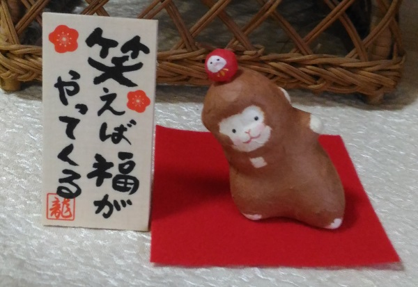

:date: 2016-1-1 0:00
:tags:

=====================
書き初め
=====================

明けましておめでとうございます。

TL;DR
========

* 色々やってたけど目標達成率は低いです
* Sphinxのメンテは中盤お休みしてました
* 今年は海外PyConにたくさん行ったので概ね満足しました

ということで、 :doc:`../2015-kakizome/index` の振り返りと、2016年の目標について。

2015年の目標と反省
===================

以下が、今年の目標でした。

* 英語リスニング・スピーキング向上のために英会話を 25分 x 200回 やる
* Blogエントリを30以上書く
* 海外のイベントでSphinxの発表を3回以上行う

英語リスニング・スピーキング向上のために英会話を 25分 x 200回 やる
----------------------------------------------------------------------

DMM英会話をやってました。

2月はほとんど海外PyConの発表プロポーザル（英語）を2つ作っていて、3月4月は仕事に追われ、5月はPyConの発表資料作り（英語）2つをやってました。英語のレッスンを受けずに英語の文章をたくさん書いてました。

そういうわけで、2月以降英会話の授業にあまり時間を割けなくなり、授業を受けるときも主に自己紹介の練習や発表資料のレビューなどをしてもらっていました。そのなかで、自分の仕事や普段の活動でなにをしているのか、といったところを話す練習がたくさんできたので、海外に行ったときに話し始めるのがだいぶ楽になったと思います。

海外PyCon等で忙しくしていて、気づいたら4か月まったくやらずにいたので一度退会しました。今年の授業階数は20回でした。達成度10%。

Blogエントリを30以上書く
-------------------------

このエントリを含めて、18個でした。

8月以降書いてませんでした。その代わりに、gihyo.jpで `海外PyCon発表修行レポート2015`_ として記事を連載していました。連載はblogよりも記事のターゲットや趣旨を意識して、伝えたいことのエッセンスを全て詰め込んだので、そっちで満足してしまった感じですね。

* `第1回　PyCon APAC 2015 in TaiwanでのSphinxに関する発表`_
* `第2回　PyCon SG 2015参加レポートとSphinxに関する発表`_
* `第3回　EuroPython 2015参加レポートと，Sphinxに関する発表（前編）`_
* `第4回　EuroPython 2015参加レポートと，Sphinxに関する発表（後編）`_
* `第5回　PyCon Malaysia 2015参加レポートとSphinx発表`_
* `第6回（最終回）　PyCon Korea 2015参加レポートとSphinx発表`_

各5ページくらいあるので、6回分の記事x5ページ = blog 30回分、ということで。

.. _海外PyCon発表修行レポート2015: http://gihyo.jp/news/report/01/overseas-pycon-presentation-training-2015
.. _第1回　PyCon APAC 2015 in TaiwanでのSphinxに関する発表: http://gihyo.jp/news/report/01/overseas-pycon-presentation-training-2015/0001
.. _第2回　PyCon SG 2015参加レポートとSphinxに関する発表: http://gihyo.jp/news/report/01/overseas-pycon-presentation-training-2015/0002
.. _第3回　EuroPython 2015参加レポートと，Sphinxに関する発表（前編）: http://gihyo.jp/news/report/01/overseas-pycon-presentation-training-2015/0003
.. _第4回　EuroPython 2015参加レポートと，Sphinxに関する発表（後編）: http://gihyo.jp/news/report/01/overseas-pycon-presentation-training-2015/0004
.. _第5回　PyCon Malaysia 2015参加レポートとSphinx発表: http://gihyo.jp/news/report/01/overseas-pycon-presentation-training-2015/0005
.. _第6回（最終回）　PyCon Korea 2015参加レポートとSphinx発表: http://gihyo.jp/news/report/01/overseas-pycon-presentation-training-2015/0006

海外のイベントでSphinxの発表を3回以上行う
------------------------------------------

5カ国でSphinxの発表をしてきました。台湾とマレーシアでは2つ発表したので、のべ7回でした。

.. csv-table::

   6/5-9, `PyCon APAC 2015 in Taiwan`_, `(1) Sphinx i18n`_ と `(2) Sphinx autodoc`_
   6/17-19, `PyCon Singapore 2015`_, `(3) Sphinx i18n`_
   7/20-26, `EuroPython 2015`_, `(4) Sphinx autodoc`_
   8/21-23, `PyCon Malaysia 2015`_, `(5) Sphinx autodoc`_ と `(6) Sphinx i18n`_
   8/29-30, `PyCon Korea 2015`_, `(7) Sphinx autodoc`_

今年は2月から8月までは、発表準備、イベント参加、レポート記事の執筆、をずっと繰り返していた感じです。最初のイベントまでは2つのプレゼン資料をカタチにするのが大変でしたが、一度発表したあとは参加者の反応を見聞きしてそこからブラッシュアップする作業になったので、大分楽でした。

発表者は知り合いがいなくても他の人から声をかけてもらえるので友人作りが楽でいいですね。この5カ国への遠征でとても多くの友人ができました。

また、レポート記事を書くつもりでセッションを聞いてメモしたり、色々な人に話しかけたりサブイベントに参加しました。このおかげで、それぞれのイベントの特徴やこまかい出来事が記憶に定着しました。

発表する、積極的に参加する、記録してレポートを書く、ということによってとても有意義な経験が出来ました。

.. _PyCon APAC 2015 in Taiwan: https://tw.pycon.org/2015apac/
.. _PyCon Singapore 2015: https://pycon.sg/static/archive/2015/index.html
.. _EuroPython 2015: https://ep2015.europython.eu/en/
.. _PyCon Malaysia 2015: http://www.pycon.my/
.. _PyCon Korea 2015: http://www.pycon.kr/2015/

.. _(1) Sphinx i18n: http://www.slideshare.net/shimizukawa/easy-contributable-internationalization-process-with-sphinx-pycon-apac-2015-in-taiwan-49057754
.. _(2) Sphinx autodoc: http://www.slideshare.net/shimizukawa/sphinx-autodoc-automated-api-documentation-pyconapac2015
.. _(3) Sphinx i18n: http://www.slideshare.net/shimizukawa/easy-contributable-internationalization-process-with-sphinx-pyconsg2015
.. _(4) Sphinx autodoc: http://www.slideshare.net/shimizukawa/sphinx-autodoc-automated-api-documentation-europython-2015-in-bilbao
.. _(5) Sphinx autodoc: http://www.slideshare.net/shimizukawa/sphinx-autodoc-automated-api-documentation-pyconmy-2015
.. _(6) Sphinx i18n: http://www.slideshare.net/shimizukawa/easy-contributable-internationalization-process-with-sphinx-pyconmy2015
.. _(7) Sphinx autodoc: http://www.slideshare.net/shimizukawa/sphinx-autodoc-automated-api-documentation-pyconkr-2015

その他のできごと
==================

イベント参加
--------------

海外PyConの他に、日本国内でいくつかPython, Sphinx関連のイベントで発表や運営をしていました。

* 10/9: `PyCon JP 2015 でSphinxチュートリアル`__
* 10/10: `PyCon JP 2015 でSphinx i18n の発表`__
* 10/11: `PyCon JP 2015 でポスターセッション`__
* 10/12: `PyCon JP 2015 のスプリントでSphinxスプリント`__
* 10/31: `Sphinxワークショップ@関西 でSphinx紹介 & ハンズオン講師`__
* 11/24: `SphinxCon JP 2015 開催`__
* 12/2: `Sphinx-Users.jp 定期総会`__
* 12/5: `Python入門者向けハンズオン チューター`__

.. __: https://pycon.jp/2015/ja/schedule/tutorials/list/
.. __: https://pycon.jp/2015/ja/schedule/presentation/45/
.. __: https://pycon.jp/2015/ja/schedule/presentation/101/
.. __: http://sphinxjp.connpass.com/event/20535/
.. __: http://sphinxjp.connpass.com/event/22023/
.. __: http://sphinxjp.connpass.com/event/22024/
.. __: http://sphinxjp.connpass.com/event/21866/
.. __: http://connpass.com/event/22808/

あとは特に準備のいらないイベントへの参加も少々。

* 毎月開催: `Python mini hack-a-thon 11回`__
* 毎月開催: `Sphinx hack-a-thon 12回`__
* 毎月開催: `Sphinx Tea Night 約8回`__

.. __: http://pyhack.connpass.com
.. __: http://sphinxjp.connpass.com
.. __: http://sphinxjp.connpass.com

本の執筆とか
--------------

SD Sphinx連載
~~~~~~~~~~~~~~~

:doc:`../sphinx-softwaredesign-201507/index` 、ということで、SoftwareDesign 2015年7月号（連載4回目）にSphinxの記事を書きました。また、連載5回目からは、短信として1ページもらってSphinx関連の情報を掲載しています。

Sphinxをはじめようの改訂
~~~~~~~~~~~~~~~~~~~~~~~~~

`Sphinxをはじめよう`_ をアップデートしました。2013年9月 [#1]_ に発行された本で、Sphinx-1.2beta版をベースに書いていました。今回、2015年11月 [#2]_ にSphinx-1.3.1ベースに更新し、これまでEPUBとKindleだけだったフォーマットにPDF版が追加されました。

.. [#1] PyCon APAC 2013 in Japan 当日
.. [#2] SphinxCon JP 2015 当日

.. _Sphinxをはじめよう: http://www.oreilly.co.jp/books/9784873116488/

Sphinxのメンテナンス
----------------------

* 2/24 `Sphinx 1.3b3 リリース`__
* 3/10 `Sphinx 1.3 リリース`__
* 3/17 `Sphinx 1.3.1 リリース`__
* 11/30 `Sphinx 1.3.2 リリース`__
* 12/2 `Sphinx 1.3.3 リリース`__ [#3]_
* 12/28 `sphinx-intl 0.9.8 リリース`__

3月末から11月末まで間が空いていますが、Sphinxの営業ばっかりやってたせいですね。本末転倒気味です。

.. __: https://pypi.python.org/pypi/Sphinx/1.3b3
.. __: https://pypi.python.org/pypi/Sphinx/1.3
.. __: https://pypi.python.org/pypi/Sphinx/1.3.1
.. __: https://pypi.python.org/pypi/Sphinx/1.3.2
.. __: https://pypi.python.org/pypi/Sphinx/1.3.3
.. __: https://pypi.python.org/pypi/sphinx-intl/0.9.8

.. [#3] Sphinx-Users.jp 定期総会の当日

2016年の目標
===============

今年の目標です。

* 英語リスニングを向上させるために、方法を模索する
* 対外的な露出よりも、文章を書いたりプログラムを書いたりすることに注力します
* Blogエントリを30以上書く
* Sphinxを月に1回リリースする

それでは、今年もよろしくお願い致します。

