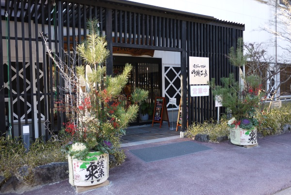

.. :date: 2017-01-21 23:00
.. :categories: []
.. :body type: text/x-rst

=====================
2017/01/21 書き初め
=====================

明けましておめでとうございます。

自分のblog環境がやっと復活したので、遅くなりましたが書き初めです。

TL;DR
========

* 色々やってたけど目標達成率は低いです
* Sphinxのメンテは、ほぼ@tk0miyaにやってもらってました
* 目標にしてなかったことに手を出しすぎたのでそっちの成果はそれなりにあります

ということで、 :doc:`../2016-kakizome/index` の振り返りと、2017年の目標について。

2016年の目標と反省
===================

以下が、2016年の目標と、成果です。

* × 英語リスニングを向上させるために、方法を模索する

  -> 何もしませんでした

* × 対外的な露出よりも、文章を書いたりプログラムを書いたりすることに注力します

  -> プログラムは多少書いたけど注力までいきませんでした

* × Blogエントリを30以上書く

  -> なんと2回でした。達成率 **6.67%**

* 〇 Sphinxを月に1回リリースする

  -> 15回のリリースがあり、2016年は9月以外毎月リリースがありました！ただ、ほぼ全部 @tk0miya がやってくれてました。ということで、×。

  * Release 1.3.4 (released Jan 12, 2016)
  * Release 1.3.5 (released Jan 24, 2016)
  * Release 1.3.6 (released Feb 29, 2016)
  * Release 1.4.0 (released Mar 28, 2016)
  * Release 1.4.1 (released Apr 12, 2016)
  * Release 1.4.2 (released May 29, 2016)
  * Release 1.4.3 (released Jun 05, 2016)
  * Release 1.4.4 (released Jun 12, 2016)
  * Release 1.4.5 (released Jul 13, 2016)
  * Release 1.4.6 (released Aug 20, 2016)
  * Release 1.4.7 (released Oct 01, 2016)
  * Release 1.4.8 (released Oct 01, 2016)
  * Release 1.4.9 (released Nov 23, 2016)
  * Release 1.5.0 (released Dec 05, 2016)
  * Release 1.5.1 (released Dec 13, 2016)

2016年にやっていたこととか
============================

全く目標を達成できなかったですが、じゃあ何をやっていたのか振り返ります。

PyCon APAC
-----------------

2016年のPyCon APACは韓国で行われました。

一般社団法人PyCon JPの企画として、 `PyCon APAC 2016 in Korea のツアーを企画・開催`_ が行われ、日本から11名が参加しました。
イベントの詳細は `「PyCon APAC 2016 in Korea」参加レポート：レポート｜gihyo.jp … 技術評論社`_ にレポートがあります。

私は、トークセッションに申し込んで採用されていたので、Sphinxの多言語化について紹介してきました。
発表の様子をレポートしてもらっています http://gihyo.jp/news/report/01/pycon-apac2016/0002?page=2

.. figure:: pyconapac2016-sphinx-talk.jpg
   :target: https://twitter.com/shimizukawa/status/764678449382367233
   :width: 300px

   Sphinxトーク開始時の参加者は10人くらい。あとからちょっと増えたかな

   JetBrainsのブースに行ったらTシャツもらった！

.. _PyCon APAC 2016 in Korea のツアーを企画・開催: http://pyconjp.blogspot.jp/2016/04/pycon-apac-2016-in-korea.html
.. _「PyCon APAC 2016 in Korea」参加レポート：レポート｜gihyo.jp … 技術評論社: http://gihyo.jp/news/report/01/pycon-apac2016

PyCon JP
-----------------

PyCon JP のスタッフをやりました。やるからにはしっかりやろうと思って、色々手を出したらだいぶ忙しくなってしまった。

- プログラムチームのトーク担当

  - トーク募集: 募集要項作成、システム調整、アナウンス、広報
  - トーク選考: 選考基準策定、選考チーム立ち上げ、選考会議、採用連絡
  - トークアドバイス1on1: 企画、段取り、実施
  - スピーカー向けメルマガ的なの: 企画、段取り、実施
  - スピーカーTips企画: 企画、段取り

- ビギナーセッション担当: 企画、段取り、当日用意
- タイムテーブル担当: 時間調整、サイト掲載、掲示物作成
- プログラムチームの執筆とりまとめ
- サイトシステム構築手伝い、機能追加、機能改善、自動化、Docker化

目に見える成果物のリンクはこんな感じです。

- Web機能: スライドとビデオの登録と掲載: `タイムテーブルページ`_, `トーク一覧ページ`_, `トーク詳細ページ`_
- Web機能: `スピーカー委陳ページ`_ の実装
- Webページ: `スピーカーTips`_ の企画、調整（翻訳は別の人）
- Webページ: `スピーカーUpdate`_ の作成とメールマガジン配信
- Webページ: `トークの応募方法`_ で、応募するメリットや過去の例、プロポーザルの書き方アドバイスを掲載
- Blog: `2016年4月21日 PyCon JP 2016 のトーク募集開始しました`_
- Blog: `2016年4月22日 PyCon JP 2016 Call for Proposals`_
- Blog: `2016年5月18日 Pythonやってみた系トークを応募しよう！PyCon JP 2016 トーク募集中です`_
- Blog: `2016年6月12日 トークのレビュワー(外部審査員)の募集開始しました`_
- Blog: `2016年6月15日 トークの応募数をPandasで集計してみた`_
- Blog: `2016年8月8日 トークアドバイス申し込み開始しました`_
- 寄稿: 2016/8/24 `PyCon JP 2016 開催前レポート　～第2回 プログラムについて (1/3)：CodeZine（コードジン）`_
- 寄稿: 2016/12/6 `PyCon JP 2016 開催後レポート　～第2回 プログラムチームのPyCon JP 2016 (1/5)：CodeZine（コードジン）`_

これとは別に、スピーカーとしてトークも1つやってきました。

- トーク発表: `仕事で使うちょっとしたコードをOSSとして開発メンテしていく - Django Redshift Backend の開発`_
- Togetter: https://togetter.com/li/1027325

おかげさまで、セッションは満席で、良い反応が得られました。

.. _2016年4月21日 PyCon JP 2016 のトーク募集開始しました: http://pyconjp.blogspot.jp/2016/04/pycon-jp-2016-call-for-talk-proposal.html
.. _2016年4月22日 PyCon JP 2016 Call for Proposals: http://pyconjp.blogspot.jp/2016/04/pycon-jp-2016-call-for-talk-proposal-en.html
.. _2016年5月18日 Pythonやってみた系トークを応募しよう！PyCon JP 2016 トーク募集中です: http://pyconjp.blogspot.jp/2016/05/pycon-jp-2016-lets-submit-your-talk.html
.. _2016年6月12日 トークのレビュワー(外部審査員)の募集開始しました: http://pyconjp.blogspot.jp/2016/06/pyconjp2016-reviewers-apply.html
.. _2016年6月15日 トークの応募数をPandasで集計してみた: http://pyconjp.blogspot.jp/2016/06/talk-proposals-summary.html
.. _2016年8月8日 トークアドバイス申し込み開始しました: http://pyconjp.blogspot.jp/2016/08/talk-advice-application.html
.. _PyCon JP 2016 開催前レポート　～第2回 プログラムについて (1/3)：CodeZine（コードジン）: http://codezine.jp/article/detail/9600
.. _PyCon JP 2016 開催後レポート　～第2回 プログラムチームのPyCon JP 2016 (1/5)：CodeZine（コードジン）: http://codezine.jp/article/detail/9828

.. _仕事で使うちょっとしたコードをOSSとして開発メンテしていく - Django Redshift Backend の開発: https://pycon.jp/2016/ja/schedule/presentation/48/
.. _トーク詳細ページ: https://pycon.jp/2016/ja/schedule/presentation/48/
.. _トーク一覧ページ: https://pycon.jp/2016/ja/schedule/talks/list/
.. _タイムテーブルページ: https://pycon.jp/2016/ja/schedule/
.. _スピーカー一覧ページ: https://pycon.jp/2016/ja/speaker/list
.. _スピーカーTips: https://pycon.jp/2016/ja/talks/tips-for-speakers/
.. _スピーカーUpdate: https://pycon.jp/2016/ja/talks/speaker-updates/
.. _トークの応募方法: https://pycon.jp/2016/ja/talks/howto/

Sphinxの連載執筆
---------------------------

SoftwareDesign 2015年4月号から、 **Sphinxで始めるドキュメント作成術** という連載を行っています。
記事は何人かで交代で書いていて、私もいくつかの記事を書きました。

2016年に執筆したのは以下の5回分でした。

* `Software Design 2016年4月号:【13】MarkdownではじめるSphinx <http://gihyo.jp/magazine/SD/archive/2016/201604>`__
* `Software Design 2016年5月号:【14】Sphinxで楽々ドキュメント翻訳 <http://gihyo.jp/magazine/SD/archive/2016/201605>`__
* `Software Design 2016年6月号:【15】ドキュメント翻訳フローの自動化 <http://gihyo.jp/magazine/SD/archive/2016/201606>`__
* `Software Design 2016年9月号:【18】ドキュメントを自動生成するautodoc <http://gihyo.jp/magazine/SD/archive/2016/201609>`__
* `Software Design 2017年1月号:【22】Sphinxで本を書こう <http://gihyo.jp/magazine/SD/archive/2017/201701>`__

連載は1号で6ページあり、執筆開始から脱稿まで、出版社側の作業を待つ期間を含めて40日くらいかかります。
3号連続で書いてたときは1号分を終える前に次の号を書き始めてた感じです。

健康面
--------

不整脈が出ました。

「不整脈」というキーワードで自分のツイートを検索すると、12ヶ月で約30回ツイートしてました。
原因は不明だし、出てるときは頭痛になる気がするけど病院で相談したら機能性だと言われたし、なかなか落ち着かない。

忙しくしてるときはあんまり出なくて、忙しいのから解放されると出るっぽい。不思議。

2017年の目標
============

改めて、2017年の目標を設定します。

blogを書くとか言っててもあまり実が無いことが分かってきたので、実践しやすい方向で行きたいと思います。

1. イベントに参加したらblogを書く
----------------------------------

"対外的な露出よりも、文章を書いたりプログラムを書いたりすることに注力" を具体的に実践しようと思います。

毎月、大小さまざまなイベントに参加していますが、最近あまり記録を残していませんでした。
そして各イベントでそれぞれ印象深い話や技術やなにかがあった気もしますが、だいたい覚えていません。
これは、記録に残していないから覚えていないというよりも、本気で向き合ってなかったからじゃないかと思っています。

blogなり記事なりを残すという行為は、本気で向き合うための道具としてちょうど良い媒体だと思います。

2017年は **「イベントに参加したらblogを書く、書かないなら参加しない」** というくらいで臨みます。

2. 英語のリスニングビデオを書き取る
------------------------------------

"英語リスニングを向上させるために、方法を模索する" を具体的にやってみます。

ただ聞くだけだと身につかなそうなので、話してる内容を書き取っていきます。
これを1日10分ずつでもやりながら、より良い実践方法も探してみようと思います。

ところで、良い動画ないかなーと思って探してたら `Klingon Course 1: nuqneH & Qapla'`_ を見つけました。
ドイツ人が教えるクリンゴン語講座。このくらいの英語ならほぼ聞き取れそうだけど、クリンゴン語を身に付けてもな...

妻に教えてもらった `Rachel's English`_ から始めてみます。

.. _`Klingon Course 1: nuqneH & Qapla'`: https://youtu.be/auqS6FR_RDE
.. _`Rachel's English`: https://www.youtube.com/user/rachelsenglish/featured

それでは、今年もよろしくお願い致します。
