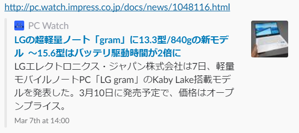

:date: 2017-07-17 22:00
:tags: Python, Sphinx, ogp

=====================================
SphinxでHTMLにOGPタグ出力
=====================================

* SNSにURL投稿したらサイト内容が展開されるの、Sphinxにも欲しい。ちょう欲しい。
* リンクだけとか寂しいしなんとかしたい。
* 他のblogツール使ってる人がうらやましい。

ということで、Sphinx拡張を :doc:`../pyhack-20170714/index` の帰りの新幹線で実装しました。

実現したいこと
==============

* Twitter/FacebookへSphinxページシェアでサイトのコンテンツを埋め込みたい。
* そのために、OGPに対応したメタタグをHTMLに埋め込みたい。

ソリューション
===============

実装したSphinx **ogtag拡張** の使い方とコードはこちら.

* `Twitter/Facebookへのページシェアでコンテンツを埋め込む(OGP)`_

.. _Twitter/Facebookへのページシェアでコンテンツを埋め込む(OGP): http://sphinx-users.jp/cookbook/ogp/index.html

結果
=====

.. figure:: facebook.*

   facebookに投稿したところ

それっぽい！これで俺のblogも人並みに！！

---

Twitterの方は、承認をもらうまで展開されないようなので、しばらく待ちます。

.. figure:: twitter-validator.*

   https://cards-dev.twitter.com/validator

おまけ: サイトがSNSシステムからどう見えているか
===============================================

Slackにきれいに表示されるリンク先のページを見て、どんなメタタグが使われているか確認しました。インプレスさんのページは良い感じに見えてるのでこれをベンチマークに。

   http://pc.watch.impress.co.jp/docs/news/1048116.html

あと、Facebookのdeveloperコンソールが役に立ちました。Facebookはコンテンツ内容をキャッシュしてるので、実験中はこまめに再取得したりとかやりました。

* https://developers.facebook.com/tools/debug/sharing/?q=http%3A%2F%2Fpc.watch.impress.co.jp%2Fdocs%2Fnews%2F1048116.html

