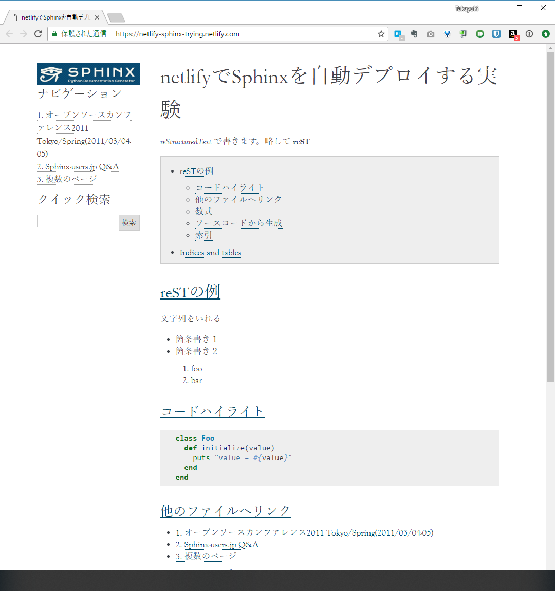

:date: 2018-05-05 15:00
:tags: Sphinx, Netlify, 静的サイトホスティング

============================================
Netlify - 静的サイトホスティングを試してみた
============================================

`Netlify`_ で静的サイトを自動ビルドしてホスティングできるというのを聞いたので、やってみました。

.. _Netlify: https://www.netlify.com/

.. raw:: html

   <blockquote class="twitter-tweet" data-lang="ja">
<a href="https://t.co/wnPZT7Nt4e">https://t.co/wnPZT7Nt4e</a> で遊んでるんだけど、GitHub Pages や Jekyll に慣れてる人にはめっちゃ簡単でいいな。要るのドメインだけや。
&mdash; mattn (@mattn_jp) <a href="https://twitter.com/mattn_jp/status/990215674613006337?ref_src=twsrc%5Etfw">2018年4月28日</a></blockquote>
   

.. contents::
   :local:

Netlifyでできること
===================

https://www.netlify.com/features/ に書いてある。興味を惹いたのだけメモ。

* ソースリポジトリ連携:  GitHub, GitLab, Bitbucket と連携。Privateリポジトリも可能
* `Automate deployment <https://www.netlify.com/docs/continuous-deployment/>`_: 自動デプロイが組み込み
* `Custom Domain <https://www.netlify.com/docs/custom-domains/>`_: 無料のカスタムドメイン
* `HTTPS <https://www.netlify.com/docs/ssl/>`_: 無料のHTTPS
* `Functions <https://www.netlify.com/docs/functions/>`_: AWS Lambda でバックエンド処理ができるらしい
* `Identity <https://www.netlify.com/docs/identity/>`_: サイトにアクセス制御を追加！ただしJWTで提供
* `Site Password <https://www.netlify.com/docs/visitor-access-control/#password-protection>`_: サイト全体にパスワード制御。チームプランのみ 45ドル/月～

Sphinxデプロイまでの手順
========================

1. リポジトリ用意

   * 用意した https://github.com/shimizukawa/netlify-trying
   * Sphinxをインストールするために `requirements.txt <https://github.com/shimizukawa/netlify-trying/blob/88d9ae8057c063d9ad830c38611ee76ecf6f8ebc/requirements.txt>`_ を用意
   * Python 3 を使って欲しいので `runtime.txt <https://github.com/shimizukawa/netlify-trying/blob/88d9ae8057c063d9ad830c38611ee76ecf6f8ebc/runtime.txt>`_ を用意 (`manual <https://www.netlify.com/docs/build-settings/#python>`__)

2. Netlify Sign up

   https://www.netlify.com/ の右上からGitHub OAuthでサインアップした

3. GitHubリポジトリと接続

   https://app.netlify.com/ から ``New site from Git`` で接続した

   .. figure:: connect-repo.*
      :width: 60%

      Create new site -- Netlify

4. 自動的にビルドされた

   * `ビルドログ <https://app.netlify.com/sites/epic-boyd-bd3d84/deploys/5aed2075dd6a544d2d6764ef>`__
   * デプロイされたページ: epic-boyd-bd3d84.netlify.com/ （URL変えたのでこれはもう見えない）

5. ドメイン設定

   * Settingタブ ``https://app.netlify.com/sites/<name>/settings/general`` で ``Chane site name`` をおして ``netlify-sphinx-trying`` に変えた
   * できた: https://netlify-sphinx-trying.netlify.com/

とりあえずできました。

あとはGitHubにPushすれば自動的にビルドされる。

Sphinxに限らず、静的サイトを楽にビルドしてホスティングしたい場合、だいぶ便利な感じでした。

パスワードアクセス制御
=======================

パスワードアクセス制御をしたいモチベーションては、秘密のコンテンツを特定の人にだけ見せる仕組みが欲しい。例えばSphinxで執筆・翻訳中の本なんかをプライベートリポジトリで管理して、自動ビルドしたものを特定の人にだけ共有したい。VPS等で自動ビルドしてBASIC認証かける程度で良いのだけど、セットアップして保守するのが面倒なので簡単な仕組みが欲しい。

Netlifyの Identity_ で出来るかな？と思ったけど、ちょっと厳しそう。 `GoTrue`_ による認証バックエンドと、JSの認証Widgetが提供されていて、認証するとJWTが発行される。これを使って認証したときだけサイトを見せれば良さそうだが、サイトに組み込む必要がある。NetlifyにはIdentityの利用例として ``Netlify CMS`` が紹介されている。Sphinxのような静的サイトジェネレータの場合、認証された場合だけページを見せるように **頑張って** 組み込まないといけなくて厳しい。

Netlifyにはもうひとつ、 `Site Password`_ というサイト全体にアクセス制限を設定する機能もあるけど、これはチームプランのみ。 `45ドル/月～ <https://www.netlify.com/pricing/>`__ なのでカジュアルに使うにはちょっと厳しいお値段。

.. _GoTrue: https://github.com/netlify/gotrue

