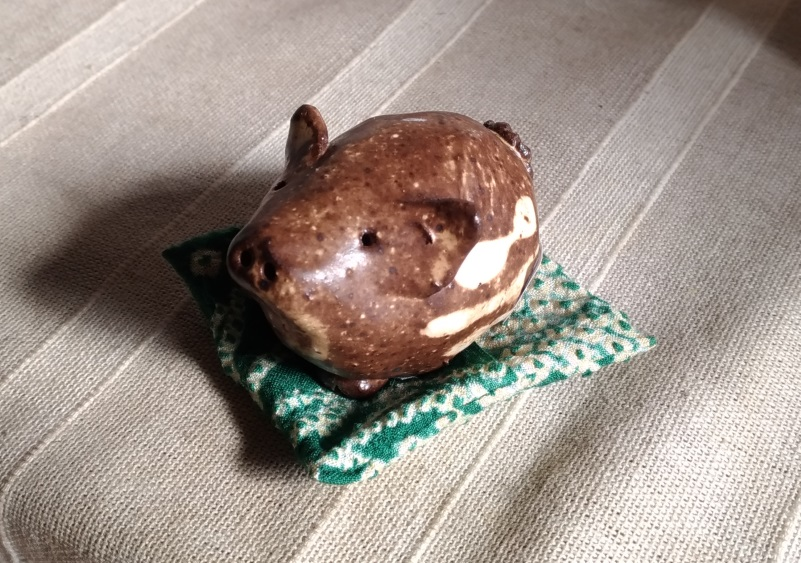

:date: 2019-01-06 23:59
:tags: kakizome

=====================
書き初め
=====================

明けましておめでとうございます。

TL;DR
========

* 2018年の目標は、ほとんど達成しなかった
* 目標以外のことは、色々やった
* 2019年は、やることを減らしていく

以下、2018年の :doc:`../2018-kakizome/index` の振り返りと、2019年の目標について。

2018年の振り返り
=================

2018年にやったこと
-------------------

* 2018年1月に :doc:`子供が生まれました <../new-family-is-comming/index>` 。
* 2018年2月に、翻訳した `独学プログラマー`_, `エキスパートPythonプログラミング 改訂2版`_ が出版されました。
* 『独学プログラマー』関連で、 `Cory Althofと対談`_ 、 `ジュンク堂でトーク`_ 、 `独学プログラマーのインタビュー`_ され、 `独学プログラマーの寄稿`_ をしました。
* `PyCon JP 2018`_, `Plone Conference 2018`_, `SphinxCon JP 2018`_ に登壇して発表を行いました。
* `Scrapbox`_ を始めて556ページ書きました（ブックマーク含む）

.. _独学プログラマー: https://scrapbox.io/shimizukawa/独学プログラマー
.. _エキスパートPythonプログラミング 改訂2版: https://scrapbox.io/shimizukawa/エキスパートPythonプログラミング_改訂2版
.. _Cory Althofと対談: https://trendy.nikkeibp.co.jp/atcl/pickup/15/1003590/070301740/
.. _ジュンク堂でトーク: https://trendy.nikkeibp.co.jp/atcl/pickup/15/1003590/070301740/?P=4
.. _独学プログラマーのインタビュー: https://type.jp/et/feature/6678
.. _独学プログラマーの寄稿: https://trendy.nikkeibp.co.jp/atcl/pickup/15/1003590/042501673/
.. _PyCon JP 2018: https://scrapbox.io/shimizukawa/PyCon_JP_2018:_Webアプリケーションの仕組み
.. _Plone Conference 2018: https://2018.ploneconf.org/talks/python-web-day/sphinx-customization-for-ogp-support
.. _SphinxCon JP 2018: https://www.slideshare.net/shimizukawa/sphinx-customization-for-ogp-support-sphinx-con-jp-2018
.. _Scrapbox: https://scrapbox.io/shimizukawa/

2018年の目標と、成果
---------------------

* △ イベントに参加したらblogを書く

  2018年は31個のイベントに参加しました（ミーティングと懇親会を除く）。
  イベント参加数は2017年の約半分でした。 `#pyhack`_ と `#sphinxjp`_ が毎月あるので、それ以外のイベントに月1回参加したら30回を超えた感じです。
  そのうち11個をblogに記録し、5つを `Scrapboxの参加ログタグ`_ で記録しました。50%くらいの記録率ということで、△。

  6月頃から Scrapbox_ に記録を残すようにしたら、だいぶはかどりました。発表系イベントでメモしたキーワードが突然他のページと繋がったりして、脳内が繋がっていく感じがあります。

  2019年も、イベント参加数は30回前後のペースにする予定です。また、 **「イベントに参加したら参加ログを書く、書かないなら参加しない」** を続けていきます。元々はアウトプットによる記憶の定着が目的でしたが、 Scrapbox_ を使うことで、記憶の結合の意味合いもでてきました。

.. _Scrapboxの参加ログタグ: https://scrapbox.io/shimizukawa/search/page?q=%E5%8F%82%E5%8A%A0%E3%83%AD%E3%82%B0
.. _#pyhack: https://pyhack.connpass.com/
.. _#sphinxjp: https://sphinxjp.connpass.com/

* △ Sphinxのメンテナに復帰

  ちょっとやりました。ちょっとしかできませんでした。

* ×英語のリスニングビデオを書き取る

  -> 何もしませんでした。

2018年は、目標達成度がだいぶ低いです。自宅で使える時間はほとんど子供のために使ってしまったし、書籍の翻訳期間はずっと寝不足だった反動から夜はしっかり寝てました。イベントでの発表資料作成などは、家族に協力してもらって時間をあけて取り組みました。通勤時間や隙間時間をうまく使わないとまずい、ということで Scrapbox_ に色々なネタを書きためていったら、4ヶ月くらいで500ページ超えたので、これが2018年の成果なのかも。

健康面
--------

* `バターコーヒー`_ は続けています。初めはダイエット目的でしたが、今は日中の思考をクリアに保つために続けています。体重は68kg～72kgで増えたり減ったり。

.. _バターコーヒー: https://scrapbox.io/shimizukawa/%E3%83%90%E3%82%BF%E3%83%BC%E3%82%B3%E3%83%BC%E3%83%92%E3%83%BC

* ここのところ毎年、風邪以外の病気っぽい何かで病院に行ってます。昨年1月に大腸内視鏡検査を受けて、特に問題なしだったのは良かった。9月に秋の花粉症を疑って `アレルギー検査をした`_ けど、ブタクサなどはレベル0。春の花粉もスギがレベル3程度（最大レベル6）。

.. _アレルギー検査をした: https://scrapbox.io/shimizukawa/%E3%82%A2%E3%83%AC%E3%83%AB%E3%82%AE%E3%83%BC

2019年の目標
============

2019年の目標を設定します。

1. イベントに参加したらblogを書く
----------------------------------

**「イベントに参加したらblogを書く、書かないなら参加しない」**

これは "対外的な露出よりも、文章を書いたりプログラムを書いたりすることに注力" の具体的な行動の1つとして継続します。2019年もさっそく1つ参加したので、Scrapboxに書きました -> `2019.01.12 sphinxjp 開発合宿`_

イベント参加数は2018年同様に30回/年くらいにします。

.. _2019.01.12 sphinxjp 開発合宿: https://scrapbox.io/shimizukawa/2019.01.12_sphinxjp_%E9%96%8B%E7%99%BA%E5%90%88%E5%AE%BF

2. Sphinxのメンテナ業を1歩ずつ
-------------------------------

2019年も、改めて、もくもくとIssueをトリアージしていきます。Issueが多すぎるという気がかかりを削減して、新機能とかにも手を出せるようにしていきたいお気持ち。

今年もさっそく `2019.01.12 sphinxjp 開発合宿`_ を開催して、参加してきました。去年はこのあとまったく動けなかったので、今年は少しずつでもやっていきたい。

.. _Sphinx + 翻訳 Hack-a-thon 開発合宿: https://sphinxjp.connpass.com/event/112910/

3. やることを減らす
---------------------

ここ数年のパターンを振り返ってみると、「〇〇をやります」と大きめの宣言を1月にして、それ以外のことは色々やるのに宣言したことはやってない、というパターンばかりでした。そこで、日々のやることを減らすのを今年の目標にします。

`2018年やったこと`_ は、どれも2018年の :doc:`../2018-kakizome/index` で立てた目標とは関係なかった。カンファレンスでのトーク応募は今後もやっていくつもりだし、突発でなにか頼まれたらいくつかは引き受けちゃうだろうし。

日々のやることを減らすために、以下の様に行動するよう心がけます。

* `どうでもいいタスクに忙殺されないように行動する`_
* 単調な雑務を自動化する
* 頼まれたときに引き受けるかどうかよく考える
* 一時的にやることが増えても後のやることが減らせるように行動する
* `数分でもやれば進むこまかいタスクと、まとまった時間が必要なタスクに分ける`_

そうして空いた時間を最新事情のキャッチアップや何か作る時間に充てていこうと思います（そうして結局新しくなにかやるのだな..）

.. _どうでもいいタスクに忙殺されないように行動する: https://scrapbox.io/shimizukawa/%E3%81%A9%E3%81%86%E3%81%A7%E3%82%82%E3%81%84%E3%81%84%E3%82%BF%E3%82%B9%E3%82%AF%E3%81%AB%E5%BF%99%E6%AE%BA%E3%81%95%E3%82%8C%E3%81%AA%E3%81%84%E3%82%88%E3%81%86%E3%81%AB%E8%A1%8C%E5%8B%95%E3%81%99%E3%82%8B
.. _数分でもやれば進むこまかいタスクと、まとまった時間が必要なタスクに分ける: https://scrapbox.io/shimizukawa/%E6%95%B0%E5%88%86%E3%81%A7%E3%82%82%E3%82%84%E3%82%8C%E3%81%B0%E9%80%B2%E3%82%80%E3%81%93%E3%81%BE%E3%81%8B%E3%81%84%E3%82%BF%E3%82%B9%E3%82%AF%E3%81%A8%E3%80%81%E3%81%BE%E3%81%A8%E3%81%BE%E3%81%A3%E3%81%9F%E6%99%82%E9%96%93%E3%81%8C%E5%BF%85%E8%A6%81%E3%81%AA%E3%82%BF%E3%82%B9%E3%82%AF%E3%81%AB%E5%88%86%E3%81%91%E3%82%8B

それでは、今年もよろしくお願い致します。

