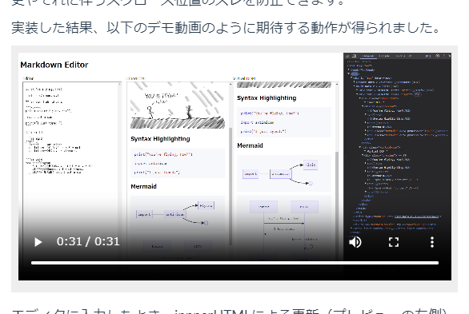

:date: 2023-12-03 12:00
:tags: Sphinx, docutils

============================================================================
SphinxでVideo Player埋め込み（Sphinx-4.0, docutils-0.17以降）
============================================================================

Sphinx_ のHTMLビルドで、動画ファイル(``.mp4``)をビデオプレーヤー付きで出力できるようになっていました（い、いつのまに！？）。

   
   ビデオプレーヤーを埋め込んだSphinxのHTML出力のキャプチャ

.. _Sphinx: https://www.sphinx-doc.org/ja/master/

以下のように書けば動画ファイルが ``<video>`` タグでHTMLビルドされます。

.. code-block:: rst

   .. figure:: ./20231125-demo.mp4
      :class: controls

``class`` オプションに ``controls`` を指定することで、プレーヤーのコントローラー（再生ボタンなど）が表示されます。

HTML出力は以下の様になりました。

.. code-block:: html

   <figure class="align-default">
     <video controls="controls" src="../../_images/20231125-demo.mp4" title="../../_images/20231125-demo.mp4">
       <a href="../../_images/20231125-demo.mp4">../../_images/20231125-demo.mp4</a>
     </video>
   </figure>

実際の出力とソースは以下にあります。

- 出力例: ":doc:`/blog/2023/11/vue-md-editor-vdom-mermaid/index`" 
- ソース: https://github.com/shimizukawa/freia.jp/blob/main/site/source/blog/vue-md-editor-vdom-mermaid/index.rst?plain=1

対応バージョン
=====================

- docutils 0.17 (2021/04/03) 以降
- Sphinx 4.0.0 (2021/05/09) 以降（docutils 0.17対応版）
- SphinxのHTML5出力を利用（Sphinx-2.0.0 2019/05/29 でデフォルト）
- 動画ファイルのmime type が ``video/mp4``, ``video/webm``, ``video/ogg`` のいずれか

docutilsが対応して、Sphnxで扱えるようになって、テーマがHTML5ベースになったので扱えるようになった、ということになります。

figure/image ディレクティブで使えるよ、という話は以下のドキュメントにありました。
https://docutils.sourceforge.io/docs/ref/rst/directives.html#images  

``:class: controls`` についてはドキュメントに無かったので、ソースをみて把握しました。
https://github.com/docutils/docutils/blob/f725d4a2742f997a95b9de53553642044df475ab/docutils/docutils/writers/html5_polyglot/__init__.py#L256-L257

昨日のイベント `Sphinx+翻訳 Hack-a-thon 2023.12`_ で話たときに誰も知らなかったようなので、気付いている人はあまり居ないかもしれません。docutilsの現在のバージョンは 0.20.1 (2023/5/17) で、リリースが継続的に行われています。2014年～2017年頃はリリースされない年もあって継続性に心配もありましたが、リリース頻度を見る限りでは、最近はその心配はなさそうです。

.. _Sphinx+翻訳 Hack-a-thon 2023.12: https://sphinxjp.connpass.com/event/303436/

背景
=========

Sphinxに動画を組み込む場合、これまではrawディレクティブを使ってYouTubueをembedする程度しか使っていませんでした。今回、直近のblog :doc:`/blog/2023/11/vue-md-editor-vdom/index` で同じディレクトリに置いた ``.mp4`` ファイルをrawで埋め込もうとして、 ``<video>`` タグを書こうとして、手が止まりました。

docutils_ の `公式ドキュメント`_ には、rawディレクティブの使い方として以下の書き方が紹介されています。

.. _docutils: https://docutils.sourceforge.io/
.. _公式ドキュメント: https://docutils.sourceforge.io/docs/ref/rst/directives.html#raw-data-pass-through

.. code-block:: rst

   .. raw:: html

      

この書き方で ``<video>`` タグを書けば良さそうですが、動画ファイルの置き場所で困りました。
``.rst`` ファイルと同じディレクトリに置いてあるだけでは、ソースから参照されていない動画ファイルはビルド対象になりません。

そこで、とりあえず画像を埋め込む ``.. figure::`` ディレクティブで ``.mp4`` ファイルを指定して ``_static/`` ディレクトリに出力させよう、と思ってビルドしたらビデオプレーヤーが出力されて、「い、いつのまに！？」とびっくりしました。

Sphinxやdocutilsのコードからしばらく離れていますが、リリースノートを眺めたら他にも色々知らない機能がありそうな感じでした。ヒマができたら眺めてみようかな。
