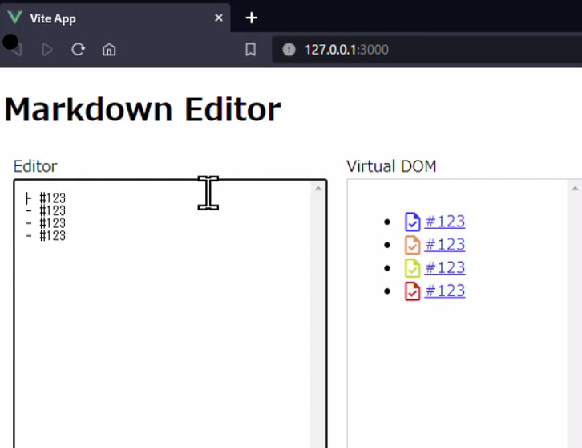

:date: 2023-12-28 23:00
:tags: Vue, VirtualDOM, Markdown

===================================================================================
Vue Componentの再利用による意図しない描画を避ける、MD仮想DOM描画の特殊ケース
===================================================================================

.. Vue Componentの再利用が仮想DOMレンダリング対応のMarkdownエディタで想定外の動作
.. Vue Markdownエディタの仮想DOMレンダリングにおける想定外のComponent再利用

Vueは効率的な画面更新のために、差分による描画更新を行います。
差分更新時にはComponentが自動的に再利用されますが、 ``v-for`` 利用時に意図通りの描画を行うためには ``key`` 属性を指定してComponentの再利用方法を制御します。

しかし、 :doc:`Markdownエディタの仮想DOMによるプレビュー描画 </blog/2023/11/vue-md-editor-vdom/index>` では、Component再利用を意図通りに制御しづらいケースがあります。

前提
=======

* Node 18
* Vue 3.3.4
* TypeScript 5.2.2
* markdown-it 13.0.2

コードはGitHubにあります。

https://github.com/shimizukawa/vue-md-editor-vdom/tree/2023.12.28

Vue Component再利用の状況を確認する
==========================================

以下のデモでは、Markdownの記法を拡張して ``#数字`` でIssue番号を指定できるようにし、専用のComponent `MarkdownRendererIssue.vue`_ で描画しています。

.. _MarkdownRendererIssue.vue: https://github.com/shimizukawa/vue-md-editor-vdom/blob/2023.12.28/src/components/MarkdownRendererIssue.vue

Issue番号の直前にアイコンを表示していますが、アイコンの色はComponentのsetup時にランダムに決定しています。Componentが再利用された場合に同じ色が使われるため、色でComponentの再利用状況が分かるようになっています

``<script setup>`` 内のコードでcolorをuuidから決定:

.. code-block:: ts

   import { v4 as uuidv4 } from "uuid";
   const color = `#${uuidv4().slice(0, 6)}`;

``<template>`` 内のHTMLでMaterialDesignIconにcolor指定:

.. code-block:: html

   task{{ issue.title }}</a>

以下のデモ動画では、箇条書きの末尾に行を追加した場合は新しい色のアイコンが使われますが、行を挿入、削除した場合は登場順でアイコン色が維持されていることが分かります。

.. figure:: ./20231228-demo1.mp4
   :class: controls

この動作から、Componentは登場順で再利用しつつ ``props`` の値を反映して差分更新していることが分かります。

意図しない描画が発生するケース
===================================

Vue 3では、Componentは子Componentとしての登場位置で再利用されます（Componentのpropに ``key`` を指定しない場合）。これはVueの効率的なDOM更新戦略の一部です。

公式ドキュメント `Maintaining State with key`_ では、Componentを登場順に再利用することの効率性と、適しているケースについて次のように紹介しています。

.. _Maintaining State with key: https://vuejs.org/guide/essentials/list#maintaining-state-with-key

    Vueが ``v-for`` でレンダリングされた要素のリストを更新する場合、デフォルトでは「インプレース・パッチ」戦略を使用します。 ``items`` の順序が変更された場合、DOM要素を移動する代わりに、各要素をインプレースでパッチし、その特定のインデックスでレンダリングされるべきものが反映されるようにします。

    このデフォルトモードは効率的ですが、リストのレンダリング出力が子Componentの状態や一時的なDOM状態（フォームの入力値など）に依存しない場合にのみ適しています。

逆に言うと、Componentの状態や一時的なDOM状態に依存する場合、登場順での再利用は適していません。先に紹介したデモ動画では、Componentの状態（生成時に決定したアイコン色）が箇条書きの挿入削除に関係なく登場順で維持されているため、不自然な表示になっています。

また、propsで渡しているIssue番号の詳細データをAPIから再取得する処理も必要です（デモでは実装していません）。もし初回描画時に取得したデータで表示し続けてしまうと、エディタでIssue番号を書き替えても表示内容が変わらず、エディタとプレビューとで内容が食い違ってしまいます。

Componentのkey属性による再利用の制御
===============================================

Componentの ``key`` 属性を指定すれば、Component再利用時に ``key`` による仮想DOMの差分検出が行えます。
DOMの並べ替えが行われるため画面更新速度は落ちますが、Componentの状態に依存した表示における情報の食い違いを避け、期待通りの表示を維持できます。Component内でデータ取得するような実装の場合、画面更新時の再取得も不要になるので、トータルでみると処理コストを抑えられると思います。

ここで指定する ``key`` の値は一意である必要があります。公式ドキュメント `Built-in Special Attributes <https://vuejs.org/api/built-in-special-attributes.html#key>`_ では、「同じ共通の親の子どもは、一意のキーを持たなければいけません。キーが重複するとレンダリングエラーになります。」と説明されています。

``v-for`` などでは、意図しない描画を避けるために ``key`` 属性を指定します。
しかし、 :doc:`Markdownエディタの仮想DOMによるプレビュー描画 </blog/2023/11/vue-md-editor-vdom/index>` のような特殊ケースでは、一意なキーを用意するために少し考える必要があります。

Markdownエディタへの入力はユーザーが行います。Issueを箇条書きするシーンでは、ユーザーが箇条書きをコピー＆ペーストして書き替えるといった使い方によってIssue番号が重複するため、Issue番号を ``key`` に直接使えません。差分検出に使うものなので、毎回変化するランダム値も使えません。

そこで、Issue番号等のid値と出現回数の組合せで一意な ``key`` を用意します。次のコードはComponentの種類（例えばIssue）と固有のID（例えばIssue番号）でkeyを生成しています。

.. code-block:: ts

  setup(props) {
    const componentCount: {[key: string]: Record<string, number>} = {};

    const resetCounter = () => {
      Object.keys(componentCount).forEach((key) => {
        componentCount[key] = {};
      })
    }

    const getNextKey = (type: string, id: string) => {
        const counter = componentCount[type] ||= {};
        const count = counter[id] || 0;
        counter[id] = count + 1;
        const key = `${type}-${id}-${count}`;
        return key;
    }

    ...

    // setup関数が返すレンダー関数
    return () => {
      ...
      resetCounter(); // renderが呼ばれる毎にカウンターをリセット
      return walkNodes(outer); // 仮想DOM生成
    };

``MarkdownRendererIssue.vue`` Componentの仮想DOM作成部分では、次のコードのように ``getNextKey()`` で一意なキーを生成して使います。他にキーの要素に使いたいpropsの値があれば、ここで ``getNextKey()`` に値を渡せるような実装にもできます。

.. code-block:: ts

      departIssue(node: HTMLElement, vNode: VNode): VNode {
        const id = node.dataset["issue"] as string;
        const key = getNextKey("issue", id);

        const newVNode: VNode = {
          type: MarkdownRendererIssue,
          props: { key, id },
          children: null,
        };
        return newVNode;
      },

一意なkeyを指定しない場合のComponent再利用対策
=======================================================

``key`` を指定しない、あるいは指定できない場合の対策としては、Componentの ``props`` に渡される値が更新されたら、その値を元に表示内容を更新します。具体的には、 ``watch`` で ``props`` の値を監視し、値が更新されたら表示用データをアップデートします。アップデートのためにデータ取得などのAPI通信が必要な場合は、初回描画時にキャッシュしておくなどの追加の対策を行うことで描画速度の低下を防げます。

.. code-block:: ts

   const { id } = toRefs(props);

   // ここでAPIからデータ取得すると状態変化に追従できない
   issue.value = ...;

   watch(
     id,
     (_id) => {
       if (!!_id) {
         // ここでAPIからデータ取得する
         issue.value = ...;
       }
     },
     { immediate: true },
   );

``props`` の変更を元にComponentの状態をリセットするのが難しい、あるいはコストが高い場合はこの対策では解決できないかもしれません。多くの状態を持つComponentの場合、一時的な状態の不整合によって意図しない描画やイベント発火が起こることもあります。

私も初めはComponentの状態を更新する方針で実装していました。しかし、複雑な機能を持つComponent（内部でステータスチェックのために定期的なAPI呼び出しを行っていたり、さらに子要素のMarkdownレンダリングをしたり等）では、状態変化時に発生した不具合によって動作が不安定になってしまいました。また不具合の原因を追うのもでした。そのようなComponentでは ``key`` 指定することで、値が入れ替わるような再利用を避けられ、動作も安定します。

まとめ
==========================

- Vue Componentは、効率的な描画のために出現順または ``key`` によって再利用される
- 動的なデータで同じComponentを繰り返し描画する場合は、 ``key`` 属性を指定する
- ``key`` 属性を指定できない場合は、 ``props`` の変更を元にComponentの状態をリセットする
- ``props`` 値でのComponent状態リセットが難しい場合は、がんばって一意な ``key`` を指定する
