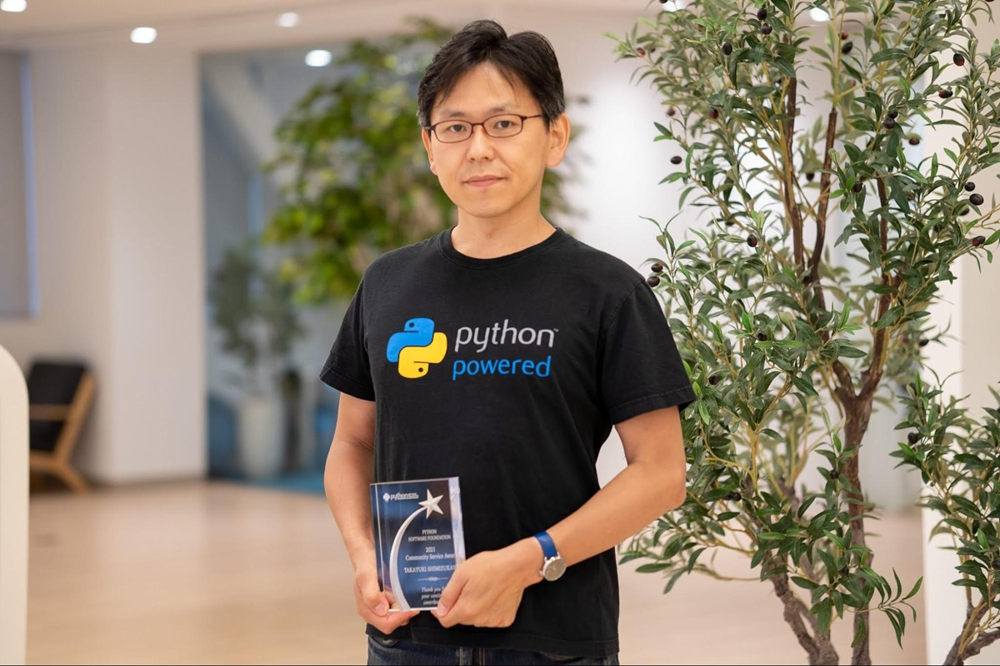

:date: 2024-03-08 20:00
:tags: Interview, findy

=============================================================
Findy Engineer Lab にインタビューが掲載されました
=============================================================

所属するBeProudで受けたインタビュー記事が公開されました。
記事にはものすごくカッコイイタイトルを付けてもらいました（うれしい）。

- `『エキスパート Pythonプログラミング』翻訳者・清水川貴之さんインタビュー　「好きなこと」と徹底的に向き合ったキャリアとは - Findy Engineer Lab`_

振り返ってみると、高校生頃からずっと好きなプログラミングを続けられるように行動してきたし、運良くPythonが広く使われる言語になったことで生き残れたんだな・・と思いました。

   記事に掲載してもらった、PSFのAward受賞の盾をもらったときの写真

写真は、PSF（Python Software Foundation）の **Q4 2021 Community Service Award** を受賞したとき、受賞者みんなで写真撮影をしたときのものです。Awardを受賞したのは2022年5月なのでもう2年も前ですね。

その頃はblog休眠中だったので、ここで受賞時の記事リンクを貼っておきます。

- `Python Software Foundation News: PyCon JP Association Awarded the PSF Community Service Award for Q4 2021`_
- `PyCon JP Blog: PyCon JP AssociationがPSFのCommunity Service Awardに選ばれました🎉`_

.. _『エキスパート Pythonプログラミング』翻訳者・清水川貴之さんインタビュー　「好きなこと」と徹底的に向き合ったキャリアとは - Findy Engineer Lab: https://findy-code.io/engineer-lab/shimizukawa
.. _`Python Software Foundation News: PyCon JP Association Awarded the PSF Community Service Award for Q4 2021`: https://pyfound.blogspot.com/2022/05/pycon-jp-association-awarded-psf.html
.. _`PyCon JP Blog: PyCon JP AssociationがPSFのCommunity Service Awardに選ばれました🎉`: https://pyconjp.blogspot.com/2022/02/psf-community-service-award.html
