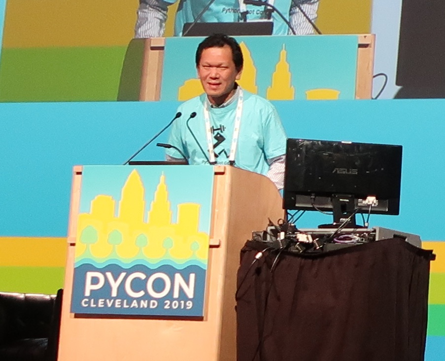

:date: 2024-03-16 11:00
:tags: terapyon_channel, podcast

=========================================
#terapyon_channel podcastで話しました
=========================================

`@terapyon`_ の #terapyon_channel podcast にゲスト出演してきました。

   `#93 清水川さんをゲストに PyCon PHとフィリピン生活（最後かも）の話 | terapyon channel podcast`_

ChatGPTによる概要文が掲載されていますが、微妙に違う気が。話の内容は次のような感じでした。

- PyConイベントについて

  - ライトニングトーク（LT）の魅力
  - さまざまな国でのPyConイベントの違いについて
  - 日本、フィリピン、シンガポールのイベント進行の違い
  - イベント中に提供される食事について

- シンガポール旅行に行ってきた話
- 子供の教育と言語の選択

過去にゲストでお呼ばれした回、直近は3ヶ月毎ぐらいに出演させていただいていました。

- 2023/12/27 `#87 清水川さんをゲストに 2023年の振り返りとフィリピン事情 | terapyon channel podcast <https://podcast.terapyon.net/episodes/0096.html>`_
- 2023/09/22 `#84 清水川さんをゲストに フィリピン移住の話からCodespacesでの開発環境、ベクター検索の話へ | terapyon channel podcast <https://podcast.terapyon.net/episodes/0093.html>`_
- 2023/06/21 `#75 Python mini hack-a-thon カンファレンス公開収録 | terapyon channel podcast <https://podcast.terapyon.net/episodes/0084.html>`_
- 2022/08/23 `#65 清水川さんをゲストに 新刊独学CS本のお勧めと 新しい技術との向き合い方 | terapyon channel podcast <https://podcast.terapyon.net/episodes/0074.html>`_
- 2021/08/03 `#43 清水川さんをゲストにライブラリの選定やエキPy3版の出版からマルチテナントの話 | terapyon channel podcast <https://podcast.terapyon.net/episodes/0052.html>`_
- 2020/11/21 `#34 清水川さんをゲストに リモートワーク関係とPythonやOpen APIの話 | terapyon channel podcast <https://podcast.terapyon.net/episodes/0043.html>`_
- 2020/05/13 `#16 清水川さんをゲストに 各種本、独学プログラマー・自走プログラマーなどとOSS活動 | terapyon channel podcast <https://podcast.terapyon.net/episodes/0025.html>`_

.. _@terapyon: https://twitter.com/terapyon
.. _#93 清水川さんをゲストに PyCon PHとフィリピン生活（最後かも）の話 | terapyon channel podcast: https://podcast.terapyon.net/episodes/0102.html