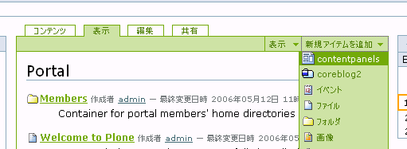
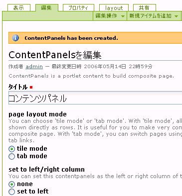
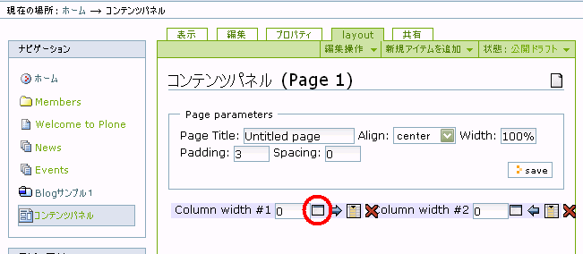
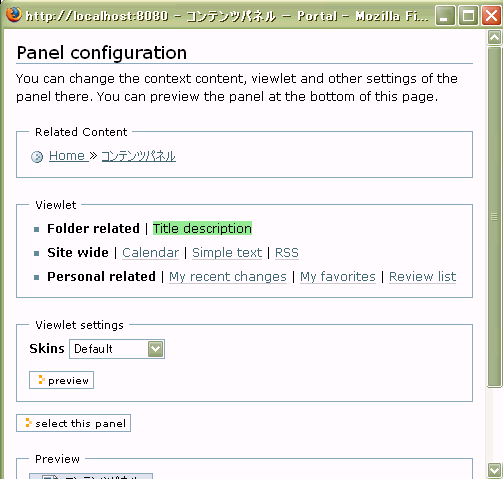
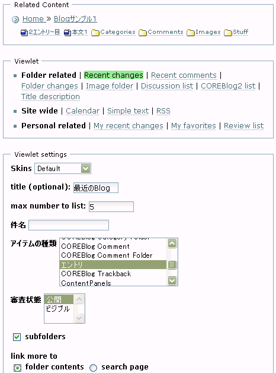
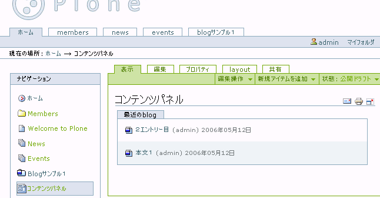
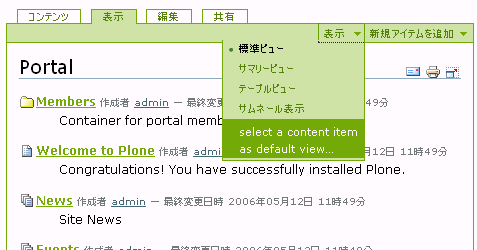
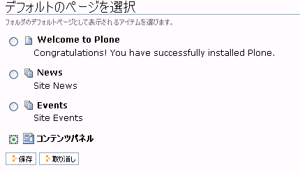
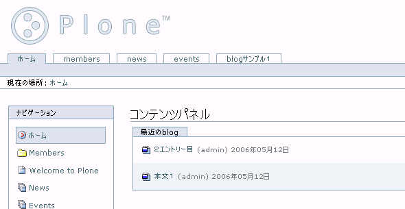
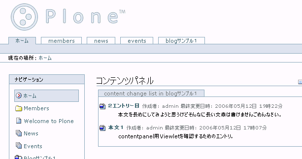

:date: 2006-05-15 00:53:55
:tags: Plone

==========================================================================
CMFContentPanelsでトップ画面に複数のCOREBlog2エントリ一覧を表示
==========================================================================

複数のCOREBlog2インスタンスがあるときに、ポータルのトップページで各Blogの最新の5件くらいを表示したい場合があります。方法の一つとして、CMFContentPanelsで表示してみます。この説明では以下のプロダクトを使用しています。

- `Plone-2.1.2`_
- `CMFContentPanels-2.3`_

.. _`Plone-2.1.2`: http://plone.org/products/plone/releases/2.1.2
.. _`CMFContentPanels-2.3`: http://plone.org/products/cmfcontentpanels/releases/2.3

.. :extend type: text/x-rst
.. :extend:

まず、CMFContentPanels-2.3を入手し、Products以下に展開します。Ploneで使えるようにするため、サイト設定の *プロダクトの追加と削除* でCMFContentPanelsを追加しましょう。

次に、任意のフォルダにContentPanelsを追加します。

今回はPloneサイトのトップに追加します。追加したらlayoutタブに移動して、ContentPanelsで表示するパネルを追加します。UIがわかりにくいですが、パネルを追加するには下図の○で囲ってある ``new panel`` をクリックします。

ポップアップWindowが表示されます。

表示対象フォルダを指定する ``Related Content`` でCOREBlog2インスタンスの場所を指定してください。次にCOREBlog2の最新のエントリを表示するためにViewletから ``Recent changes`` を選択してください。

CMFContentsPanelsは、Related Contentの選択しているPloneオブジェクトのタイプによって選択できるViewletの内容が変化します。またViewletによってViewlet settingsの内容が変化します。このUIも慣れるまではわかりにくい気がします。

``Viewlet settings`` の設定で、表示するskin、タイトル、アイテムの種類、審査状態、subfolders(フォルダ以下を内容を表示するかどうか)などを設定します。COREBlog2の投稿のみを表示する場合は、アイテムの種類で ``エントリ`` のみを選択してください。

設定が完了したら ``select this panel`` を押して設定を反映します。これでBlogのエントリが表示されるようになったと思います。表示タブへ移動して内容を確認しましょう。

最後に、ContentPanelをサイトのトップページに表示するように設定します。ホームディレクトリに移動して、ContentPanelをのデフォルトビューに設定しましょう。グリーンのバー部分にある ``表示`` プルダウンメニューからデフォルトビューを設定することが出来ます。

そのフォルダに置かれている、デフォルトビューになることが出来る複数のオブジェクトが一覧表示されるので、作成したContentPanelsを選択します。

トップページに移動して、ContentPanelsが表示されていることを確認してください。

なお、パネルの設定でRecent changesの代わりに ``Folder changes`` を選択するとタイトルと本文の一部が表示されるようになります。

これで一通りの設定が完了しました。同じ手順で他のBlogの内容を表示したりしてみましょう。

次は、COREBlog2エントリを表示するviewletを作った過程について書こうとと思います（つづく）
