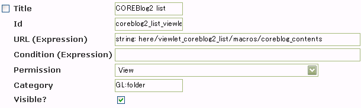
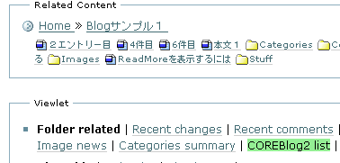
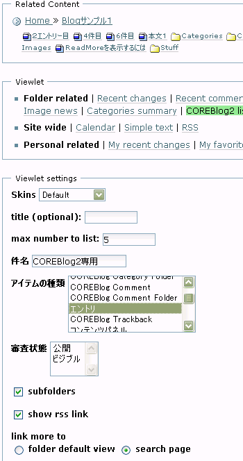

:date: 2006-05-17 02:27:48
:tags: Plone
:body type: text/x-rst

=======================================================
2006/05/17 COREBlog2用のCMFContentPanelsのViewletを作る
=======================================================

前回のBlogで、 `CMFContentPanelsでトップ画面に複数のCOREBlog2エントリ一覧を表示`_ することが出来るようになりました。しかしこれだけだと何となく寂しい気がします。という無理矢理な導入で、CMFContentPanelsで使えるオリジナルViewletを作ってみましょう。

なお、今回使用したバージョンは、 `CMFContentPanels-2.3`_ と `COREBlog2-0.9b`_ です。

.. _`CMFContentPanelsでトップ画面に複数のCOREBlog2エントリ一覧を表示`: http://www.freia.jp/taka/blog/343/

.. _`CMFContentPanels-2.3`: http://plone.org/products/cmfcontentpanels/releases/2.3

.. _`COREBlog2-0.9b`: http://www.coreblog.org/jp

.. :extend type: text/x-rst
.. :extend:

Viewlet用PageTemplateを作る
----------------------------
CMFContentPanelsでは表示用のパネルをViewletと呼んでいて、CMFContentPanelsインスタンスページに複数並べることが出来ます。この方法を使って、一つのページの上半分をPloneのドキュメント、下半分にCOREBlog2のエントリ一覧表示するといった事が出来るようになります。

まずはViewletを表示するためのPageTemplateファイルを作成します。ZMIで /plone/portal_skins/custom へ移動してPageTemplateを新規に作成します。オブジェクトIDは何でも良いのですが、CMFContentPanelsの命名方法を真似て ``viewlet_coreblog2_list`` としておきます。次にこのオブジェクトの中身を作成します。とりあえず以下のようにスケルトンを用意しましょう。

.. code-block:: xml

    <html xmlns:tal="http://xml.zope.org/namespaces/tal"
          xmlns:metal="http://xml.zope.org/namespaces/metal"
          i18n:domain="plone">

    <body>

    

    

    

    

    </body>
    </html>

viewlet_coreblog2_listには2つのマクロを定義しています。CMFContentPanelsのドキュメントを読むと書いてあるのですが、Viewletのマクロ名を ``hoge`` とした場合、そのViewletの設定用UIのマクロ名を ``hoge_viewletconf`` とする必要があります。ここではViewletのマクロ名と設定用マクロ名は上記のように命名しています。coreblog2じゃなくてcoreblogになってますが、細かいことは気にしない方向でお願いします。

Viewletを登録する
------------------
空っぽのViewletを用意して、次はいきなりViewlet登録を行います。まずは空っぽのViewletが使えるモノかどうかを確認する意味で、実際にCMFContentPanelsで試してみようという作戦です。

設定のためにZMIで ``/plone/portal_contentpanels`` に移動すると、CMFContentPanelsで使えるViewletがずら～っと登録されています。このページの一番下に移動して、今作ったばかりの空Viewletを登録しましょう。

:Id: coreblog2_list_viewlet
:url: string: here/viewlet_coreblog2_list/macros/coreblog_contents
:Permission: View
:Category: GL:folder
:Visible: On

設定値の中で、今作ったPageTemplateのIDとマクロ名が出てきています。タイトルやIDは適当に‥‥いちおうCMFContentPanelsの命名を真似て付けたつもりです。

これでCMFContentPanelsで上記のViewletを使えるようになったはずです。空っぽですが。Categoryを ``GL:folder`` としているので、 ``COREBlog2 list`` というViewlet名を選択できるのは、Related Contentでフォルダ型オブジェクトを選択しているときだけです。

とりあえず、問題が起きたときに切り分けしやすいように、ここまでの内容で動くことを確認しておいた方が良いでしょう。

表示用Viewletを書く
--------------------
今回は、Ploneのフォルダの中身一覧を表示するViewletをコピーして、COREBlog2用に機能拡張したい部分だけカスタマイズします。以下で紹介するコードは、基本的にはCMFContentPanels/skins/cp_viewlets/viewlets_folder_recentのbase_portletマクロがやっている処理を真似して作ったのですが、CMFContentPanelsのPageTemplateはかなり細かく部品化されているので、共通する部分はmetal:use-macroとmetal:fill-slotを駆使して再利用することが出来ました。

.. code-block:: xml

    

    
        

            

                <tal:block tal:repeat="item results">
    
                    

    
                        <tal:block tal:define="result_url item/getURL;
                                               url string:$result_url/view;">
    
                            <a href="#"
                               tal:attributes="href url">
    
                                

                                    
    
                                    
                                      Title or Id
                                    
    
                                    
                                          creator   08/19/2001 03:01 AM
                                    
                                

    
                                

                                    
                                

                                

                                    
                                

                            </a>
    
                        </tal:block>
                         
                        
                    

                </tal:block>
            

        

    

上記コードのほとんどは CMFContentPanels/skins/cp_viewlets/content_list_macros.pt の ``<metal:block metal:define-macro="separate_line_description">`` ブロック内をコピーしカスタマイズしました。CSSがPageTemplateに埋め込まれていてあまり美しくないので、本当は別ファイルに分離して、portal_cssとかに登録しておきたいところです。これは各自で工夫してみてください。

改造のポイントは、COREBlog2エントリに結びつけられた画像がある場合は一覧表示に画像をサムネイル表示するようにしている点です。ほかにもいろいろやってますが見た目的に大きな特徴はそれくらいです。で、関連づけられた画像を表示するために ``getCBRefTag`` というScript(Python)を呼び出しています。/plone/portal_skins/custom にgetCBRefTagを作成して、以下のような(テキトーな)スクリプトを記述します。パラメータに ``item`` を受け取るようにしましょう。

:Id: getCBRefTag
:parameters: item

.. code-block:: python

    cbentry_references = item.getObject().getRefsByKind()
    try:
        cbentry_ref = cbentry_references[0]
        cbentry_ref_tag = cbentry_ref.tag(scale='thumb', css_class='referenceImage')
    except:
        return None
    
    return cbentry_ref_tag

これで表示画面は出来ました。あとは設定画面を用意すれば動くようになります。

Viewletの設定画面を作る
------------------------
表示以外は変えなくても動くので、base_portletの設定画面をそのまま流用します。

.. code-block:: xml

    

        

    

これで設定画面も作成が完了しました。早速みてみましょう。

うまく表示されました。アイテムの種類については「エントリ」以外を選ぶ事は想定していないViewletではありますが、Previewしてみたところちゃんと表示されました。ところで、この設定画面は実は若干問題があります。link moreで ``folder default view`` を選択すると、Viewlet表示で「もっと...」のリンク先がフォルダコンテンツ一覧となってしまいます。COREBlog2用には、エントリ一覧等のページを表示したいところです。

Viewlet表示と言えば、カテゴリアイコンも表示したいとか、細かいことを言えばきりがないので、ここから先は各人でViewletを作成していろんなパターンのViewletが作られると良いなぁと思います。誰か作って公開してくれないかしら‥‥。

.. :comments:
.. :comment id: 2007-06-16.4924488332
.. :title: Re:COREBlog2用のCMFContentPanelsのViewletを作る
.. :author: ueda
.. :date: 2007-06-16 12:28:13
.. :email: 
.. :url: 
.. :body:
.. 清水川様
.. Plone関連の情報について、このページを大変参考にさせていただいております。
.. 上記の「COREBlog2用のCMFContentPanelsのViewletを作る」について
.. 教えていただきたいことがあり、コメントいたしました。
.. 初心者であるため、初歩的な質問で恐縮です。
.. 
.. 上記の中項目「表示用Viewletを書く」のコードについてはどこのファイルに記述すればよいのでしょうか。
.. 同様に「Viewletの設定画面を作る」のコードについてはどこのファイルに記述すればよいので
.. しょうか。
.. 
.. 
.. :comments:
.. :comment id: 2007-06-16.2159645448
.. :title: Re:COREBlog2用のCMFContentPanelsのViewletを作る
.. :author: しみずかわ
.. :date: 2007-06-16 15:43:36
.. :email: 
.. :url: 
.. :body:
.. > どこのファイルに記述すれば
.. 
.. 両方とも、「Viewlet用PageTemplateを作る」に入れます。
.. 
.. :comments:
.. :comment id: 2007-06-16.2898004794
.. :title: body内のstyle
.. :author: しみずかわ
.. :date: 2007-06-16 15:44:49
.. :email: 
.. :url: 
.. :body:
.. ところでdivタグ内でstyleタグを使ってるのはよくないです。なんでこんなところに・・。
.. 
.. :comments:
.. :comment id: 2007-06-16.5875304640
.. :title: Re:COREBlog2用のCMFContentPanelsのViewletを作る
.. :author: ueda
.. :date: 2007-06-16 23:53:08
.. :email: 
.. :url: 
.. :body:
.. お返事、どうもありがとうございました。
.. 早速、試させていただきます。
.. 今後ともこのサイトを参考にさせていただきます。
.. 
.. :comments:
.. :comment id: 2007-07-03.6947045370
.. :title: Re:COREBlog2用のCMFContentPanelsのViewletを作る
.. :author: ueda
.. :date: 2007-07-03 22:18:15
.. :email: 
.. :url: 
.. :body:
.. 清水川様
.. 
.. 先日は質問にご回答頂き、ありがとうございました。
.. COREBlog2については、上記によりContentPanelsでタイトルやサムネイル、本文を表示することができました。
.. 大変助かりました。
.. さて、今度はPloneでフォルダを追加し、そのフォルダ配下にページを作成し、コンテンツを掲載することを考えていますが
.. その際に上記の上記のCOREBlog2と同様にページを利用してタイトルやサムネイル、本文をContentPanelsで表示するには
.. 上記の表示用Viewletのどこを修正する必要があるでしょうか。ポイントだけでもご教授いただけないでしょうか。
.. 毎々お手数をおかけいたしますが大変恐縮ですがどうぞよろしくお願い申し上げます。
.. 
.. :comments:
.. :comment id: 2007-07-05.3544550369
.. :title: Re:COREBlog2用のCMFContentPanelsのViewletを作る
.. :author: しみずかわ
.. :date: 2007-07-05 18:55:54
.. :email: 
.. :url: 
.. :body:
.. 以下等を参考にしたり、ZopeやPloneのMLで聞くのがよいでしょう。
.. 
.. CMFContentPanelsのViewletを作る — JZUG
.. http://zope.jp/documents/tutorial/make-cmfcontentpanels-viewlet
