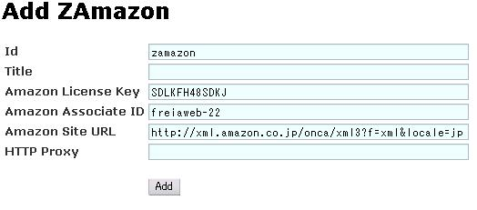

:date: 2004-08-17 00:01:18
:tags: Zope, python

================================
2004/08/17 ZAmazonを改造してみる
================================

先日 `Zope Weekend 4`_ で「 ZAmazon_ というProductを使って‥‥」という話をしたのですが、実際の所 ZAmazon_ は今(2004/08/16)はそのままでは使えなくなってしまっており、そのまま紹介することは出来ない状態でした。

そこで、使える状態にしたものを公開できればと思いgoogleで引いてみると、micro-8さんが `Something Red`_ で書かれている記事 " ZAmazonを使う_ "," `Zamazon Hack for COREBlog`_ " が引っかかり、既に ZAmazon_ を使いやすいように改造した物を配布して‥‥いたようなのですがリンク切れ(^^; とりあえずpythonやProductの改造練習ということで、自分で手を入れてみることにしました。

[ 清水川改造版ZAmazon_ ]

.. _`Zope Weekend 4`: http://zope.jp/misc/zopeweekend4/report/
.. _ZAmazon: http://douweosinga.com/projects/zamazon
.. _`Something Red`: http://somethingred.dip.jp/blog/
.. _ZAmazonを使う: http://somethingred.dip.jp/blog/106
.. _`Zamazon Hack for COREBlog`: http://somethingred.dip.jp/blog/108
.. _清水川改造版ZAmazon: file/zamazon/zamazon_freia1.tgz

.. :extend type: text/x-rst
.. :extend:

まず、 ZAmazonを使う_ でも書かれていますが、 ZAmazon_ を手に入れてもそのままでは使えません。引数の数が合っていなかったりしているので、その辺のつじつまを合わせる必要があります。また、AmazonのWebAPIのURLが固定で埋め込まれていたり(URLは時々変わるようです)、アソシエイトIDが埋め込まれていたり(--;; します。そのへんをZope上から設定できるようにQuickHackしてみました。

|ZAmazon追加|

上記の *Amazon License Key* と *Amazon Associate ID* はAmazonで `デベロッパー・トークンを申し込む`_ ことで入手することが出来ます。また、サンプルで使うためにここではidを *zamazon* とします。(タイトルとProxyはオプション)

そして以下のような *DTML Document* を作成して使います [1]_ ::

  ＜dtml-var standard_html_header＞
  ＜table border=1＞
    ＜tr＞
      ＜th＞Asin＜/th＞
      ＜th＞SalesRank＜/th＞
      ＜th＞ProductName＜/th＞
      ＜th＞URL＜/th＞
      ＜th＞Media＜/th＞
      ＜th＞OurPrice＜/th＞
      ＜th＞ImageUrlMedium＜/th＞
    ＜/tr＞
  ＜dtml-in expr="zamazon.searchByASIN('4894716658')" 
  prefix="book"＞＜tr＞
      ＜td＞＜dtml-var expr="book_item['Asin']"＞＜/td＞
      ＜td＞＜dtml-var expr="book_item['SalesRank']"＞＜/td＞
      ＜td＞＜dtml-var expr="book_item['ProductName']"＞＜/td＞
      ＜td＞＜a href="＜dtml-var 
      expr="book_item['URL']"＞"＞Link＜/a＞＜/td＞＜td＞＜dtml-var 
      expr="book_item['Media']"＞＜/td＞
      ＜td＞＜dtml-var expr="book_item['OurPrice']"＞＜/td＞
      ＜td＞＜img src="＜dtml-var expr="book_item['ImageUrlMedium']"＞" /＞＜/td＞＜/tr＞
  ＜/dtml-in＞
  ＜/table＞
  ＜dtml-var standard_html_footer＞

これで *ASIN=4894716658* に対応した本、 *人月の神話* についての情報を引き出すことが出来ます。

searchByASINの部分を以下のように書き換えると::

  zamazon.searchByWishlist('3AEH19HYIMCTJ')

自分のWishListを表示_ することが出来たりします [2]_ 。

ZAmazon_ は今のままでもコードさえ書けばたいていのことは出来るのですが、micro-8さんのようにCOREblogで使えるようにするとか、辞書でProductNameを引くなどのコードを書かなくても任意の情報を取得できるようにするとかをしていかないと、一般の人への訴求力はかなり弱いですね。

.. [1] なんか&lt;と書いてもだめなので、とりあえず全角で‥‥
.. [2] 少なくとも2004/8/16現在はWishListが表示されます。実験用URLなので‥‥

.. _`デベロッパー・トークンを申し込む`: http://www.amazon.co.jp/exec/obidos/subst/associates/join/webservices.html
.. _自分のWishListを表示: http://root.freia.jp/freia/taka/test/ZAmazon
.. _ZAmazon: http://douweosinga.com/projects/zamazon
.. _ZAmazonを使う: http://somethingred.dip.jp/blog/106

.. :comments:
.. :comment id: 2005-11-28.4465803217
.. :title: Re: ZAmazonを改造してみる
.. :author: micro-8
.. :date: 2004-08-17 01:33:50
.. :email: 
.. :url: 
.. :body:
.. 実は、リンク切れというか、CVSでコミットしたときに自動でアーカイブしなおすのってかっこいいなと思いつつ、CVSを導入しただけで終わっているのでした(^^;
.. すなおにcronにすべきかもしれません。
.. 
.. 
.. :comments:
.. :comment id: 2005-11-28.4466949324
.. :title: Re: ZAmazonを改造してみる
.. :author: 清水川
.. :date: 2004-08-17 07:02:44
.. :email: taka@freia.jp
.. :url: 
.. :body:
.. > CVSでコミットしたときに自動でアーカイブしなおすのってかっこいいなと思いつつ
.. 
.. 確かに、かっこいいかも。
.. COREblogなんかでアーカイブを参照すると、あとでアップデートした時などにリンク問題で悩むんですよね(--;;
.. 
