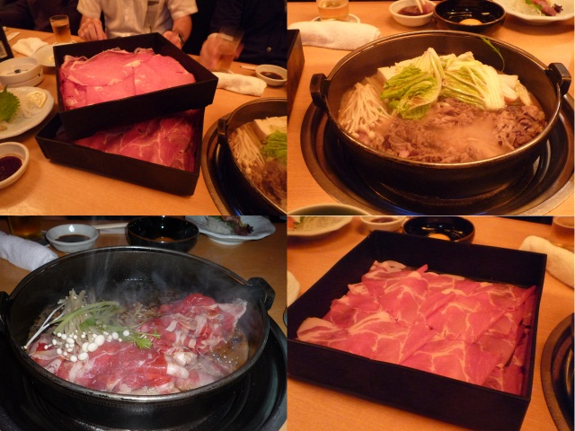

:date: 2009-10-10 19:52:52
:tags: misc

=======================
2009/10/10 最近の清水川
=======================

最近、難しいことばっかり書いてあって何やってるかよく分からない、と複数方面から言われたので、近況を書いてみます。

最近の自転車
------------
* Louis Garneau のオートマです。
* ここ1年で10回くらいしか乗ってないなぁ...。
* 会社まで片道20kmを数回と、近くの野川公園までを数回。
* 総走行距離1000kmを超えたのは既に一昨年の話か...。
* 9月頃に @zenich の自転車と30分くらい交換して乗ってみたり
* 手動で変速変えるのは苦手だ。

最近の旅行
-----------
* Python温泉で熱海へ(6月)
* Python温泉で熱海へ(10月)

Python温泉は技術修練の場です！

元々旅行とかあんまりしないからなー...。

最近の料理
-----------
* ラタトゥーユを大皿３つくらい作って1週間延々とそればっかり食べてた

* それ以来、毎日トマトを食べないと生きていけないカラダに。
* 毎日1本 やさいしぼり。
* ホームベーカリーで月に何回かパン焼いてる。焼きたてパンならバターだけで1斤いける！

ここ１年のお仕事
----------------
* Ruby on Rails を使って既存Oracleと格闘したり
* Ruby on Rails を WindowsServer, IIS, SQLServer と繋いでみたり
* Ruby on Rails を使ってアクセスログ解析して集計するツールを作ったり
* Ruby on Rails とmongrelで非同期データストリーミングしたり
* Ruby on Rails でExcelファイルを出力したり
* Zope2.6で作られたサイトの改修をしたり
* CakePHPでの開発にヘルプで入ったらPerlのCGIを渡されたり
* Selenium を使ってOpenPNEサイトのテストを書いたり

なぜかPythonが少ないな。

最近の映画
-----------
* スタートレックおもしろかった！DVDはほぼ全部(200枚以上)持ってるぜ。
* エヴァ 破 を最前列端っこで見たら、目と首が疲れた。
* サマーウォーズ を２回観に行った！花札買うかな！

最近のコミュ活動
-----------------
* Twitterを始めてみた。うまく使わないと仕事に影響が出るねこれは。
* Plone研究会によく顔を出している。飲み会目当て。
* `Zope/Plone勉強会`_ を毎月、土曜日にやってる。毎回成果発表が楽しみ。
* http://docs.zope.jp/ を公開した。先週土日は2日間英訳ばっかりだったなー。
* @koichiroo に誘われて `Tokyu.rb`_ に参加してきた。すき焼き食べ放題だった。

* 10月末にOSCでプレゼン予定。用意しなきゃ－。

.. _`Zope/Plone勉強会`: http://atnd.org/events/1474
.. _`Tokyu.rb`: http://qwik.jp/tokyurb/

最近のテレビ
-------------
* テレビタックル
* 本当は怖い家庭の医学
* けいおん！
* エンドレスエイト
* とらドラ, @shibukawa に勧められて！
* ターミネーター サラコナークロニクル
* スタートレック
* スタートレック
* スタートレック

その他、色々。

最近のゲーム
-------------
* デモンズソウル。初心者お断り的な難易度。
* 戦場のヴァルキュリア。2やりたいけどPSP持ってないしなあ。
* ドラクエ９。クリアしたら熱が冷めたヨ。

* メタルギアソリッド3が途中で止まってる。4はクリアした。
* うみねこのなくころに。
* トロステーション。10月末で終了のお知らせ。5000みゃいるが...。

最近理不尽に思ったこと
-----------------------
* Webに○○買った、とか書くと誰かに妬まれるから止めろと母に言われた
* Webに○○に旅行に行くとか書くと空き巣に入られるから止めろと母に言われた
* Webに個人的な事を書くとどこで誰が見てるか分からないから止めろと母に(ry
* 最近Webに難しいことばかり書いててつまらないから近況を書けと母に(ry

まー、こんなかんじ。

.. :extend type: text/html
.. :extend:

.. :comments:
.. :comment id: 2009-10-10.2084776905
.. :title: Re:最近の清水川
.. :author: hiroshi
.. :date: 2009-10-10 22:10:19
.. :email: 
.. :url: http://blog.yakitara.com/
.. :body:
.. 「個人的な事を書くな」と「近況を書け」と矛盾している気がしますが、心配してくださる良いお母様じゃないですか。
.. 
.. 
.. :comments:
.. :comment id: 2009-10-11.5188048308
.. :title: Re:最近の清水川
.. :author: t2y
.. :date: 2009-10-11 22:42:02
.. :email: 
.. :url: http://d.hatena.ne.jp/t2y-1979/
.. :body:
.. 私も昨日、サマーウォーズを見てきました。小学生ぐらいの頃に花札をやった記憶があるんですけど、今はもうルールを覚えてないですね。私も花札をやりたくなりました(^ ^;;
.. 
