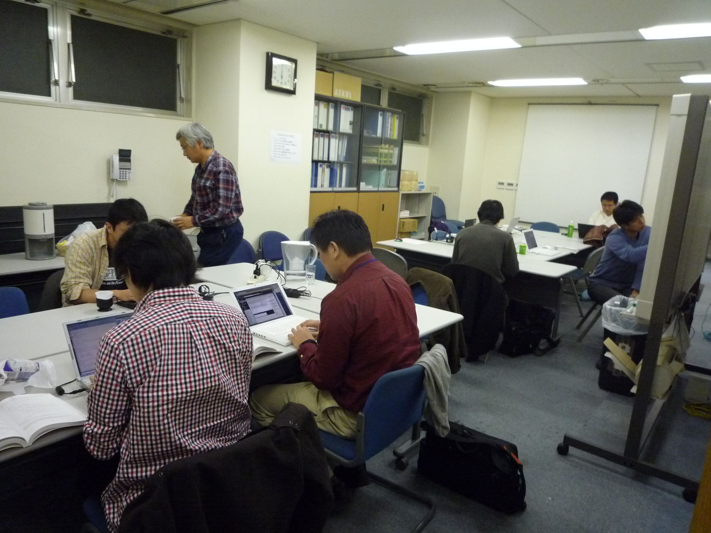
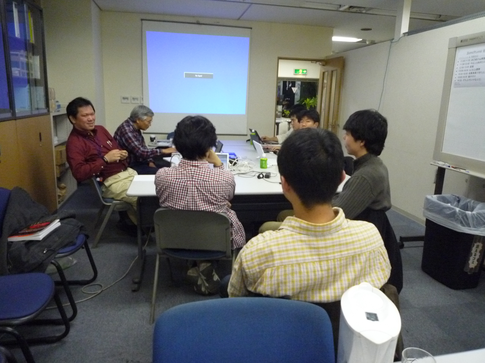

:date: 2009-11-22 19:35:00
:categories: ['Event', 'Zope', 'Plone']
:body type: text/x-rst

===================================================
2009/11/22 第5回 Zope/Plone開発勉強会に参加しました
===================================================

*Category: 'Event', 'Zope', 'Plone'*

今回も開場が開始5分前になってしまい、一人待たせてしまったり。もうしわけない。
そんな開発勉強会ですが今回で通算6回目となりました。ここ最近の参加人数は10人前後に落ち着いています。

http://atnd.org/events/1855

自分が今回さわったのは、前回第4回で成果を出すところまで行かなかった z3c.form を使用したフォーム作成、です。最小のパッケージ構成で WSGI サーバーを起動してフォーム登録、一覧表示などをおこなうやつです。いちおう動作するところまでは出来たので、のちほどまとめて次のblogエントリに投稿しようとおもいます。

次回はこれにDeliveranceでデザインを適用するなどをしてみようかと思っています。あるいはフォームそのものを編集出来るようにしてみようかな。

会場の様子
----------

  会場の様子

  成果発表の様子

  会場の様子を撮る人の様子

`他の写真はDropboxで公開しました`_ 。

.. _`他の写真はDropboxで公開しました`: http://www.dropbox.com/gallery/284189/1/2009_11_zopeplonedev?h=25ebd2

他の参加者の報告
----------------

* `plone 4.0 alpha 1 を buildout でインストール - takanory.net`_
* `第5回Zope/Plone開発勉強会の報告 - enbug diary(2009-11-21)`_
* `Plone3のメールバグ解消プロダクト公開 — CMSコミュニケーションズ`_
* `(第5回)Zope/Plone 開発勉強会が終了 — takanory.net`_

.. _`plone 4.0 alpha 1 を buildout でインストール - takanory.net`: http://takanory.net/takalog/1182
.. _`第5回Zope/Plone開発勉強会の報告 - enbug diary(2009-11-21)`: http://enbug.tdiary.net/20091121.html#p01
.. _`Plone3のメールバグ解消プロダクト公開 — CMSコミュニケーションズ`: http://www.cmscom.jp/blog/259
.. _`(第5回)Zope/Plone 開発勉強会が終了 — takanory.net`: http://takanory.net/takalog/1183

前日・当日の #zopeplonedev の発言
----------------------------------

:Terapyon: 明日開催のZope/Plone開発勉強会ですが、まだ枠があるようです。お時間のある方は参加されてみては・・。 http://bit.ly/4sfRPM (expand) #zopeplonedev 今回の個人的な目標は、Plone3のメール関連パッチを作りPyPIに登録と、飲み過ぎないことです。
:ytakeuch: Zope/Plone開発勉強会ですが、家族が発熱でインフルエンザの可能性があります。正午頃には判定が出る予定です。 #zopeplonedev
:takanory: 二日酔いで遅刻します。すいません #zopeplonedev
:jbking: 12時前には着きたいです。 #zopeplonedev
:t2y: 会場に着いたけど、エレベータが動かない？ #zopeplonedev
:t2y: pylucene に付属しているサンプルプログラムを実行して遊んでる、初めて触ってみると動いただけでおもしろい #zopeplonedev
:takanory: 1時くらいに到着します #zopeplonedev
:okuji: やっぱり現実逃避に行こうかと #zopeplonedev
:shimizukawa: @okuji 会場にはまだまだ余裕があります＞＜ #zopeplonedev
:takanory: @okuji 待ってま～す #zopeplonedev
:takanory: いま頃やること発表中。ゆるさが上がってます #zopeplonedev
:jbking: 弊社過半数の社員が参加する勉強会 #zopeplonedev
:takanory: そして @okuji さんがきた #zopeplonedev
:ytakeuch: インフルエンザ確定です＞＜。不参加とさせていただきます。 #zopeplonedev
:shimizukawa: @ytakeuch ＞＜ おだいじに！ #zopeplonedev
:takanory: plone 4.0a1 を buildout でインストールした http://takanory.net/takalog/1182 #zopeplonedev
:Terapyon: 会場入りして、テストを実行中。どうも変なエラーがでる。なぜだろう？？ #zopeplonedev
:takanory: 成果発表の時間だが誰も手を上げない的な。。。 #zopeplonedev
:takanory: もりの: ArchExample を元にカスタマイズしたコンテントタイプ作ったよ #zopeplonedev
:shimizukawa: 今日も7時間黙々と開発していた会だった。もうちょっと質問とか飛び交っても良いと思うよ！ #zopeplonedev
:takanory: @shimizukawa z3c.form で動くテストツールと、そのツール作るためのレシピ書いたりとかした #zopeplonedev
:shimizukawa: @takanory Plone4.0a1 をゼロ環境からインストールする手順をまとめました http://bit.ly/6C5AR2 (expand) #zopeplonedev
:shimizukawa: @ yusei zope3 のzmiを分離するプロジェクト zmi.core 開発を進めていました。そろそろ完了が近いかな。 http://bit.ly/iK7Im (expand) #zopeplonedev
:takanory: 今日わかったこと、家でもやらないとダメ #zopeplonedev
:takanory: @t2y pylucene を Plone に組み込むためにいろいろ準備してる #zopeplonedev
:takanory: collective.solr http://plone.org/products/collective.solr/ あるから参考になるかも #zopeplonedev
:takanory: こみや ruby でデータベース仕様書を作成するツールをメンテナンスしてた #zopeplonedev
:takanory: データベースのカラムとテーブルにコメントをつけて、そのコメントからExcelで仕様書を作成してる #zopeplonedev
:takanory: @okuji python 2.6 のメソッドキャッシュによる最適化をZopeで使えるようにするパッチ作成 #zopeplonedev
:takanory: @terapyon メールのバグがまだ残ってて、解消しようといろいろやってた #zopeplonedev
:takanory: @@manage-viewlets ってなんで知ったんだろう、なぞだ #zopeplonedev
:takanory: 次回のzope/plone開発勉強会は12月5日に開催します #zopeplonedev
:takanory: @shimizukawa お疲れ様でした。二次会の場所はなんか聴いたことあるような? #zopeplonedev
:zenich: 今日は #zopeplonedev を欠席して iPhoneアプリのプロモ／サポートサイトをつくってました

これは search.twitter.com からコピーして逆順にソートして...とやったんですが、もうちょっと簡単に加工したい。時刻表示したいし、twitterの発言にリンクしたいし... どうすれば？API叩くしかないかな..

次回 第6回
-----------

次回は 12/5(土) 開催。 2週間後です、って近いなあ...。

登録はこちら！ http://atnd.org/events/2258

.. :extend type: text/html
.. :extend:

