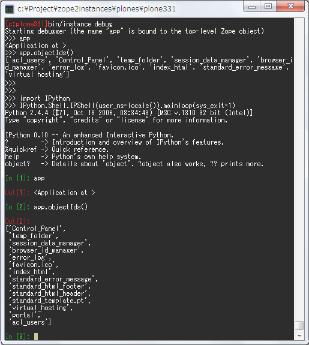
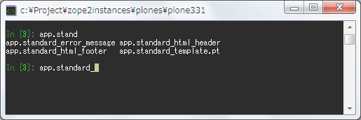
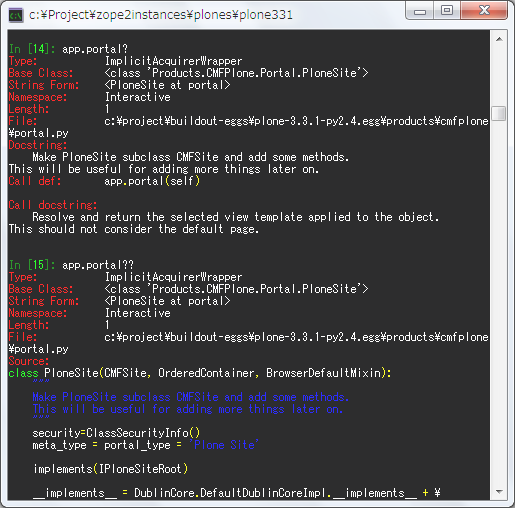

:date: 2009-12-02 23:00:00
:tags: Zope
:body type: text/x-rst

===============================================
2009/12/02 Zopeのdebugコンソールをipython化する
===============================================

`Zope/Ploneアドベントカレンダーをtakanoryさんにお願いされた`_ ので2日目を担当します。Zopeのdebugコンソールをipython化します。

とりあえずipythonはインストール済み( easy_install ipython )ということにしておきます。

まず ``bin/zopectl debug`` コマンドで起動します。最近のPloneなら ``bin/instance debug`` ですね。次に起動したインタラクティブシェル上で以下のように入力します::

  >>> import IPython
  >>> IPython.Shell.IPShell(user_ns=locals()).mainloop(sys_exit=1)

これ以降の対話はipythonで行われるようになります。お手軽ですね！以下は実際にやってみたときの画面キャプチャ（見やすくするためにちょっと加工）。出力結果が自動的pprintされるので見やすくなっていますね。

  bin/instance debug 後にipython化する例

pyreadline_ がインストールしてあるとタブ補完も使えるようになります。

  ipython+pyreadlineでタブ補完する

ipythonの機能で、オブジェクトの後ろに `?` を付けると、型やソースの場所、doc stringが表示されます。さらに `??` (ハテナ２つ）を付けるとソースコードまで表示されます。とっても便利ですね。

  オブジェクトの後ろに?を付けると...

次はこれを ``import IPython`` 等せずに ``bin/zopectl debug`` 起動したら最初からipythonシェルにする方法を書こうと思ったのですが、時間切れで間に合わず＞＜ 

次のバトンは `田原悠西の日記`_ の田原さんです。よろしくー。

.. _`Zope/Ploneアドベントカレンダーをtakanoryさんにお願いされた`: http://takanory.net/takalog/1186#comments

.. _pyreadline: http://ipython.scipy.org/moin/PyReadline/Intro

.. _`田原悠西の日記`: http://yusei.tdiary.net/

関連するサイト
--------------

* `IPythonを使ってZope3デバッグ`_
* `Zope 2 wiki DebuggingWithIPythonAndOtherTips`_
* `Install and setup ipython for zope`_

.. _`IPythonを使ってZope3デバッグ`: http://makunouchi.jp/zope3/9900417093
.. _`Install and setup ipython for zope`: http://plone.org/documentation/how-to/setup-ipython-for-zope
.. _`Zope 2 wiki DebuggingWithIPythonAndOtherTips`: http://wiki.zope.org/zope2/DebuggingWithIPythonAndOtherTips

.. :extend type: text/x-rst
.. :extend:

.. :comments:
.. :comment id: 2009-12-03.8209297329
.. :title: Re:Zopeのdebugコンソールをipython化する
.. :author: Tahara
.. :date: 2009-12-03 00:13:41
.. :email: yusei@domen.cx
.. :url: 
.. :body:
.. お願いされた！笑
.. 
