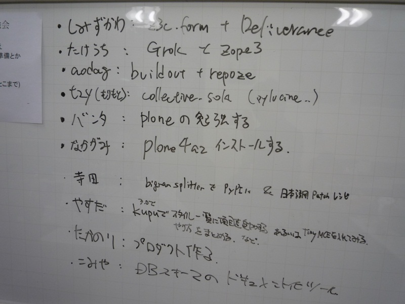
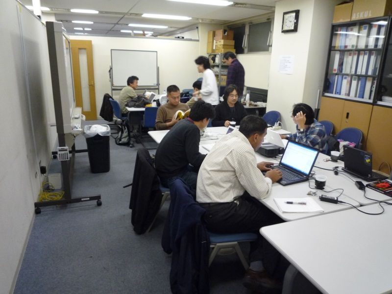

:date: 2009-12-06 15:58:07
:tags: Zope, Plone

===================================================
第6回 Zope/Plone開発勉強会に参加しました
===================================================

昨日は `(第6回)Zope/Plone開発勉強会`_ に参加しました。 前回の `第5回`_ では一人待たせてしまいましたが、今回は40分前くらいに開場しました。二日酔いだったのに、すごいぞ俺。よく頑張った。

.. _`(第6回)Zope/Plone開発勉強会`: http://atnd.org/events/2258
.. _`第5回`: http://www.freia.jp/taka/blog/684

今回はPloneを始めて触る方が参加されていたので、Ploneハンズオンを1時間ちょっとかけてやってみました。先日のPlone研究会後に居酒屋でやったののちょっと拡張版ですが、Ploneの高機能化にはほんとに驚かされます。いつかそのうち説明文を付けてスクリーンキャストしたいですね（いつかそのうち...）。

午後は色々読んだり相談に乗ったりしているうちに16時を過ぎてしまい、成果発表まで残り2時間ということで慌てて `distutils, setuptools, distribute, pip, virtualenv, buildout - 清水川Web`_ を書き始めたりしてました。予定していた z3c.form + Deliverance はカケラも触りませんでしたが、まあまた次回にでも触ろうと思います（あっ、前回の成果をblogに書こうと思って忘れてる...）。

.. _`distutils, setuptools, distribute, pip, virtualenv, buildout - 清水川Web`: http://www.freia.jp/taka/blog/691

会場の様子
----------

  各自の勉強の予定

  会場の様子

他の参加者の報告
----------------

* `aodag blog: repoze.whoを調べてみた`_
* `aodag blog: buildoutでwebtestする`_
* `plone プロダクトの開発時には plone.reload を使おう — takanory.net`_
* `(第6回)Zope/Plone開発勉強会：ある nakagami の日記：So-netブログ`_
* `(第6回)Zope/Plone開発勉強会 - 人は歴史を創り出し、人は歴史を語り継ぐ`_
* `Plone:kupu のスタイル一覧プルダウンをカスタマイズ — Ciel Serein シエルセラン Web制作・映像制作・IT利用コンサルティング`_

.. _`aodag blog: repoze.whoを調べてみた`: http://blog.aodag.jp/2009/12/repozewho.html
.. _`aodag blog: buildoutでwebtestする`: http://blog.aodag.jp/2009/12/buildoutwebtest.html
.. _`plone プロダクトの開発時には plone.reload を使おう — takanory.net`: http://takanory.net/takalog/1189
.. _`(第6回)Zope/Plone開発勉強会：ある nakagami の日記：So-netブログ`: http://nakagami.blog.so-net.ne.jp/2009-12-05
.. _`(第6回)Zope/Plone開発勉強会 - 人は歴史を創り出し、人は歴史を語り継ぐ`: http://d.hatena.ne.jp/ytakeuch/20091205
.. _`Plone:kupu のスタイル一覧プルダウンをカスタマイズ — Ciel Serein シエルセラン Web制作・映像制作・IT利用コンサルティング`: http://ciel-serein.jp/blog/kupuStylesCustomise

前日・当日の #zopeplonedev の発言
----------------------------------

:jbking: @aodag 週末はZope/Plone勉強会よ http://atnd.org/events/2258 #zopeplonedev
:aodag: これ行こうかな。 RT @jbking: @aodag 週末はZope/Plone勉強会よ http://atnd.org/events/2258 #zopeplonedev
:ytakeuch: 今日は豊洲で 東のエデン 二回目観にいこうかと思っていたのだが、頭痛がしてきた。明日のZope/Plone開発勉強会があるから自重するかな。 #zopeplonedev
:ytakeuch: 起床。今日は (第6回)Zope/Plone開発勉強会 http://bit.ly/5QbJ5J に行く。 #zopeplonedev
:ytakeuch: 曙橋タイムインターメディアへ向かう。(第6回)Zope/Plone開発勉強会。まだ空きあります。 http://atnd.org/events/2258 #zopeplonedev
:shimizukawa: Zope/Plone 開発勉強会 開場しました。 #zopeplonedev
:shimizukawa: こいつ、速いぞ!? http://pypi.python.jp/ #zopeplonedev
:shimizukawa: pypi 復活したっぽいけど、jpの方が超速なのでそのまま使い続ける #zopeplonedev
:voluntas: RT @shimizukawa: pypi 復活したっぽいけど、jpの方が超速なのでそのまま使い続ける #zopeplonedev
:jbking: 一人Zope/Plone勉強会@会社 #zopeplonedev
:t2y: @shimizukawa 先生が plone の概要説明を始めた #zopeplonedev
:zenich: 私も向かう。遅れてすみません RT @ytakeuch: 曙橋タイムインターメディアへ向かう。(第6回)Zope/Plone開発勉強会。まだ空きあります。 http://atnd.org/events/2258 #zopeplonedev
:Terapyon: I'm starting Zope/Plone sprint Tokyo. #zopeplonedev I'll rebuild BigramSplitter & JaPatch recipe for PyPI.
:okuji: 一人じゃないよ、ここではみんな毎日Zopeだもん RT: @jbking: 一人Zope/Plone勉強会@会社 #zopeplonedev
:takanory: 曙橋なう #zopeplonedev
:zenich: #zopeplonedev でもお知らせさせてください RT ウェブサイトの公募が集まってきています！ぜひ、あなたのウェブサイトもこのチャンスにご応募ください。自推は1月15日までです。 #daremoga (via @daremogajp)
:takanory: おなかすいた #zopeplonedev
:zenich: 今日のゴールその1 Zope/Ploneアドベントカレンダーの記事を書く http://takanory.net/takalog/1187 #zopeplonedev その2は未定
:yosisa: RT @shimizukawa: pypi 復活したっぽいけど、jpの方が超速なのでそのまま使い続ける #zopeplonedev
:takanory: Zope/Plone開発勉強会(合宿バージョン) 日程調整中 http://chouseisan.com/schedule/List?h=8d7934debdbb5e2c3f971e959d241555 #zopeplonedev
:t2y: RT @takanory: Zope/Plone開発勉強会(合宿バージョン) 日程調整中 http://chouseisan.com/schedule/List?h=8d7934debdbb5e2c3f971e959d241555 #zopeplonedev
:t2y: http://tinyurl.com/yj6egqg Apache Tika は Lucene のサブプロジェクトで、各々のフォーマット毎に既にあるライブラリを利用するツールキット。OLE2 なら POI で、PDF なら PDFBox とか #zopeplonedev
:shimizukawa: コーヒー入りましたー #zopeplonedev
:takanory: 残り、およそ5分です #zopeplonedev
:ytakeuch: Grok全然進まず orz... #zopeplonedev
:takanory: @terapyon BigramSplitter を pypi に登録したよ #zopeplonedev
:takanory: @terapyon ploneの日本語メールバグなおしたプロダクトも pypi に入れたよ #zopeplonedev
:takanory: @terapyon 次は、このあたりをまとめてインストールするレシピを作りたいな #zopeplonedev
:takanory: http://pypi.python.org/pypi/Products.BigramSplitter #zopeplonedev
:Terapyon: RT @takanory: http://pypi.python.org/pypi/Products.BigramSplitter #zopeplonedev
:takanory: なかがみ: plone4a2を入れた。来月はがんばる #zopeplonedev
:takanory: @aodag repoze.who 調べた #zopeplonedev
:takanory: @ytakeuch grok チュートリアルのその先に #zopeplonedev
:takanory: @ytakeuch と思ったら、サンプルコードが動かないので、チュートリアルの次はなにしたらいいの? #zopeplonedev
:takanory: @shimizukawa distutils, setuptools, distribute, pip, virtualenv, buildout ? 清水川Webhttp://www.freia.jp/taka/blog/691 #zopeplonedev
:zenich: #zopeplonedev 本日のアウトプット、ようやくできました http://ciel-serein.jp/blog/kupuStylesCustomise
:takanory: 超長い :D RT: @zenich: #zopeplonedev 本日のアウトプット、ようやくできましたhttp://ciel-serein.jp/blog/kupuStylesCustomise
:takanory: こみや DBの関連を graphviz でやったら、ぐちゃぐちゃになった #zopeplonedev
:zenich: オープンソースソフトウェアコミュニティへの参加もプロボノ的な活動って言っていいでしょうか？ #zopeplonedev #helloprobono
:takanory: 合宿は 1/29-31 にする #zopeplonedev
:takanory: 第8回は 2/20 #zopeplonedev
:Terapyon: RT @takanory: 合宿は 1/29-31 にする #zopeplonedev
:k2mine: OKWaveがプロボノなら、オープンソースもプロボノでしょう。プロボノの範囲の定義によりますね。 RT @zenich: オープンソースソフトウェアコミュニティへの参加もプロボノ的な活動って言っていいでしょうか？ #zopeplonedev #helloprobono
:dateofrock: 私もそう思います。RT @k2mine: OKWaveがプロボノなら、オープンソースもプロボノでしょう。プロボノの範囲の定義によりますね。 RT @zenich: オープンソースソフトウェアコミュニティへの参加もプロボノ的な #zopeplonedev #helloprobono

これは search.twitter.com からコピーして逆順にソートして...とやったんですが、もうちょっと簡単に加工したい。時刻表示したいし、twitterの発言にリンクしたいし... と、前回と同じ事を思った。API叩くしかないのか..

次回 第7回
-----------

次回は 1/29(金)～31(日) に合宿！ まだ場所とか決まってないけど行くことだけは確定した雰囲気。
そのうち告知すると思いまーす。

.. :extend type: text/x-rst
.. :extend:

