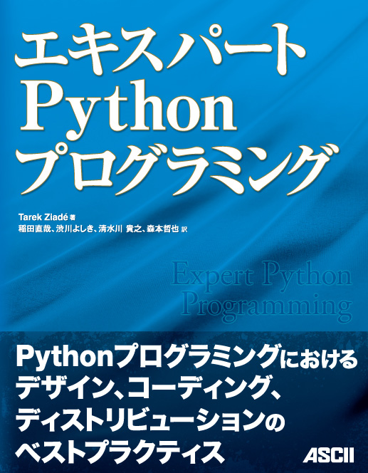

:date: 2010-05-22 13:20:00
:categories: ['misc', 'python']
:body type: text/x-rst

===============================================================
2010/05/22 エキスパートPythonプログラミングのサンプルが届いた！
===============================================================

*Category: 'misc', 'python'*

翻訳した本のサンプルがアスキーメディアワークスさんから送られてきた！(なぜかAmazonの箱で)。

自分の誕生日に自分が訳した本が届くとか、タイミング良すぎる。そういえば出版会議で出版が承認されたのは去年のクリスマスイブだったし。

Expert Python Programming と比べてみると若干厚くて、若干重い。オンデマンド印刷の原書に比べると紙の質は良い気がする！

:タイトル: エキスパートPythonプログラミング
:出版社: アスキー・メディアワークス
:著者: Tarek Ziade
:翻訳: 稲田直哉, 渋川よしき, 清水川貴之, 森本哲也
:定価: 3,780円 (本体3,600円)
:ISBN13: 978-404-8686297
:ISBN10: 4048686291
:購入: `Amazonで購入`_ (アフィリエイト付き)

.. _`Amazonで購入`: http://astore.amazon.co.jp/freiaweb-22/detail/4048686291

.. figure:: http://rcm-images.amazon.com/images/G/09/extranet/associates/buttons/remote-buy-jp1.gif
  :target: http://astore.amazon.co.jp/freiaweb-22/detail/4048686291
  :alt: Amazon.co.jpで買う

.. :extend type: text/x-rst
.. :extend:

.. :comments:
.. :comment id: 2010-05-22.6570038152
.. :title: Re:エキスパートPythonプログラミングのサンプルが届いた！
.. :author: とか★ちん
.. :date: 2010-05-22 22:24:17
.. :email: 
.. :url: 
.. :body:
.. 自分の名前が本に載るのってすごいな。
.. なにはともあれ、おめでとう。
.. 
.. :trackbacks:
.. :trackback id: 2010-05-30.6536916197
.. :title: [python] エキスパートPythonプログラミング
.. :blog name: 彷徨えるフジワラ
.. :url: http://d.hatena.ne.jp/flying-foozy/20100530/1275155241
.. :date: 2010-05-30 02:54:14
.. :body:
..  稲田直哉氏/渋川よしき氏/清水川貴之氏/森本哲也氏による ”エキスパートPythonプログラミング” を頂きました。 エキスパートPythonプログラミング 作者: Tarek Ziade,稲田直哉,渋川よしき,清水川貴之,森本哲也 出版社/メーカー: アスキー・メディアワークス 発売日: 2010/05
.. 
