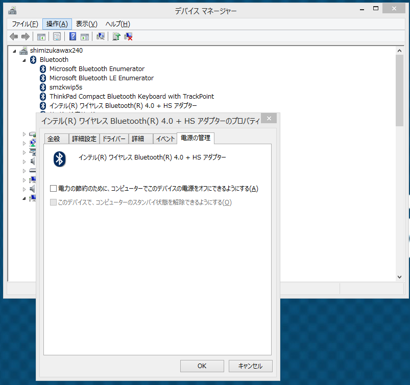

:date: 2014-01-19 13:10
:tags: Windows, Bluetooth, Keyboard

=================================================================
Lenovo Bluetoothキーボードが頻繁に切断される問題の対処
=================================================================

問題
====

Lenovo Bluetoothキーボードが頻繁に切断される問題があります。
Windows7でも8でも起きていました。

暫定的な対処法として、OSのBluetoothをOff/Onすると復活するのは気づいていましたが、OS(Win8.1)のBluetooth接続一覧画面を表示するだけでキーボードが復活することに気づきました。

解決方法
=========

Bluetoothデバイスの電源を自動的に切らないようにします。

   Bluetoothデバイスの電源の管理

   「電源の管理」で「電力の節約のために、コンピューターでこのデバイスの電源をオフに出来るようにする」のチェックを外す。

環境
====

:Keyboard: `ThinkPad Bluetooth ワイヤレス・トラックポイント・キーボード`__
:PC: Lenovo ThinkPad X240(Win8.1), X201 (Win7)

.. __: http://www.amazon.co.jp/dp/B00DLK4GQA

参考
====

* http://clipsclips2.blogspot.jp/2013/04/windows8bluetooth.html

