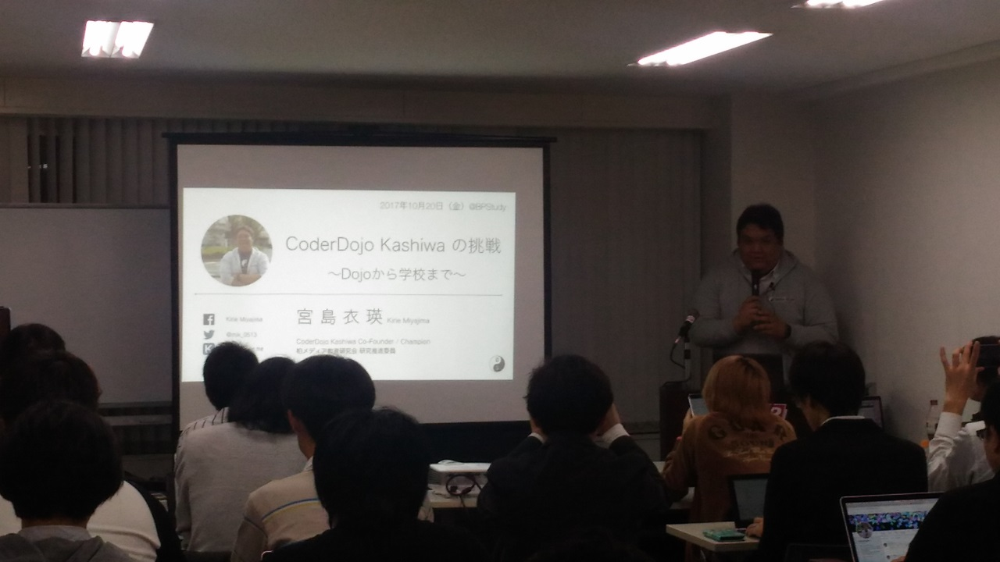

:date: 2017-10-20 21:00
:tags: BPStudy, 教育

======================================================================================
#bpstudy 122: いかにプログラミングを学ぶか？プログラミング教育を考える に参加しました
======================================================================================

`BPStudy #122`_ **いかにプログラミングを学ぶか？プログラミング教育を考える** に参加しました。

.. _BPStudy #122: https://bpstudy.connpass.com/event/66418/

.. contents::
   :local:

第１部ー１：子どものためのプログラミング道場「CoderDojo」とは?
===============================================================

* 安川 要平 氏
* CoderDojo Japan 代表
* Twitter: `@yasulab`_
* 資料: TBD

.. _@yasulab: https://twitter.com/yasulab

* CoderDojoの活動色々紹介（ちょっと遅れて参加したのでメモとれませんでした）

第１部ー２： 子どもも大人もプログラミングで遊んで学ぶ！「CoderDojo」が楽しい！
===============================================================================

* CoderDojo藤沢 代表、イラストレーター
* 向井　アリー 氏
* Twitter: `@AllyMukai`_
* 資料: *TBD*

.. _@AllyMukai: https://twitter.com/AllyMukai

---------------

* 藤沢のCoderDojoの代表をやっている

  * 調布にもCoderDojoがあって、メンターとして参加している
  * イラストレーターなのでプログラミングはそんなに詳しくないけど、調布のメンターさんが藤沢に参加して手伝ってくれているので運営できている
  * そういうコミュニティーが出来ている、作ったのが安川さん

* 2020年のプログラミング教育必修化

  * 「ゲームばっかりやってないで勉強しなさい！」
  * プログラミングでゲームを作るのは勉強？ゲーム？

* 親が近くに居ない方が良い

  * べったり怪獣
  * お子さんの横にずっとくっついて、いちいち口を出す
  * 先生の言うことを聞きなさい、言われたことをやりなさい、etc...
  * 最終兵器、マウスを奪って自分でやりはじめる

* CoderDojoの良いところ

  * みんなが別々のことをやっている
  * 発表タイムでみんなに拍手をもらってまた作りたくなる
  * 循環型の学び
  * 循環がうまくいって自分でコミュニティを作り始める子供達がいる

* プログラミングの道具

  * マインクラフト、マインドストーム、RaspBerryPI 等々
  * 色々紹介（詳細は資料を参照）

感想
--------

* 子供にプログラミングを教える生の情報を知れて良かった
* 自分の子供の頃を思い出しても、子供は面白ければ勝手に覚えてやっていくので、サポートするにしても入り口までで良いんだろうなあ

第１部ー３： CoderDojoと教育行政
=================================

* CoderDojo柏 代表
* 宮島衣瑛 氏
* Twitter: `@mjk_0513`_

.. _@mjk_0513: https://twitter.com/mjk_0513

---------------

* CoderDojo 柏

  * 小学生、中学生、高校生、大学性、大人、が一つの場所にいる
  * 年代性別に関係なくみんなが学び会える環境
  * 柏、柏の葉、流山、の共同発表会を設けたり
  * 今年は12月23日に発表会を開催予定

* ミッション

  * 市内のどこに居てもプログラミングを学べる場所を作る
  * 柏、柏の葉、南柏、湘南
  * それぞれ独立して運営している
  * 毎週どこかの道場が開催している

* 柏市とのミッション

  * 学べる場が提供できるなら、CoderDojoにこだわる必要はない
  * プログラミング的思考を育てる
  * ネコあるき、ネコから逃げる
  * カリキュラムは全て公開されている: http://www.it.kashiwa.ed.jp/index.php?page_id=136
  * 教育委員会との共催
  * 柏プログラミングフェスタ http://www.city.kashiwa.lg.jp/soshiki/020300/p042565.html

* 子供達の発表の様子

  * 例: マインクラフト「を」スクラッチ「で」作ろう
  * すごいマインクラフト好きで、めちゃめちゃ作り込んでくる　
  * この間発売された `マインクラフト+Pythonの本`_ [#minecraftpython]_ を持ってきて、教えろっていう話になった
  * 教える側も何でも知ってるわけじゃないので、一緒に学びながら作っていくのがCoderDojoスタイル
  * ゲームのエンドロールから作り始めた（なぜそこからｗ）

.. [#minecraftpython] `Minecraftで楽しく学べる Pythonプログラミング`_
.. _マインクラフト+Pythonの本: http://amzn.to/2ipjp04
.. _Minecraftで楽しく学べる Pythonプログラミング: http://amzn.to/2ipjp04

感想
--------

* 小学4年生すげー
* 自分が小4の時ってファミコン発売前年だし、今の子の環境すごい

第１部ー４： 元プログラマが辿り着けたプログラミングコミュニティ「CoderDojo」
=============================================================================

* CoderDojo市川 代表
* 土屋健一 氏
* Twitter: `@Ken1Tsuchi8`_

.. _@Ken1Tsuchi8: https://twitter.com/Ken1Tsuchi8

---------------

* PC-8001をリクエストしたのに親父がJR-3000を買ってきた

  * ゲームがまったくない
  * ベーマガに救われた
  * ベーマガのプログラムを打ち込んで、バグを直して、改造して
  * 写経はいつの時代も偉大

* 子供は勝手に楽しみ始める

  * ネコあるき
  * チュートリアル終わる頃には色々やりたくなってる
  * ネコ増やしたり、早くしたり、絵を書き換えたり
  * メンターはninjaサポート、Q&Aヘルプ、親御さんサポート

* 出欠管理はconnpass使いたいけど、アカウント登録がハードルで難しいらしい

* モノ

  * 安くて、ネットが使えて、騒いでもOKな場所
  * 保管場所があると助かるが、、
  * 自分のPCを持ってきてもらうのが良いけど、PCを持ってない子供への提供もCoderDojoの目的の一つなのでなかなか難しい

* カネ

  * 開催時寄付
  * 現物
  * CoderDojoは参加費無料が原則
  * お金はなかなか難しい

* やってて嬉しいこともいっぱい

  * 近所の知り合いが増える
  * 近所の人が駐車場を貸してくれるようになったり
  * 若手は教わる立場の年齢だけどCoderDojoでは教える立場で活動できる（そこから色々学びがある）

* 気をつけてること

  * ミニマムで。1人でうごけるサイズを意識すると継続もなんとかなる
  * 共感できる価値。人が集まってくるとサイズが大きくなる、そのとき価値の共有は重要

Q&A
-------------

* Q （ナカガワさん）大人の人が一緒に来てもらうとPCを持ってくるけど、PCが壊れる場合があって悩んでいる

  * A: 有料イベントだと、自分のコンピューター持ってきて、っていうのはハードルありそう。

  * Q: 親御さんのPCが壊れたと言うことはないんですか？

  * A: CoderDojo全体でみてもそういう話はあまり聞いたことがない

  * A: CoderDojoでは初めから廃棄予定だったPCにUbuntuを入れて動かしているので、「初めから壊れてるようなもの」

* Q（セキュリティエンジニアさん）子供達のセキュリティ意識ってどうやって育てますか？著作権など

  * A: 大前提としてDojo毎に独立しているので強制するルールはない。でも、気に掛けているDojoが増えてきている。本を読みながら勉強する子供が増えてきていて、橋爪さんが書かれたマンガで学ぶScratchの本 [#scratchbook]_ があってそれには初めからセキュリティの話が入っている。そうなっていると教えるのも凄い楽です。

.. [#scratchbook] これかな？ http://amzn.to/2gqL3Wk

第２部−１：私の異常なプログラミング教育、あるいはどうやってプログラミングを教えているのか
==========================================================================================

* 株式会社クオリティスタート
* ゆもと みちたか 氏
* Twitter: `@gothedistance`_

.. _@gothedistance: https://twitter.com/gothedistance

---------------

* 某F社さんからプログラミング教育の依頼があった

  * Pythonの入門書 [#dokupy]_ を書いた以上、後には引けない
  * けっこうカリキュラム作るのに苦労した
  * 必ず言われる「なんでJavaじゃないの」
  * Javaはプログラミングの入門に不向き！！

* プログラミングの学習ハードルはナゼ高いのか

  * 行間の広さを独習で埋めるのは難しい

* ハードル1

  * 繰り返しが難しい
  * ``for v in (1,2,3,4,5): print(v)`` で繰り返しでどんどん値が変わっていくというイメージが湧かない
  * whileはさらに難しい

    * （感想: whileの方がifに近いので分かりやすい気がするなあ。教え方次第なのかも？）
  * for, while の変数更新が難しい
  * ズンドコきよし、を使って教えると理解度がグンと上がる

* ハードル2

  * 1変数に1つの値なら問題ない
  * 1変数に2つ以上の値が入るコンテナ型だとピンとこない
  * 表の形で手で書かせるとピンとくるようになった

* ハードル3

  * クラスを使って抽象化できるありがたみが分からない
  * グローバル変数によるグローバル汚染がー、といっても汚染されたことがないイノセントな入門者には伝わらない（わかる）
  * オブジェクト指向とは、などと言ってはいけない。これはデータをまとめるための便利な記法だ

* ハードル4

  * 行き過ぎた抽象化
  * 外部のデータ（HTMLやDB）を抽象化して扱えるクラス、はまったく伝わらない
  * 書けば動くのは分かっても、ショートカットしすぎてなぜそうなのか理解できない

* どうやって思考を整理するべきなのか問題

  * 処理の内容を全部説明してみてください -> どうやって説明したらいいか分からない
  * 大きな問題を小さな課題に分割する
  * ゴルフのアプローチ
  * 一発でホールインワンを狙うのではなく、少しずつ近づけていく

.. [#dokupy] 独習Python入門 http://amzn.to/2ioVMoH

Q&A
-------------

感想
--------

第２部−２：PyQの学習者サポートから学んだPython初学者への解説ノウハウ
====================================================================

* 株式会社ビープラウド
* 大村 亀子 氏 `@okusama27`_
* 清原 弘貴 氏 `@hirokiky`_

.. _@okusama27: https://twitter.com/okusama27
.. _@hirokiky: https://twitter.com/hirokiky

---------------

Q&A
-------------

感想
--------

