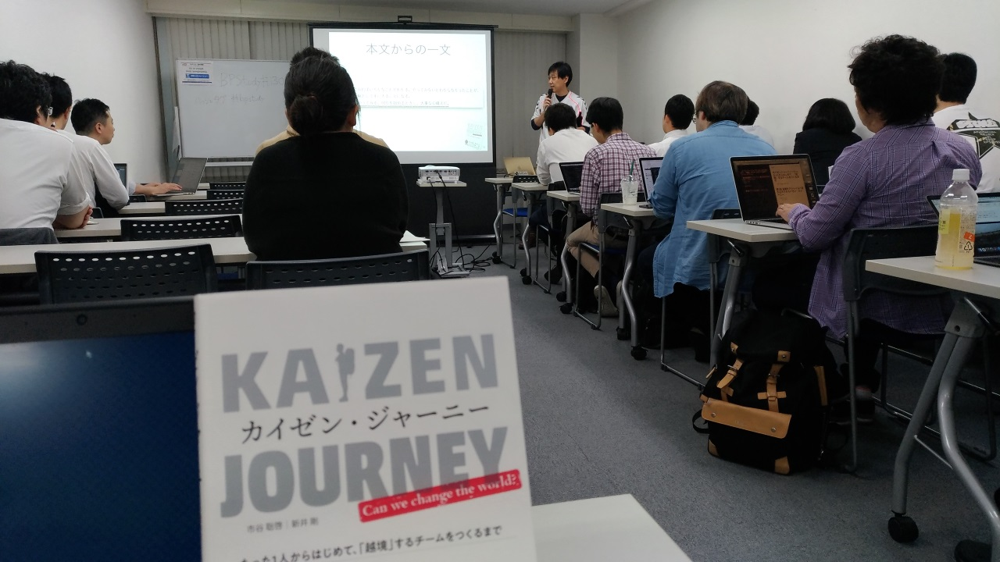

:date: 2018-06-21 21:00
:tags: BPStudy, Agile, Scrum, Kaizen

========================================================================================================
#bpstudy 130:「カイゼンジャーニー〜たった1人からはじめて、「越境」するチームをつくるまで」に参加しました
========================================================================================================

`BPStudy #130` **カイゼンジャーニー〜たった1人からはじめて、「越境」するチームをつくるまで** に参加しました。

.. raw:: html

   

<a href="http://www.amazon.co.jp/exec/obidos/ASIN/4798153346/freiaweb-22/ref=nosim/" name="amazletlink" target="_blank">カイゼン・ジャーニー たった1人からはじめて、「越境」するチームをつくるまで</a>
posted with <a href="http://www.amazlet.com/" title="amazlet" target="_blank">amazlet</a> at 18.06.21

市谷 聡啓 新井 剛  翔泳社  売り上げランキング: 4,156 

<a href="http://www.amazon.co.jp/exec/obidos/ASIN/4798153346/freiaweb-22/ref=nosim/" name="amazletlink" target="_blank">Amazon.co.jpで詳細を見る</a>

.. _BPStudy #130: https://bpstudy.connpass.com/event/89074/

.. contents::
   :local:

第1部 組織をアジャイルへ変えるボクのカイゼン・ジャーニー
========================================================

* ヴァル研究所 新井 剛 氏（Twitter: `@araratakeshi` ）
* 資料: *TBD*

.. _@araratakeshi: https://twitter.com/araratakeshi

* みなさんぼっちですか（会場への問いかけ）

  * 最初は造船の会社に入った、プログラミングの話が出来る人はいなくて、ずっとぼっちだった
  * 助けてくれるヒーローはいない、自分が動く
  * ヴァル研究所は古くからある会社、キラキラした今話題の会社ではないが、常にカイゼン手法を持ち込んでいる

* 当たり前のことを当たり前に

  * 単なる一生懸命な人
  * イノベーター理論 https://bizamurai.com/4472

    * キャズムの手前の人達はカイゼンに乗ってくる
    * ラガードの人達は「越権行為ですよねプンプン」そうですよねそうですよね（スルー）

* 同僚を助けることを評価

* メンターが社内にいっぱいいる

* 感謝を伝える「恩送り」

* 旅路のまとめ

  * できない理由はやまほどある

  * 自分でコントロール出来る範囲を徐々に大きくしていく

  * 八百屋の親父はなぜ元気に働いているのか（なぜ鬱にならないのか）

    * フィードバックループがめっちゃ早い

    * わるいフィードバックが来たらすぐ「じゃあこの果物もってって」と対応できる

  * 直接か間接か分からないけど、次に恩を受ける誰かがいるから、動ける

  * 自分の市場価値を高めるにはどうすればいいか

    * 1つの突出したスキルを身に付けるのは難しい
    * そこそこのスキルを複数持って、かけ算にする

  * 巻き込み、巻き込まれる組織になっていき、越境する組織になった

  * 考え過ぎちゃダメダよ

  * アレグザンダーのデザインパターン: 無明の質

    * 世の中の至る所に散らばっている小さな美しさを見つける努力をする

Q&A
-------------

* Q: (@Ken1Tsuchi8) Win Win とか巻き込みとかに苦手意識があって、巻き込まれそうになったら逃げろ、みたいに思っていて、そういう苦手意識を解消する方法はありますか

  * A: (新井) 社内では「巻き込み」とは言ってなくて「一緒にやろう」って言ってます

* Q: (萩本) 匠メソッドを作ったり本をかいたりしたときに、自分に足りないのは感性だ、と思ったんですが、

  * A: (新井) 自分は感性の方に振り切ってます。プログラムなどは社内にすごい人がいっぱいいるので、自分は感性の方で活動しようと思ってます

  * (萩本) 開発者の人に何かメッセージありますか

  * (新井) ドーナッツ食べると笑顔になるよね。むっつりしてたおじさんがドーナッツ食べると笑顔になるんですよ。こういうの楽しいよね、うれしいことだよね、と言い続ける、「新井が言ってるからしょうがないよね」という感じになっていく。

  * (萩本) わかりました、ドーナッツ買います！

感想
--------

.. raw:: html

   <blockquote class="twitter-tweet" data-partner="tweetdeck">
<a href="https://twitter.com/hashtag/bpstudy?src=hash&amp;ref_src=twsrc%5Etfw">#bpstudy</a> 「単なる一生懸命な人」というけれど、ものすごい多くの人と関わりを持ちにいって知識をもらって実践する、ってもはやスキルだよなあ
&mdash; Takayuki Shimizukawa (@shimizukawa) <a href="https://twitter.com/shimizukawa/status/1009746483019579393?ref_src=twsrc%5Etfw">June 21, 2018</a></blockquote>
   

第２部 第2部 リアルカイゼン・ジャーニー
=======================================

* ギルドワークス 市谷 聡啓 氏（Twitter: `@papanda`_ ）
* 資料: **TBD**

.. _@papanda: https://twitter.com/papanda

.. raw:: html

   <blockquote class="twitter-tweet" data-partner="tweetdeck">
<a href="https://twitter.com/hashtag/bpstudy?src=hash&amp;ref_src=twsrc%5Etfw">#bpstudy</a> 第2部、リアルカイゼン・ジャーニー はじまりー (@ 代々木研修室 国際英語学校代々木教会ビル会場 in 渋谷区, 東京都) <a href="https://t.co/okd0osBsuZ">https://t.co/okd0osBsuZ</a> <a href="https://t.co/SUD3RgG096">pic.twitter.com/SUD3RgG096</a>
&mdash; Takayuki Shimizukawa (@shimizukawa) <a href="https://twitter.com/shimizukawa/status/1009752584167489536?ref_src=twsrc%5Etfw">June 21, 2018</a></blockquote>
   

* なんのために作るのか

  * 顧客よりも、チームのレビューが一番厳しい

  * **目的** に忠誠を誓う, No Why, No Dev

* 越境:
  
  * 目的のために、役割を選ばない、あらゆる人を巻き込む、あらゆる手段を取る、目的を問い続ける

  * 「越境する」こと、そのものが仕事になっている

* どうして越境するようになったのか

  * 12年前TISにいた、塹壕、組織の限界

  * `デブサミ2007 <https://codezine.jp/devsumi/2007>`_ 、 `血があつい鉄道ならば走りぬけてゆく汽車はいつかは心臓を通るだろう <https://codezine.jp/devsumi/2007/timetable_detail/#467>`_

  * どこからか現れる救世主を待ち続けるほど、人生は長くない

  * 会社(TIS)の中で自分たちのデブサミを開く, 2007夏, ... 未だに続いている!

* DevLOVE立ち上げ

  * 2人最強、失敗しても2人、人が増えると失敗できなくなっていく

  * 立ち上げから今日（！）でちょうど10年、230回

* 事件

  * （顧客）お金あるから開発しよう -> 無謀な開発を止められない

  * 止めることは出来た、間違ったモノをどう作ってもだめだろう

  * プロダクトオーナーの向こう側にある「正しいもの」を作るにはどうすればいいか

  * 自分たちで背負うために、会社を作った

  * 当事者意識をどれだけ持てるか

* カイゼン・ジャーニー

  * 2017年夏に執筆開始

  * もやもやしていた時期、本を書きながら自分で励まされた

  * カイゼン・ジャーニーは、自分がないに心を動かされてきたかを思い出すためのジャーニーだった

* 時を超えた越境への道

  * 越境とは、引力

  * 視座と視野の間で見るべきものを変える

    * 視座: プロジェクト、プロダクト、

    * 視野: 人、

  * 高い視座、広い視野がよい？ -> 切り替えられるほうが大事

    .. raw:: html

       <blockquote class="twitter-tweet" data-partner="tweetdeck">
「視座が高くて、視野が広ければいいんでしょ」ではなくて、行き来することが大事。でもすごく難しい。人間が得意のではないのではないか。バイアスがかかる <a href="https://twitter.com/hashtag/bpstudy?src=hash&amp;ref_src=twsrc%5Etfw">#bpstudy</a>
&mdash; 佐藤治夫 (@haru860) <a href="https://twitter.com/haru860/status/1009759215580168192?ref_src=twsrc%5Etfw">June 21, 2018</a></blockquote>
       

  * 実験とフィードバックと調整

  * 越境すると、見える風景が変わる、感じる事が変わる、自分の振るまいが問い直される

  * 越境した結果得られる色々なモノは、越境した人だけが得られる報酬。それに対して色々言ってくる周りの声は気にしなくて良い

  * 越境していくと、孤独になる。ある問題に自分だけが気づける状態

    .. raw:: html

       <blockquote class="twitter-tweet" data-partner="tweetdeck">
前提を問うような問題。誰もがきづくわけではない。なのでぼっちになる <a href="https://twitter.com/hashtag/bpstudy?src=hash&amp;ref_src=twsrc%5Etfw">#bpstudy</a>
&mdash; 佐藤治夫 (@haru860) <a href="https://twitter.com/haru860/status/1009760664791838720?ref_src=twsrc%5Etfw">June 21, 2018</a></blockquote>
       

* Start with Why

  * なぜ越境するのか

  * デブサミ2007や、組織や、コミュニティで、自分がenergizeされてきた

  * こんどは自分がenergizeしていきたい

  * 時を超えて、越境をenergizeする

Q&A
-------------

* Q: (`@terapyon`_) 私は2人より3人の方がいいなと思うんですが、3人より2人の方が良い理由があれば教えてください。忙しくなったときも維持できるし、意見が割れたときも進められると思うし。

  * A: (市谷) 3人でもいいんじゃないですかね。私はぼっちだったのでもう1人しか見つけられなかっただけで、3人目を見つけられたらそれでいいんじゃないですかね

* Q: (?) お二人に聞きたいんですが、会社でやってみようかなと思ったときに周りの目が気になって踏み出せないとき、やっちゃえば良いじゃん、で進めてマイナスに働いてしまうこともあると思うんですが、そういう失敗例とかあれば教えてください

  * A: (市谷) 全部失敗みたいなもんですよ！最初は多くの人が「いいねいいね」って言ってくるけどそれぞれの人の思惑があってやってるので、どんどん意見が合わなくなっていく。色々美談っぽく言ったけど、イベントもコミュニティも離散集合みたいなもんですよ。ある視座でみたときには、失敗、ということになります。

  * A: (新井) 僕の中で「失敗」と思うフィルターがないみたいで、他の人が見てどうかはあると思うけど、自分では失敗はないと思ってます。短期的には失敗かもだけど長期的には学びだろうし。ただ、社内にアジャイルを推進しようとおもったときに社内全員がアジャイル好きということはないし、アジャイル嫌悪してる人もいるので、そういう感じになってしまったのは手順をもうちょっと考えればよかったな、と思った事もあります。それでもそれも長い目で見たら良い経験かなと。

.. _@terapyon: https://twitter.com/terapyon

第3部 大LT大会
===============

* カドオカさん: たった1人からはじめてみました カイゼン・ジャーニー
  
  * スライド: *TBD*
  * カイゼン・ジャーニーを読んで、1人でやるのはリスクもないので、さっそくやってみた

  * 1人朝会: 毎朝10分。この儀式で仕事モードに切り替える、リズムが生まれる、リスク回避

  * KPT振り返り: 模造紙に付箋を貼って、席のパーティションに貼る。タイムボックスは40分。

  * 月次タスクバックログ: 1ヶ月に入らないタスクは細分化して実施。MUSTではない企画系タスクが進むようになった！

  * 中間タスクのバッファ排除（CCPM）: 常に全力でやるので疲れる、学生症候群（パーキンソンの法則）を退治できる

  * 総合的に感じたこと

    * これまでダラダラ仕事してたんだな、と気づいた

    * 自分1人なら失敗を恐れずにやってみることができる

* `@haru860`_: 越境と収入の関係

  * スライド: *TBD*
  * カイゼン・ジャーニーを夢中で読んだ

    * 江島に共感を覚えて、どんどん引き込まれていった

    * 開発現場をイメージさせる表現、文章

  * 越境 = 境界線を越えること

    * コンフォートゾーン（自分が心地よいエリア）にいると力を発揮できる
    * コンフォートゾーンを越えると、不安になる、パフォーマンスがでない、超えたくない
    * コンフォートゾーンを越えることで、新しい経験をして、自分の価値を高められる

  * 仕事における越境パターン

    * 1 越境しない

    * 2 受動的越境: だれかに言われて越境する

    * 3 主体的越境: 自分でまず価値を描いて、新しい役割を描いて、向かっていく

  * 越境と収入の関係

    * 1 越境しない: 給料400万だからこれだけやればいいよね（お金が先）

    * 2 受動的越境: 役割を与えられて、役割をやれば給料が増えるからやってみて、他人任せで収入が増える（お金が先）

    * 3 主体的越境: 自分でまず価値を描いて、新しい役割を描いて、越境した結果、収入が増える（越境が先）

  * 本当に稼ぐ人になりたいのであれば、主体的越境をしよう

    * 越境することで空洞を埋めて、そこで価値を生み出して、稼いでいく

.. _@haru860: https://twitter.com/haru860

