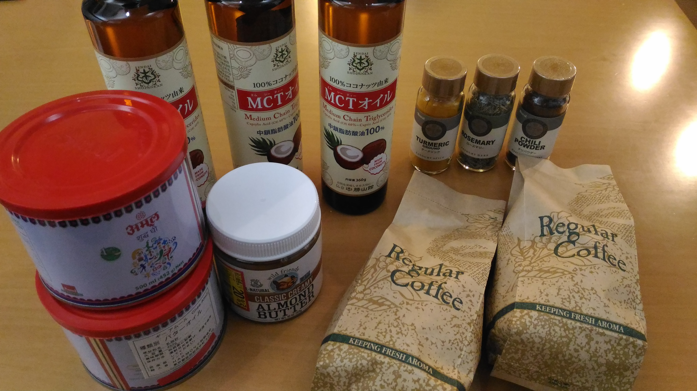
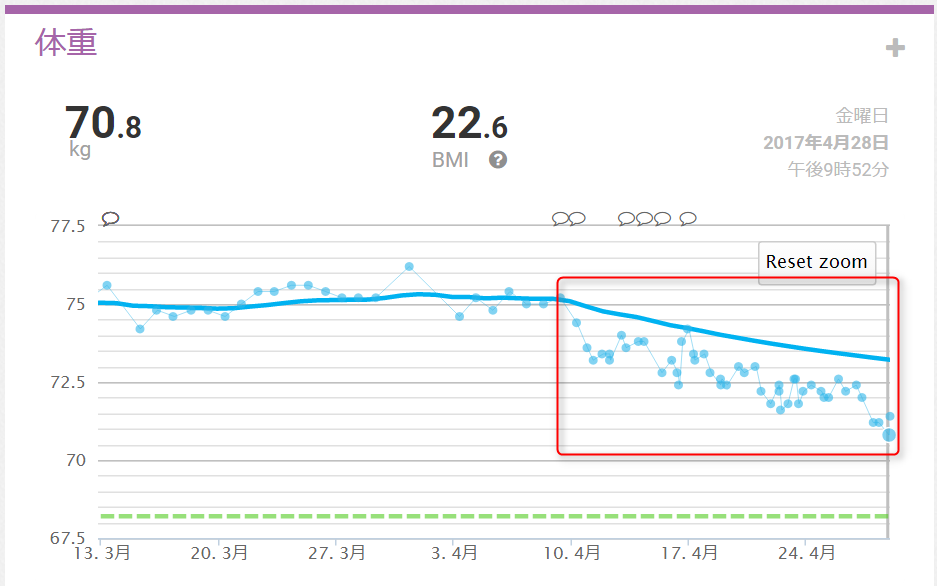
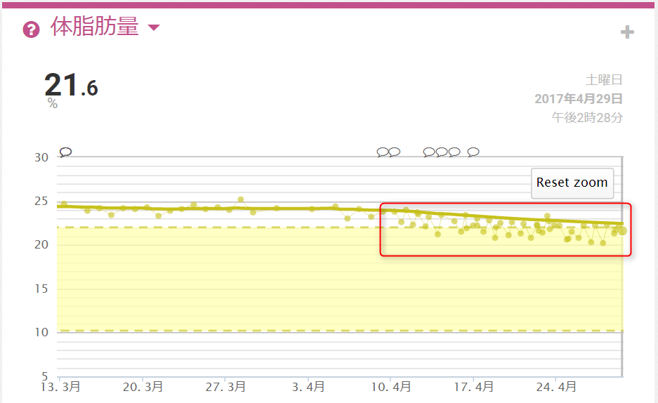

:date: 2017-05-01 23:59
:tags: Diet

==========================================================
完全無欠ダイエットしてみた - 3週間の結果と食材
==========================================================

`シリコンバレー式 自分を変える最強の食事`_ を読んで実践してみました。きっかけは知り合いがFacebookかTwitterの投稿で始める、って言ってたから。

MCTオイルとかグラスフェッドバターって、どこで売ってるの？と、何度か聞かれたので `バターコーヒーの材料をどこで買ってるの？`_ に自分が探した範囲でまとめました。

.. warning:: 免責事項: このblogに書いてある内容だけで実践せず、本を読んで自己責任で実践してください。健康を損なう恐れや、実践すべきでない人や状態についても本で紹介されています。

.. _シリコンバレー式 自分を変える最強の食事: http://amzn.to/2qkPXec

.. raw:: html

   <iframe style="width:120px;height:240px;" marginwidth="0" marginheight="0" scrolling="no" frameborder="0" src="//rcm-fe.amazon-adsystem.com/e/cm?lt1=_blank&bc1=000000&IS2=1&bg1=FFFFFF&fc1=000000&lc1=0000FF&t=freiaweb-22&o=9&p=8&l=as4&m=amazon&f=ifr&ref=as_ss_li_til&asins=4478039674&linkId=00695e61e724fdd9b40bafd2fb803539"></iframe>

この本を短くまとめると
=========================

こんな感じ。

* 2週間、体に影響の少ない（全くない）食べ物だけ食べて体をリセットしよう
* 昼食と夕食は6時間位内にとり、残りの18時間は断続的ファスティング（絶食）することでケトン体質になろう
* 朝食代わりにMCTオイル入りバターコーヒーを飲んで、空腹を感じずに、思考のパフォーマンスを上げよう

基本的に、ハードモードの炭水化物制限ダイエットなんだろうと思いますが、週に1回運動した日には良質の炭水化物をたっぷりとる、夜の少量の冷や飯（レジスタントスターチ=難消化性でんぷん）はOK、という話が出てきたりします。

.. contents::
   :local:

3週間やった結果
==================

4kgちょっと減りました。

.. csv-table::
   :stub-columns: 1
   :header-rows: 1
   :class: table-hover table-bordered

   ,4/9,4/29,差分
   体重,75.2kg,70.8kg,-4.4kg
   BMI,24.0,22.8,-1.2
   体脂肪,23.8%,21.6%,-2.2%

開始直後は、MCTオイル少なめで始めたけれどだいぶお腹が緩くなってしまってました。
最初の頃に体重が落ちてるのはそれが原因な気がします。

この本の読み方
================

読み物として面白いし、それぞれの主張には裏付けがありそうな感じですが、全部真に受けなくてもいいかなと思います。著者がかなりのアレルギー体質でこの本の主張も著者自身で試した結果で良かったこと良くなかったことを書いているので、私に全部当てはまる感じはしません。主張としては、最初の2週間で悪影響のありそうな食べ物を一切排除して、3週間目から自分にあった食材を少しずつ試してみて、体への影響の出方を見る、ということなので、とりあえず最初は合わせておこうかな、という感じです。

グラスフェッドビーフや草食の羊の肉は良い、というのが繰り返し書かれていますが、どうなんでしょうね？脂肪酸の質が（成分が）と言われても個人では検証できないので、とりあえず従ってみていますが、しばらくしたら他の肉に切り替えて「体への影響の出方を見」てみようと思います。青魚もオススメという主張なので、そこはそのまま受け入れてサバとかよく食べるようになりました。

こんな感じで、この3週間は、自分の感覚に合っているところは積極的に受け入れて、合ってないところは半信半疑で試してみた感じでした。

バターコーヒー
===============

美味しいです。

`「コーヒーと脂肪」が最強に痩せる組み合わせ | シリコンバレー式自分を変える最強の食事 | ダイヤモンド・オンライン`_ で作り方等を読めます。

バターコーヒーの効果
----------------------

朝7時に1杯飲むと、だいたい11時くらいまでの4時間くらいは保ちます。
午前中眠くなることもなく、活動的になりました。

以前も朝にコーヒーは飲んでたけど、目が覚める感じもあまりしてなかったので、何か効果は出てるっぽいです。

私の妻も一緒に朝のバターコーヒーだけやっていますが、「これを始めてからパン食べたい欲求がなくなった」と、ビックリしてました。毎日朝は必ずパン、夜もときどきパンを食べたい！と言っていたのに、ここ2週間くらい食べてないっぽいです。

バターコーヒーの材料
-----------------------

マグカップ1杯のバターコーヒーのための材料

* コーヒー豆（酸味系より苦み系のほうがバターコーヒーに合ってて好きです）
* MCTオイル（中鎖脂肪酸100%） 大さじ2
* グラスフェッドバター（またはAOP認定バターやギー）大さじ2

バターコーヒーを作るための道具
----------------------------------

* コーヒーミル（持ってた）
* コーヒーメーカー（持ってた）
* コーヒーフィルタ（金属フィルタがよいらしいので（元々欲しかったので）買った）
* ブレンダー（持ってた `BOSCHのハンディブレンダー` を使った）

.. _BOSCHのハンディブレンダー: http://amzn.to/2qlk1Gk

バターコーヒー作り方のポイント
----------------------------------

* ブレンダーでよく撹拌して、バターやMCTオイルの粒を小さくする

しっかりまざってると、美味しい。

撹拌してからちょっとたつと脂が分離してきますが、そうなると不味くて飲めないです。
一度だけ、脂の粒がくっつき始めたのを飲んだら、2時間くらいしてからめっちゃ気持ち悪くなりました。

バターコーヒーの材料をどこで買ってるの？
=========================================

バター
----------

通販でも売ってますが、直接店舗で買った方が送料がかからないので安いです。

* `グランフェルマージュ バイオ・グラスフェッドバター 無塩 250g`_

  * 成城石井（九段下店と、恵比寿駅店）で、税込み2700円（1080円/100g）
  * Amazonも税込み2700円だけど、さらに送料あり
  * 一度買って、高くてやめました

  .. raw:: html

     <iframe style="width:120px;height:240px;" marginwidth="0" marginheight="0" scrolling="no" frameborder="0" src="//rcm-fe.amazon-adsystem.com/e/cm?lt1=_blank&bc1=000000&IS2=1&bg1=FFFFFF&fc1=000000&lc1=0000FF&t=freiaweb-22&o=9&p=8&l=as4&m=amazon&f=ifr&ref=as_ss_li_til&asins=B00L8IZ1E8&linkId=c66d85812b10689b5057ca1befd0699d"></iframe>

* `冷凍　ラヴィエット無塩バターAOP / 500g`_

  * ららぽーと豊洲の富澤商店で税込3240円（648円/100g）
  * バターはこれを2回買いました
  * 新宿高島屋の富澤商店には無かった残念

  .. raw:: html

     <iframe style="width:120px;height:240px;" marginwidth="0" marginheight="0" scrolling="no" frameborder="0" src="//rcm-fe.amazon-adsystem.com/e/cm?lt1=_blank&bc1=000000&IS2=1&bg1=FFFFFF&fc1=000000&lc1=0000FF&t=freiaweb-22&o=9&p=8&l=as4&m=amazon&f=ifr&ref=as_ss_li_til&asins=B01N3KCR24&linkId=8d3f5cef46bfa4698d28e59091ff7cc3"></iframe>

* バラインタイン グラスフェッド発酵バター 食塩不使用 250g

  * 成城石井（恵比寿駅店） 税込み2139円 （855円/100g）
  * 買ってない

  .. figure:: ballantyne.jpg
     :width: 400

* `エシレ バター 食塩不使用 100g`_

  * 成城石井（あちこち）税込み1207円（1207円/100g）
  * AOKI（ららぽーと豊洲）
  * エシレは高い

  .. raw:: html

     <iframe style="width:120px;height:240px;" marginwidth="0" marginheight="0" scrolling="no" frameborder="0" src="//rcm-fe.amazon-adsystem.com/e/cm?lt1=_blank&bc1=000000&IS2=1&bg1=FFFFFF&fc1=000000&lc1=0000FF&t=freiaweb-22&o=9&p=8&l=as4&m=amazon&f=ifr&ref=as_ss_li_til&asins=B01EJAJRRI&linkId=93b3f3e64b428b5f1c2931e1ca8e8c65"></iframe>

* `GHEE EASY 100g`_

  * ららぽーと豊洲のAOKIで、1280円（1280円/100g）
  * 一度買って、2日で使い切りました。高い。

  .. raw:: html

     <iframe style="width:120px;height:240px;" marginwidth="0" marginheight="0" scrolling="no" frameborder="0" src="//rcm-fe.amazon-adsystem.com/e/cm?lt1=_blank&bc1=000000&IS2=1&bg1=FFFFFF&fc1=000000&lc1=0000FF&t=freiaweb-22&o=9&p=8&l=as4&m=amazon&f=ifr&ref=as_ss_li_til&asins=B06X3R88H7&linkId=d8c3d400641f90d6db259b3bf55fe042"></iframe>

* `ギー アムール 500g`_

  * イオン東雲のカフェランテで、税込み3024円が、在庫処分で4割引の1814円（363円/100g）
  * イトーヨーカドー木場店のKALDIで税込み3024円（605円/100g）
  * このギーはグラスフェッドバターが原料かどうか不明です
  * 4割引のやつを3つ買い込んじゃった

  .. raw:: html

     <iframe style="width:120px;height:240px;" marginwidth="0" marginheight="0" scrolling="no" frameborder="0" src="//rcm-fe.amazon-adsystem.com/e/cm?lt1=_blank&bc1=000000&IS2=1&bg1=FFFFFF&fc1=000000&lc1=0000FF&t=freiaweb-22&o=9&p=8&l=as4&m=amazon&f=ifr&ref=as_ss_li_til&asins=B01JG0JKBO&linkId=f7d528d9b693f00201c7fee2947c4e74"></iframe>

.. _冷凍　ラヴィエット無塩バターAOP / 500g: https://tomiz.com/item/00082300
.. _グランフェルマージュ バイオ・グラスフェッドバター 無塩 250g: http://amzn.to/2p0PUA7
.. _エシレ バター 食塩不使用 100g: http://amzn.to/2qkQeOk
.. _GHEE EASY 100g: http://amzn.to/2pAwLrT
.. _ギー アムール 500g: http://amzn.to/2qkQA7j

MCTオイル
-------------

* `仙台勝山館 ＭＣＴオイル 360g`_

  * ららぽーと豊洲のAOKIで、税込み2138円（594円/100g）
  * 成城石井（九段下）で、税込み2366円（657円/100g）

  .. raw:: html

     <iframe style="width:120px;height:240px;" marginwidth="0" marginheight="0" scrolling="no" frameborder="0" src="//rcm-fe.amazon-adsystem.com/e/cm?lt1=_blank&bc1=000000&IS2=1&bg1=FFFFFF&fc1=000000&lc1=0000FF&t=freiaweb-22&o=9&p=8&l=as4&m=amazon&f=ifr&ref=as_ss_li_til&asins=B013MW3B4Y&linkId=84361ab2c3737ef2f0e5eabdb3e4217d"></iframe>

* `MCTオイル(中鎖脂肪酸100%) 250g`_

  * KALDI（ららぽーと豊洲、ヨーカドー木場）で、税込み1684円（673円/100g）

  .. raw:: html

     <iframe style="width:120px;height:240px;" marginwidth="0" marginheight="0" scrolling="no" frameborder="0" src="//rcm-fe.amazon-adsystem.com/e/cm?lt1=_blank&bc1=000000&IS2=1&bg1=FFFFFF&fc1=000000&lc1=0000FF&t=freiaweb-22&o=9&p=8&l=as4&m=amazon&f=ifr&ref=as_ss_li_til&asins=B01N6J3K2Z&linkId=f4ef3ca35ba052d7e6b48d5c0acbfc2e"></iframe>

.. _仙台勝山館 ＭＣＴオイル 360g: http://amzn.to/2oY6Er5
.. _MCTオイル(中鎖脂肪酸100%) 250g: http://amzn.to/2qppnhg

コーヒー豆
--------------

* KALDIとか
* カフェランテとか
* 200gで500円しないくらいの豆を買ってます

まとめ
====================

とりあえず3週間で4kgちょっと痩せました。

アルコールは、この3週間でビールを3杯飲んだくらいで、半禁酒状態。

バターやMCTオイルは高いので、1週間に5000円くらい使った感じです。半禁酒で家飲みしなくなったのと飲み会に行かなかったのとで、5000円くらい浮いてトントンかなあ。

睡眠時間が平均1時間減ったみたいです。7時間が6時間くらいになりました。日中はとくに眠くないかな。起きてる時間が増えて、朝食時間が減って、トータルの活動時間が1日2時間弱増えた感じ。

健康面では、1週間目の終わりくらいにちょっと肌荒れと疲れが出たので、ビタミンBとミネラルのサプリを飲むようにしました。サプリじゃない食材で取れるように今後考えないといけないですね。

バターはグラスフェッドじゃないとだめなのか、本当に穀物飼育よりも牧草飼育のほうが良い脂肪酸比率の肉になるのか、疑問は残りますが調べられてません（難しそう）。だれか調べてくれないかなあ。

コーヒー以外の食事についてはまた機会があれば書きますが、牛肉、豚肉、羊肉、鯖、等と、サラダや蒸し野菜をたくさん食べてます。

参考にしたサイト等
-----------------------

書籍の抜粋

* `「コーヒーと脂肪」が最強に痩せる組み合わせ | シリコンバレー式自分を変える最強の食事 | ダイヤモンド・オンライン`_

肯定系

* `【管理栄養士に聞いた！】驚愕…完全無欠コーヒーダイエットの真実とは？ | 健康チョキン  セルフメディケーションで将来も健康に！サプリメントマイスターが話題の健康情報をわかりやすくお届け！`_

* `【実践・結果編】完全無欠バターコーヒーダイエット方法（健康チョキン流） | 健康チョキン  セルフメディケーションで将来も健康に！サプリメントマイスターが話題の健康情報をわかりやすくお届け！`_

* `シリコンバレー式自分を変える最強の食事・実践記 | あなたの可能性を発見し、形にし、発信するコンサルタント、小澤竜太のブログ`_

* `シリコンバレー式最強の食事をレビュー。口コミで評判だけど本当に毎日0.5kg痩せる？ - 50kgダイエットした港区芝浦IT社長ブログ`_

* `MCTオイルとは？ ダイエット効果と価格比較、認知症予防の最新まとめ - 50kgダイエットした港区芝浦IT社長ブログ`_

* `グラスフェッドバターとは？ダイエットに本当にいいの？ - 50kgダイエットした港区芝浦IT社長ブログ`_

否定系

* `「科学的根拠に基づく本当に体によい食事」とは？ &#8211; 医療政策学×医療経済学`_

* `嘘と捏造の世界『シリコンバレー式 自分を変える最強の食事』。小保方晴子のやり方と同様の手法でコントロールされる人々。グラスフェッドな乳製品はなぜ日本に存在してないのか。 - ロストテクノロジ研究会`_

その他役立ち情報

* `Amazon.co.jp： マンガで分かる肉体改造 糖質制限編 (ヤングキングコミック)の ゅぅゃさんのレビュー`_

* `グラスフェッドビーフが通販で簡単に購入できる！日本国内の牧草飼育牛肉ショップならココ！！`_

.. _「コーヒーと脂肪」が最強に痩せる組み合わせ | シリコンバレー式自分を変える最強の食事 | ダイヤモンド・オンライン: http://diamond.jp/articles/-/78172

.. _【管理栄養士に聞いた！】驚愕…完全無欠コーヒーダイエットの真実とは？ | 健康チョキン  セルフメディケーションで将来も健康に！サプリメントマイスターが話題の健康情報をわかりやすくお届け！: https://kenko-chokin.com/special/4132

.. _【実践・結果編】完全無欠バターコーヒーダイエット方法（健康チョキン流） | 健康チョキン  セルフメディケーションで将来も健康に！サプリメントマイスターが話題の健康情報をわかりやすくお届け！: https://kenko-chokin.com/special/4366

.. _シリコンバレー式自分を変える最強の食事・実践記 | あなたの可能性を発見し、形にし、発信するコンサルタント、小澤竜太のブログ: http://ozawaryuta.jp/category/businesshealthy/health/

.. _シリコンバレー式最強の食事をレビュー。口コミで評判だけど本当に毎日0.5kg痩せる？ - 50kgダイエットした港区芝浦IT社長ブログ: http://tanaboo.hatenablog.com/entry/2015/11/23/085424

.. _MCTオイルとは？ ダイエット効果と価格比較、認知症予防の最新まとめ - 50kgダイエットした港区芝浦IT社長ブログ: http://tanaboo.hatenablog.com/entry/2016/01/28/135049
.. _グラスフェッドバターとは？ダイエットに本当にいいの？ - 50kgダイエットした港区芝浦IT社長ブログ: http://tanaboo.hatenablog.com/entry/2016/04/30/060000

.. _「科学的根拠に基づく本当に体によい食事」とは？ &#8211; 医療政策学×医療経済学: https://healthpolicyhealthecon.com/2016/06/05/evidence-based-healthy-diet/

.. _嘘と捏造の世界『シリコンバレー式 自分を変える最強の食事』。小保方晴子のやり方と同様の手法でコントロールされる人々。グラスフェッドな乳製品はなぜ日本に存在してないのか。 - ロストテクノロジ研究会: http://d.hatena.ne.jp/losttechnology/20160512/1462581159

.. _Amazon.co.jp： マンガで分かる肉体改造 糖質制限編 (ヤングキングコミック)の ゅぅゃさんのレビュー: https://www.amazon.co.jp/review/R2LTXN55BS485H/ref=cm_cr_rdp_perm?ie=UTF8&ASIN=4785954833

.. _グラスフェッドビーフが通販で簡単に購入できる！日本国内の牧草飼育牛肉ショップならココ！！: https://lifeqa.net/grass-fed-beef/

