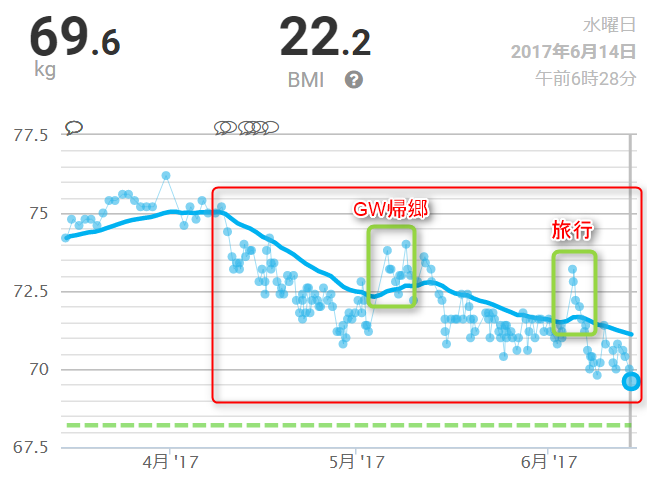
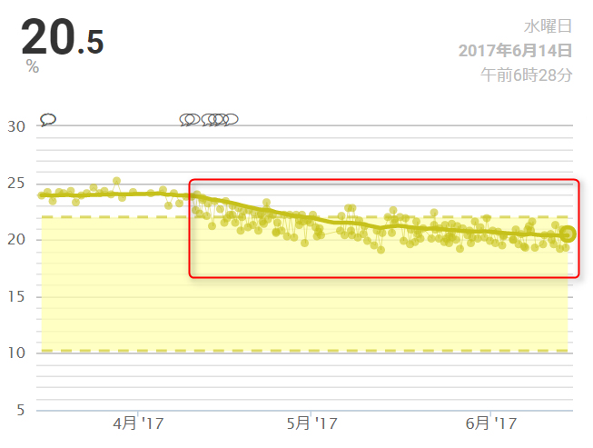
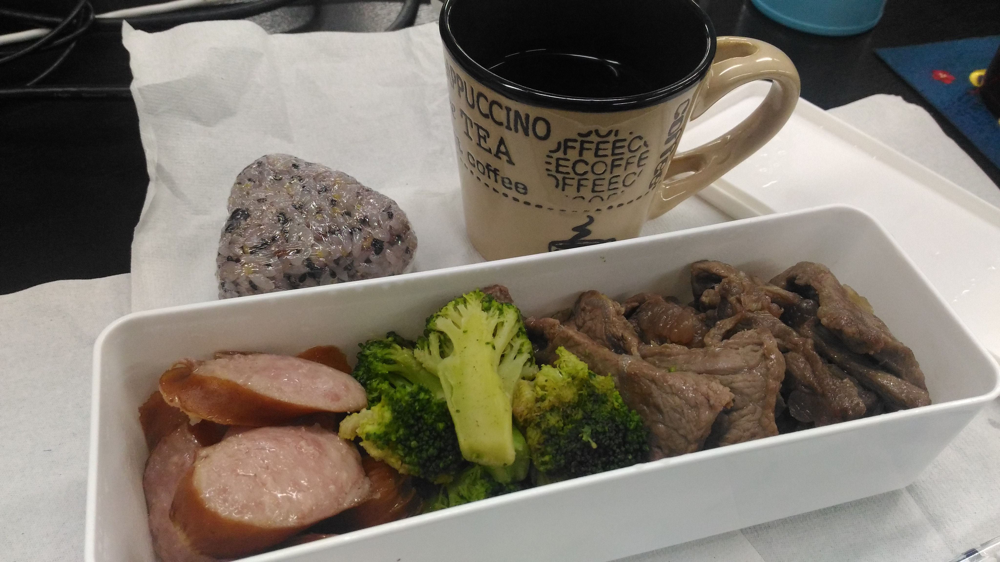

:date: 2017-06-14 21:30
:categories: ['Diet']
:body type: text/x-rst

==================================================
2017/06/14 完全無欠ダイエット - 2ヶ月の結果と食事
==================================================

`シリコンバレー式 自分を変える最強の食事`_ を読んで実践して目標体重に順調に近づいてます。

:doc:`../bulletproof-diet-try/index` の続きです。2ヶ月たったので、現状について。

.. contents::
   :local:

まとめ
=======

- 2ヶ月で5kgちょっと減りました
- 食事は、朝にバターコーヒー、昼夜は肉野菜。炭水化物は毎日夜に少量
- 運動はぶっちゃけやってません

.. raw:: html

   <blockquote class="twitter-tweet" data-lang="ja">
体重が2014年4月20日以来の下値更新。ダイエット開始から2ヶ月と4日目。75.2kg -&gt; 69.6kg うぇーい！
&mdash; Takayuki Shimizukawa (@shimizukawa) <a href="https://twitter.com/shimizukawa/status/874744791728128001">2017年6月13日</a></blockquote>
   

.. _シリコンバレー式 自分を変える最強の食事: http://amzn.to/2qkPXec

2ヶ月やった結果
==================

2ヶ月で5kgちょっと減りました。

:doc:`前回blog(5/1) <../bulletproof-diet-try/index>` 以降、帰郷や旅行で一時的に体重が増えたりしてましたが、移動平均線は下降を維持しています。

.. csv-table::
   :stub-columns: 1
   :header-rows: 1
   :class: table-hover table-bordered

   ,4/9,6/14,差分
   体重,75.2kg,69.6kg,-5.6kg
   BMI,24.0,22.2,-1.8
   体脂肪,23.8%,20.5%,-3.3%

計測体重が目標BMI=22の68.9kgになるのは、単純計算で8.25日後の6月22日。68.0kgになるのは18.86日後の7月3日、ですね！

食事
================

食事は、朝にバターコーヒー。
コーヒーに脂、なのでクリーム入りコーヒーが苦手は人はダメらしい。
これを飲むようになってから、午前中のパフォーマンスがめっちゃ良いです。眠くならず、活動的になりました。

5月頭と6月頭の旅行中以外はずっとこれです。旅行中に和食など糖質のある食事をしたときは、昼前にお腹が空いてつらかった。

.. figure:: buttercoffee.*

   朝のバターコーヒー

昼は肉と野菜。野菜が肉よりも多い方が良いみたいです。肉の方が多いと便秘になりがち。MCTオイルのおかげで便秘になりにくいけど、なるときはなる。野菜を食べよう。

いきなりステーキ、よく見るとGrass Fed Beefって書いてあるメニューがあるので、付け合わせをブロッコリーにチェンジして、さらにブロッコリートッピングとかで食べます。高いので月に1回くらい。だいたいはコストコで大量に買ったラム肉とブロッコリーのお弁当です。

.. figure:: lunch1.*

   昼のお肉と野菜（高い方）

.. figure:: lunch2.*

   昼のお肉と野菜（通常）

イベントで出されたおやつはありがたく頂いてます。

.. figure:: birthday-cake.*

   誕生日に同僚が用意してくれたケーキ。おいしかった

夜は（肉または魚）＋野菜＋少量の炭水化物（レジスタントスターチ=冷や飯）。
たまにポテチ食べたりアイス食べたりもします。その辺は気分で。

   夜の食事（勉強会行く前に食べる）

お酒は旅行時やたまに参加する飲み会でちょっとだけ飲むことにして、普段は止めました。ゆるーく断酒。ドライゼロはほぼ毎日飲んでる。

.. raw:: html

   <blockquote class="twitter-tweet" data-lang="ja">
利き酒！132種類の日本酒を500円で5種類お試しできる！！ (@ 越後のお酒ミュージアム ぽんしゅ館 - <a href="https://twitter.com/yuzawaponshukan">@yuzawaponshukan</a> in 湯沢町, 新潟県) <a href="https://t.co/H7mCEG4Z1y">https://t.co/H7mCEG4Z1y</a> <a href="https://t.co/HBckuYZfyS">pic.twitter.com/HBckuYZfyS</a>
&mdash; Takayuki Shimizukawa (@shimizukawa) <a href="https://twitter.com/shimizukawa/status/870924642835456000">2017年6月3日</a></blockquote>
   

ダイエットを始めてから、意識の変化なのか、バターコーヒーの影響なのか、糖質（おやつ系、米系、麺系）を食べたいとまったく思わなくなったのが不思議でした。なので、糖質食べてなくても苦しくない感じ。食べたくなったら時々食べるから、飢えてる感じもないです。お酒は飲みたい。飲みに行ったら飲むので、普段はまあドライゼロでいいかな。

運動
=====

運動は毎日1万歩前後あるいてるけどそれだけ。

`シリコンバレー式 自分を変える最強の食事`_ では、1週間に1回、筋肉を付けるための高強度トレーニングをするのがお勧めされてます。それを読んで、書いてあるとおりに1回だけやったらものすごく疲れました。

.. raw:: html

   <blockquote class="twitter-tweet" data-lang="ja">
高強度インターバルトレーニングやった。30秒全速力で走って90秒休む、を最低10分、最大15分間。4セット8分で力尽きた...。その後30分以上へばってるところ
&mdash; Takayuki Shimizukawa (@shimizukawa) <a href="https://twitter.com/shimizukawa/status/855632622487093248">2017年4月22日</a></blockquote>
   

今週末またやろうかな..  そろそろ何かしないと、脂肪の代わりに筋肉落ちていきそう。

