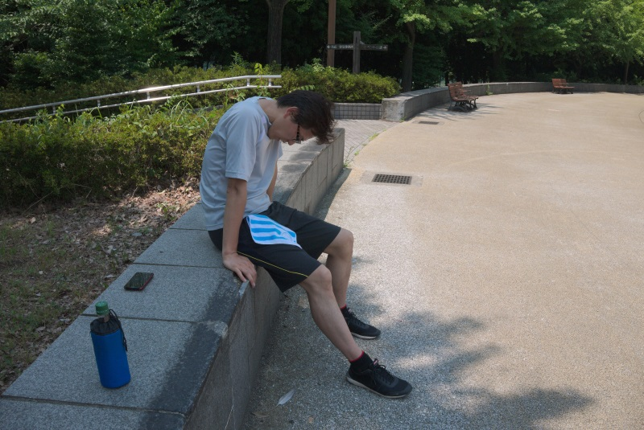

:date: 2017-07-09 21:30
:tags: Diet, バターコーヒー

==================================================
完全無欠ダイエット - 3ヶ月の結果と運動
==================================================

`シリコンバレー式 自分を変える最強の食事`_ を読んで実践して目標体重に到達しました！

以下の2つのblogの続きです。

* :doc:`../bulletproof-diet-try/index`
* :doc:`../bulletproof-diet-try2/index`

.. contents::
   :local:

まとめ
=======

- ちょうど3ヶ月で7kg減りました
- 食事は、朝にバターコーヒー、昼夜は肉野菜。炭水化物は毎日夜に少量
- 運動は月に2回の高強度インターバルトレーニング、あと毎日1万歩

.. _シリコンバレー式 自分を変える最強の食事: http://amzn.to/2qkPXec

3ヶ月やった結果
==================

3ヶ月で **7kg** 減りました。

.. csv-table::
   :stub-columns: 1
   :header-rows: 1
   :class: table-hover table-bordered

   , 体重, BMI, 体脂肪
   4/9, 75.2kg, 24.0, 23.8%
   5/9, 73.0kg(-2.2kg),23.3(-0.7), 20.5%(-3.3%)
   6/9, 70.2kg(-2.8kg),22.4(-0.9), 19.6%(-0.9%)
   7/9, 68.2kg(-2.0kg),21.8(-0.6), 18.7%(-0.9%)
   開始時との差, (-7.0kg), (-2.2), (-5.1%)

   体重

   体脂肪率

前回blogからの1ヶ月の間に、1週間の出張などありましたが、バターコーヒーの道具と材料を出張先まで持っていった成果か、大きな増加もなく順調に減少しました。

前回blogで以下の様に単純計算予測しましたが...

  * 目標BMI=22の68.9kgになるのは、6月22日
  * 68.0kgになるのは7月3日

68.9kgは7月5日（13日遅れ）、68.0kgは今日だとして、7月9日（6日遅れ）でした。まあそんなもんだよね。

運動
======

運動は毎日1万歩前後歩くのは継続してます。通勤だけです。

`シリコンバレー式 自分を変える最強の食事`_ では、筋肉を付けるために、高強度トレーニングを週1回、ウエイトトレーニングを週3回、やるのがお勧めされてます。それを読んでやりました。

やったのは、高強度インターバルトレーニング。色々あって3ヶ月で3回しか出来なかったので、筋肉はだいぶ落ちてそう。

やり方は以下の通り。

* 30秒全速力で走って90秒休む
* これを最大15分間行う（8回走れる計算）

時間の計測を妻にお願いした都合もあって（ストップウォッチの付いた腕時計を持ってないので）、円形のフィールドがあれば同じ場所がゴールになるのでよさそう、ということで公園に行って走ってます。

1回目

.. raw:: html

   <blockquote class="twitter-tweet" data-lang="ja">
高強度インターバルトレーニングやった。30秒全速力で走って90秒休む、を最低10分、最大15分間。4セット8分で力尽きた...。その後30分以上へばってるところ
&mdash; Takayuki Shimizukawa (@shimizukawa) <a href="https://twitter.com/shimizukawa/status/855632622487093248">2017年4月22日</a></blockquote>
   

2回目

* 2回目はストレートでやってみた。
* 実施回数は4回（2報復）。
* 時間が分からないのと、足下が砂っぽくて全力疾走には向かなかった。
* 実施後は帰ってから20分くらい動けなかった

3回目

* 3回目は1回目と同じ円形の場所でやった
* 実施回数は4回（4周）
* 実施後は10分くらいその場で動けなかったし、帰るのもつらかった
* 暑くなったからなのか、体調なのか、筋肉が落ちたからなのか、1回目よりキツかった

   1週目終盤（元気）

   2週目終盤（ちょっと疲れ）

   4週目（限界でショートカット）

   終わった後（10分動けなかった）

帰り道、家までの15分間は、だいぶ限界でフラフラしてました。

.. raw:: html

   <blockquote class="twitter-tweet" data-lang="ja">
さすがにこの時期この時間の高強度は自殺行為なのでは。
&mdash; (び) (@bizenn) <a href="https://twitter.com/bizenn/status/883903305881067521">2017年7月9日</a></blockquote>
   

はい。

涼しくなるまで別のトレーニングやろう。ウェイトトレーニングどこでやろうかな。

運動した日の食事と睡眠
----------------------

「夜に炭水化物を多めにとって、睡眠をいつもより多くとることで筋肉を付ける」

はい。

関連blog
========

* :doc:`../bulletproof-diet-try1/index`
* :doc:`../bulletproof-diet-try2/index`
* :doc:`../bulletproof-coffee/index`

