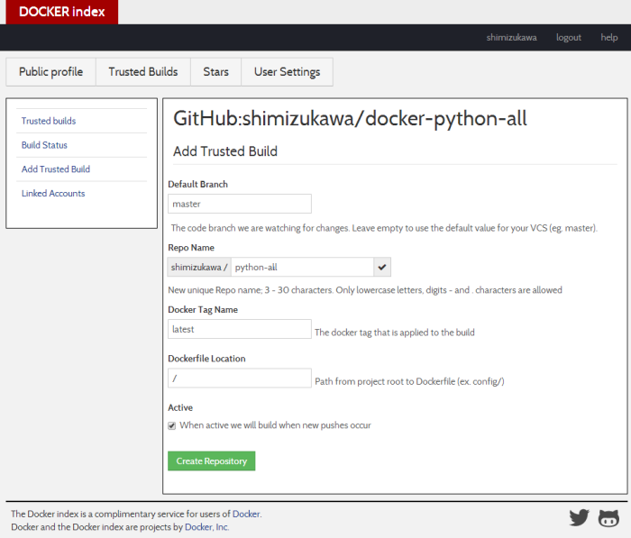
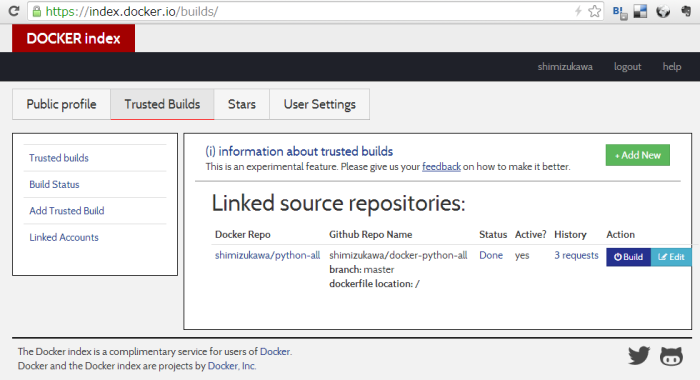
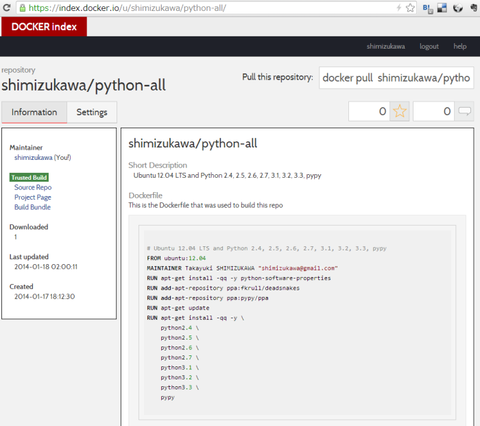

:date: 2014-01-17 23:50
:tags:

=================================================================
2014/01/17 Docker公式リポジトリでTrustedビルドimageを作成する手順
=================================================================

`Python mini Hack-a-thon 雪山合宿`__ に来てます。現在1/17 26:50。

.. __: http://connpass.com/event/3703/

Dockerでimageを作って公式リポジトリに登録したので手順メモを書きました。

前提条件
========

* Dockerを動かす環境はVagrantで構築
* Vagrant: 1.4.3
* OS: Ubuntu-12.04 LTS
* Docker: version 0.7.6, build bc3b2ec

Vagrantを起動する
=================

Vagrantfile::

   # -*- mode: ruby -*-
   # vi: set ft=ruby :

   VAGRANTFILE_API_VERSION = "2"

   Vagrant.configure("2") do |config|
     config.vm.box = "ubuntu-12.04-x64"
     config.vm.box_url = "http://files.vagrantup.com/precise64.box"
     config.vm.provision "docker"
   end

vagrant up::

   $ vagrant up
   Bringing machine 'default' up with 'virtualbox' provider...
   [default] Importing base box 'ubuntu-12.04-x64'...
   [default] Matching MAC address for NAT networking...
   [default] Setting the name of the VM...
   [default] Clearing any previously set forwarded ports...
   [default] Fixed port collision for 22 => 2222.
   [default] Clearing any previously set network interfaces...
   [default] Preparing network interfaces based on configuration...
   [default] Forwarding ports...
   [default] -- 22 => 2222 (adapter 1)
   [default] Booting VM...
   [default] Waiting for machine to boot. This may take a few minutes...
   [default] Machine booted and ready!
   [default] Mounting shared folders...
   [default] -- /vagrant
   [default] Running provisioner: docker...
   [default] Installing Docker (latest) onto machine...

Dockerfileを用意する
====================

Vagrantfileと同じディレクトリにDcokerfileを用意します。

Dockerfile::

   # Ubuntu 12.04 LTS and Python 2.4, 2.5, 2.6, 2.7, 3.1, 3.2, 3.3, pypy
   FROM ubuntu:12.04
   MAINTAINER Takayuki SHIMIZUKAWA "shimizukawa@gmail.com"
   RUN apt-get install -qq -y python-software-properties
   RUN add-apt-repository ppa:fkrull/deadsnakes
   RUN add-apt-repository ppa:pypy/ppa
   RUN apt-get update
   RUN apt-get install -qq -y \
       python2.4 \
       python2.5 \
       python2.6 \
       python2.7 \
       python3.1 \
       python3.2 \
       python3.3 \
       pypy

Dockerイメージをビルドする
==========================

VM環境にログインしてdocker buildします。

``/vagrant/`` ディレクトリがログイン前のVagrantfileとDockerfileがあるディレクトリをマウントしているので、/vagrant/ で実行します。

ビルドするときに任意のリポジトリ名を設定しておいて、あとでIDではなく名前で扱えるようにします。
リポジトリ名には ``ユーザー名/リポジトリ名`` の書式で好きな名前を指定します。とりあえずユーザー名を省略して ``python-all`` というリポジトリ名にしておきます。

docker build::

   $ vagrant ssh
   vagrant@precise64:~$ cd /vagrant/
   vagrant@precise64:/vagrant$ sudo docker build -t python-all .
   Uploading context 81.92 kB
   Uploading context
   Step 1 : FROM ubuntu:12.04
   Pulling repository ubuntu
   8dbd9e392a96: Pulling image (12.04) from ubuntu, endpoint: https://cdn-registry-8dbd9e392a96: Download complete
    ---> 8dbd9e392a96
   Step 2 : MAINTAINER Takayuki SHIMIZUKAWA "shimizukawa@gmail.com"
    ---> Running in 661cd7d9d425
    ---> ef6acb3727da
   Step 3 : RUN apt-get install -qq -y python-software-properties
    ---> Running in ef86eede816b
    ---> d161837ff918
   Step 4 : RUN add-apt-repository ppa:fkrull/deadsnakes
    ---> Running in 5d733ed86ac0
    ---> 23219187c053
   Step 5 : RUN add-apt-repository ppa:pypy/ppa
    ---> Running in a2db781064c8
    ---> 7a703485a57a
   Step 6 : RUN apt-get update
    ---> Running in b9e3664bb265
    ---> fdf62b5cbfd8
   Step 7 : RUN apt-get install -qq -y    python2.4    python2.5    python2.6    python2.7    python3.1    python3.2    python3.3    pypy
    ---> Running in c16bd95ffe23
    ---> 584371a86c76
   Successfully built 584371a86c76

(長いのでだいぶ省略しました)

これでPython-2.4から3.3までをインストールしたイメージ ``584371a86c76`` ができあがりました。

docker images::

   vagrant@precise64:/vagrant$ docker images
   REPOSITORY          TAG                 IMAGE ID            CREATED             VIRTUAL SIZE
   python-all          latest              584371a86c76        57 seconds ago      450.9 MB
   <none>              <none>              67de15d531a5        3 hours ago         223.7 MB
   ubuntu              12.04               8dbd9e392a96        9 months ago        128 MB

``python-all`` を使ってコンテナを起動します。

docker run::

   vagrant@precise64:/vagrant$ docker run -t -i python-all /bin/bash
   root@e94fcf40e739:/# compgen -c python
   python3.3
   python3.1
   python3.3m
   python3.2mu
   python3.2
   python2.6
   python2.4
   python2.5
   python2
   python2.7
   python

インストールされてました。起動とか確認して大丈夫そうならDockerfileの内容はOKでしょう。

githubに登録する
================

index.docker.ioにTrustedイメージとして登録するには、Dockerfileを含むリポジトリをgithubで公開しておく必要があります。ということで作成したVagrantfileとDockerfileをdocker-python-allという名前で登録しました。

とりあえずgithubにdocker-python-allというリポジトリを作成。

Vagrantの母艦の方でgitにコミットしてgithubにpushします::

   $ git init
   $ git add Vagrantfile Dockerfile
   $ git commit -m "initial"
   $ git remote add origin https://github.com/shimizukawa/docker-python-all.git
   $ git push origin master

index.docker.io でビルドする
============================

`Share Images via Repositories`__ に書いて有るとおりです。

.. __: http://docs.docker.io/en/latest/use/workingwithrepository/#to-setup-a-trusted-build

1. `Docker Index account`_ を作成してログイン
2. アカウントメニューでGitHubアカウントを関連づける
3. `Trusted builds`_ ページで　Add New して設定画面へ
4. 対象のGitHubプロジェクトを選ぶ(この例ではshimizukawa/docker-python-all)
5. Default Branchをmasterを入力(デフォルト値です)
6. Repo NameにDockerで使うリポジトリ名を入力。デフォルトはGitHubのリポジトリ名docker-python-allが入力されているが、 ``shimizukawa/python-bulid`` にしたいのでちょっと書き換える。
7. Docker Tag Name はlatestのまま。
8. Dockerfile Location はさきほどgitリポジトリの / に保存したので / のまま。

.. _Docker Index account: https://index.docker.io/
.. _Trusted builds: https://index.docker.io/builds/

   `Trusted builds`_ 設定画面

設定が終わるとサーバーのリソースが空き次第、docker buildが実行されてimageが作成されます。

   `Trusted builds`_ ステータス画面

ビルドを待ってる間にimageの説明文を設定しておきます。上記のステータス画面で ``Docker Repo`` にあるリンクから `shimizukawa/python-all`_ に遷移してSettingsタブでDescriptionを設定しておきます。これはあとで docker search したときに表示されます。

.. _shimizukawa/python-all: https://index.docker.io/u/shimizukawa/python-all/

   `shimizukawa/python-all`_ 画面

しばらくして `Trusted builds`_ ステータス画面でStatusがDoneになれば完了。

docker search と docker pull
============================

Vagrant環境で、dockerリポジトリのイメージを検索してみます。

docker search::

   $ vagrant ssh
   vagrant@precise64:/vagrant$ docker search python-all
   NAME                     DESCRIPTION                                     STARS     OFFICIAL   TRUSTED
   shimizukawa/python-all   Ubuntu 12.04 LTS and Python 2.4, 2.5, 2.6,...   0                    [OK]

はい。TRUSTED、OK。

docker pullして使います::

   vagrant@precise64:/vagrant$ docker pull shimizukawa/python-all
   Pulling repository shimizukawa/python-all
   dd6848c8a762: Pulling dependent layers
   8dbd9e392a96: Download complete
   dfd192db4c11: Download complete
   2064c6fb055e: Download complete
   ...

docker run::

   vagrant@precise64:/vagrant$ docker run -t -i shimizukawa/python-all /bin/bash
   root@e94fcf40e739:/# compgen -c python
   python3.3
   python3.1
   python3.3m
   python3.2mu
   python3.2
   python2.6
   python2.4
   python2.5
   python2
   python2.7
   python

問題なさそう。

他のDockerfileを作る時に ``FROM shimizukawa/python-all`` とすれば、このコンテナを元に環境を作ることが出来るので便利。

