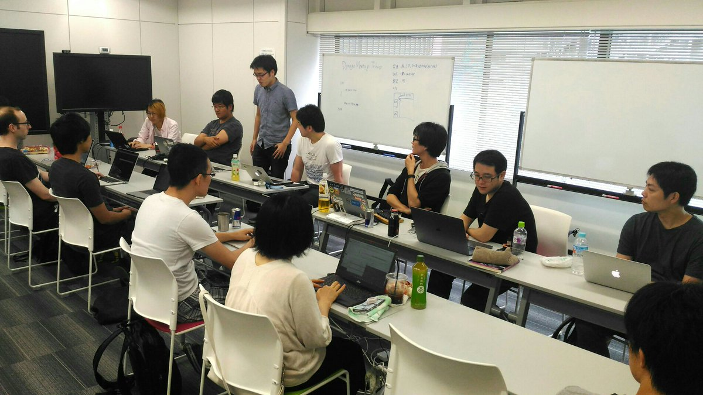

:date: 2017-08-26 17:30
:tags: Python, django, hack-a-thon

==================================================================
Django Redshift Backend の更新 - Django Meetup Tokyo #10 #djangoja
==================================================================

django-redshift-backend_ は、Djangoから `Amazon Redshift`_ を操作するためのデータベースバックエンドです。
今日は、 `Django Meetup Tokyo #10`_ の開催に合わせて、溜まったIssue/PRの対応を進めました。

.. _django-redshift-backend: https://pypi.python.org/pypi/django-redshift-backend
.. _Amazon Redshift: https://aws.amazon.com/jp/redshift/

今日の作業で対応された新機能、バグはこんな感じです。

* `#15`_,`#21`_: Redshiftに無いCHECK制約を使わないように修正
* `#20`_: CREATE TABLEのsortkey対応
* `#18`_: Django 1.9 から内部実装が変わってて動作しなくなっていたmigrateの修正

.. _#15: https://github.com/shimizukawa/django-redshift-backend/pull/15
.. _#16: https://github.com/shimizukawa/django-redshift-backend/issues/16
.. _#18: https://github.com/shimizukawa/django-redshift-backend/issues/18
.. _#20: https://github.com/shimizukawa/django-redshift-backend/pull/20
.. _#21: https://github.com/shimizukawa/django-redshift-backend/issues/21

そして進行中がもうすこし。

* `#10`_,`#23`_: Redshift TIMEZONEサポート
* `#24`_: UUIDField サポート

.. _#10: https://github.com/shimizukawa/django-redshift-backend/issues/10
.. _#23: https://github.com/shimizukawa/django-redshift-backend/pull/23
.. _#24: https://github.com/shimizukawa/django-redshift-backend/pull/24

TIMEZONEのサポートはうかつに入れると既存の利用者から悲鳴が上がりそうなのでちょっと慎重になってます。
Django的には問題なさそうなんだけど、DataTimeFieldで作ったDB側のカラムが、既存テーブルはTIMESTAMP型(TIMEZONEなし)、新しいテーブルはTIMESTAMPTZ(TIMEZONEあり)になって混在しちゃいそう。運用者から悲鳴でるやつ。

このあたり対応したらリリースする予定です。

----------

昨年、PyCon JP 2016 で `仕事で使うちょっとしたコードをOSSとして開発メンテしていく - Django Redshift Backend の開発`_ という発表をしてから、あまりまとまった時間が取れてませんでした。色々申し訳なくなってきたタイミングで Django Meetup Tokyo を開催してくれた `@horikiky`_ に感謝！

.. _仕事で使うちょっとしたコードをOSSとして開発メンテしていく - Django Redshift Backend の開発: http://www.freia.jp/taka/talks.html#oss-django-redshift-backend
.. _@hirokiky: https://twitter.com/hirokiky

Django Meetup Tokyo #10 のようす
=================================

:イベント: `Django Meetup Tokyo #10`_
:参加者: 16人くらい
:会場: BeProud社（新宿）
:tag: `#djangoja`_

.. _#djangoja: https://twitter.com/search?q=djangoja
.. _Django Meetup Tokyo #10: https://django.connpass.com/event/62656/

   Django Meetup Tokyoのようす

* Django Meetup Tokyoに初参加
* 補欠(22/20)だったけど、実際に来たのは16人だった
* なんかDjangoConやろうぜ！、っていう話がチラっと聞こえてきたよ
* Django-ja のSlackの入り口が作られた https://djangoja-slackin.herokuapp.com
* djangoja slack に参加してみた。プライベートでは7つ目くらいのSlackチーム

インスタ映えするランチ

.. raw:: html

   <blockquote class="twitter-tweet" data-lang="ja">
インスタ映え (@ ビストロ熟肉 in 新宿区, 東京都) <a href="https://t.co/DSnEqfEQPw">https://t.co/DSnEqfEQPw</a> <a href="https://t.co/x5Hp8BsYzA">pic.twitter.com/x5Hp8BsYzA</a>
&mdash; Takayuki Shimizukawa (@shimizukawa) <a href="https://twitter.com/shimizukawa/status/901293331736653824">2017年8月26日</a></blockquote>
   

用事で、成果発表まで残らず17:30で撤収。成果発表ききたかったー

