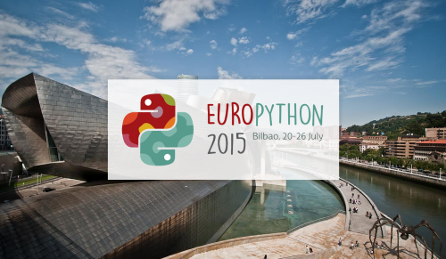

:date: 2015-8-10 23:55
:categories: ['Python', 'EuroPython', 'PyCon', 'Sphinx']
:body type: text/x-rst

====================================================
2015/08/10 EuroPython に行ってきました（観光編）
====================================================

*Category: 'Python', 'EuroPython', 'PyCon', 'Sphinx'*

   EuroPython 2015

`EuroPython 2015`_ に参加しにスペインへ行ってきました。詳細は `第3回　EuroPython 2015参加レポートと，Sphinxに関する発表（前編）`_ でレポートしています。このblogでは、観光したところについて写真で紹介します。

.. _EuroPython 2015: https://ep2015.europython.eu/

.. _第3回　EuroPython 2015参加レポートと，Sphinxに関する発表（前編）: http://gihyo.jp/news/report/01/overseas-pycon-presentation-training-2015/0003

.. figure:: bilbao-location.*

   ビルバオの場所。フランス国境が近い。

   ビルバオはバスク地方の1都市。
   日本からフランス経由で18時間（フライト時間は合計14時間くらい）。
   GMT+2（夏時間）。

   主言語はスペイン語。カンファレンスは英語だったけど、それ以外では、ホテルや観光地以外では英語が使えないことが多い。

.. figure:: bar-day0.*

   スペインバル。これはビルバオの隣のサンセバスチャンのお店。

   たくさんの種類のピンチョス売ってた。1つ1.5ユーロから2ユーロくらい。

   * こんにちは = Hola オラー
   * これください = ウナ エスト ポルファボーレ
   * ビール1杯ください = ウナ セルベッサ ポルファボーレ
   * お会計お願いします = ラ クエンテ ポルファボーレ

   これだけ覚えてバル巡りした

.. figure:: tram.*

   トラム（路面電車）。

   一律1.5ユーロ（200円弱）だけど、Barikカード（日本のSuicaっぽいやつ）を使うと半額くらいになる。

   滞在中はストライキしていて運行本数がだいぶ少なかったみたい。

.. figure:: pintxos.*

   ビルバオのPankoというお店のピンチョスセット。

   8つで13ユーロ。パンと前菜付き。ワインは1杯2ユーロ。

   ピンチョスの1つは寿司だった（右の黒っぽいやつ）

.. figure:: guggenheim.*

   グッゲンハイム美術館

   ジェフ・クーンズのパピー（花で作られた巨大な子犬）

   美術館自体が現代建築のなかでとても有名なものらしい。

.. figure:: guggenheim2.*

   グッゲンハイム美術館の展示物（撮影可）

   さくらんぼ？なんだろうこれ

.. figure:: sansebastian.*

   サンセバスチャンの街（旧市街）

   旧市街の方が町並みが綺麗だった。道は狭かったし観光客も多かった。

.. figure:: sansebastian-sea1.*

   サンセバスチャンの海

   日陰は涼しく、日向は暑い。たくさんの海水浴客がきてた

.. figure:: sansebastian-sea2.*

   場違い

.. figure:: funicular.*

   フニクラで丘の上へ

   ロープで2台を吊って、1台の重さでもう1台が上がる、ケーブルカー。

.. figure:: boart.*

   丘の上で水路のボートにのった

   1周3分の水路をめぐるボート。2人で3.6ユーロ（約500円）。

   景色はとても良かった！

.. figure:: startrek.*

   STARTREKのプラモ売ってた

   サンセバスチャンのおもちゃ屋さん、STARTREK推しすぎでしょ。

.. figure:: bar-day4.*

   サンセバスチャンのバル

   今回、一番ピンチョスの種類と数が多いお店だった。カウンター全部ピンチョス。

.. figure:: bar-day4-2.*

   ホテル近くのバル

   生ハムフランスパンと、色々乗った何かのピンチョス。あとセルベッサ（ビール）。

.. figure:: bar-day4-2b.*

   イカフリットたっぷりピンチョス

   このイカフリットが柔らかくて美味しかった。

.. figure:: vizcaya.*

   ビルバオのビスカヤ橋

   1893年建築、長さ164m、高さ45m。

   ゴンドラを運搬橋からワイヤーで吊って、車や人を運ぶ。片道0.3ユーロ（約40円）。

.. figure:: vizcaya2.*

   ビスカヤ橋の運搬橋

   観光用で、エレベータで上って対岸まで歩いてわたれる。片道5ユーロ（約650円）。

   板張りで隙間から50メートル下の川が見える。ゴンドラが動くとガタガタ音がしてちょっと揺れる。

.. figure:: vizcaya3.*

   ビスカヤ橋の運搬橋を歩いてわたった。こわい！

   50メートルって、ビルの15階くらい？こわい！

.. figure:: bar1.*

   バル巡り1 - ビルバオ旧市街

   スペイン語しか話せないお店。
   でも、これください、だけ言えればなんとかなる。

.. figure:: bar1b.*

   血のソーセージとスペインオムレツ

   血のソーセージには香辛料がたくさんはいってた。食べやすくて美味しかった。
   ドイツで食べた血のソーセージよりずっと美味しいかった気がする。

.. figure:: bar2.*

   バル巡り2 - ビルバオ市街

   左のピンチョスはスパイシーなミンチ肉が入ってるたこ焼きっぽいやつ。

   右は生ハム、チーズ、バルサミコ、トマト、かな。美味しかった。

.. figure:: bar3.*

   バル巡り3 - ホテル近く

   これまで巡った中で一番普通な感じ。

   これでバル巡りは終了。

.. figure:: la-barraca1.*

   レストラン La Barraca （ワイン）

   最後の夜に行ってきました。お店の人が英語分からず、適当に赤ワイン頼んだつもりがロゼが出てきた。

.. figure:: la-barraca2.*

   レストラン La Barraca （サラダ）

   巨大なホワイトアスパラとチーズの乗ったサラダ（ハーフ）。

   ハーフのサラダ、食べきれなかった。巨大。

.. figure:: la-barraca3.*

   レストラン La Barraca （ミックスフライ）

   これもハーフ。2人前くらいある。

   左手前はアサリの貝にホワイトソースを盛って揚げたやつ。美味しかった。

   右はイカのフリット。超柔らかくて超美味しかった。

.. figure:: la-barraca4.*

   レストラン La Barraca （シーフードパエリア）

   レストランに来た目的はこれ。
   バルのピンチョスも飽きなかったけど、パエリアを食べてみたかった。

   妻と2人で行ったので2人前頼んだけど、多分1人前でも多かった。美味しかった。

