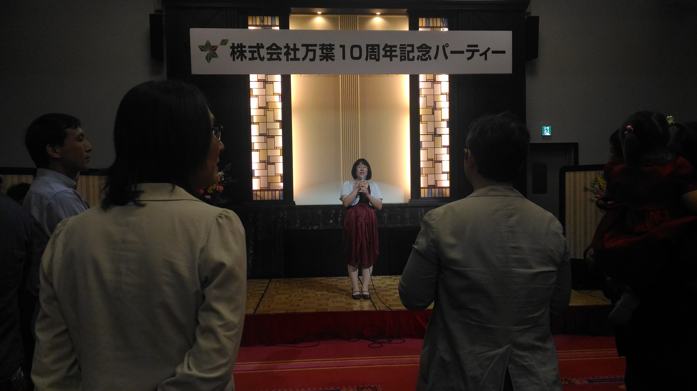
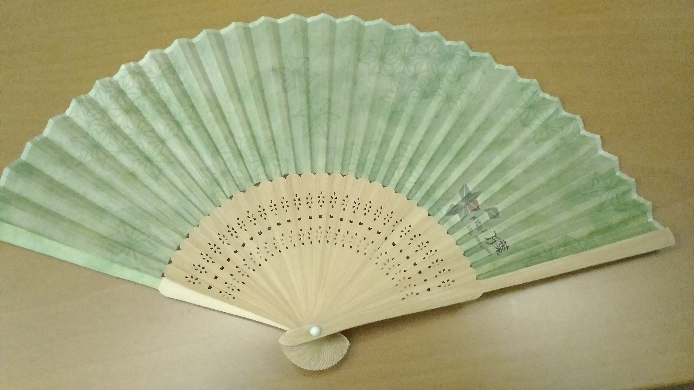
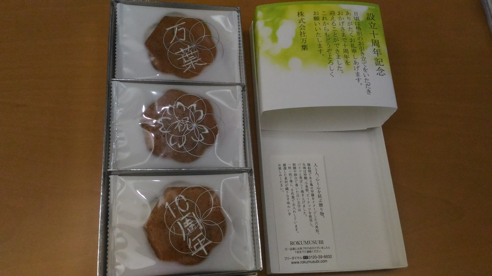

:date: 2017-04-15 17:00
:categories: ['万葉', 'party']
:body type: text/x-rst

============================================================
2017/04/14 #everyleaf 万葉10周年パーティーに参加してきました
============================================================

*Category: '万葉', 'party'*

万葉さん、10周年おめでとうございます！

ということで、 `株式会社 万葉`_ さんの10周年記念パーティーに参加してきました。
今回は、フリーランス時代 [#freelance]_ に万葉さんのお仕事をさせていただいてたご縁で、ご招待いただきました。

「つい先日、6周年記念の `万葉.rb`_ に参加したばかりなのに [#6th-sphinx]_ 、もう10周年？ウソでしょ！？」と、10周年パーティーの連絡をもらったときだいぶ驚きました。時間たつの早すぎ。

当日は、18時半開始なのに間違えて19時に会場に到着して、オープニング見れず。残念 & スミマセン。
当時仕事で関わった方々にご挨拶しきれなかったのもスミマセン>< [#retrieva]_

.. raw:: html

   <blockquote class="twitter-tweet" data-lang="ja">
万葉さんの10周年パーティー！盛り上がってるなー。前回6周年の万葉.rbからもう4年も経ってるの早すぎ (@ 学士会館 - <a href="https://twitter.com/gakushikaikan">@gakushikaikan</a> in 千代田区, 東京都) <a href="https://t.co/EVUdLaA5vu">https://t.co/EVUdLaA5vu</a> <a href="https://t.co/5LSWmlC7hl">pic.twitter.com/5LSWmlC7hl</a>
&mdash; Takayuki Shimizukawa (@shimizukawa) <a href="https://twitter.com/shimizukawa/status/852843350940143617">2017年4月14日</a></blockquote>
   

上の写真は、万葉さん10年の軌跡を紹介する動画です。しっかり作ってあってすごい。神保町にオフィスを構えている理由が、 **美味しいお店が多いから** ってｗ

パーティーは非常に盛況でした。
途中の余興として、東大かるた会の4段の方と5段の方（すみません、名前失念）が競技かるたをやるのを生で見てきました。
「場に可能性のある札が2枚ある場合、牽制のために相手側の札をとりに行きつつ札が確定した時点で手元の正しい方の札を取りにいく」って、解説してもらわないと何が起きてるのかまったく判らなかったけど、なんか凄かった！暗記力と瞬発力と判断力が要るなあ。

   締めのご挨拶は久保専務

   * 「マイクスタンドがあると歌っちゃうので、スタンド外して手持ちにしますね」
   * 「万葉は "東大かるた会" が母体の会社で、立ち上げ時に同会の先輩たちが株主になってくれて無借金」

東大かるた会、なるほど: `Rubyist Magazine - Rubyist Hotlinks 【第 33 回】 大場さん夫妻 前編`_

最後に、万葉メンバーにお見送りいただいて、ノベルティまでもらってしまいました。

   万葉ロゴいり扇子、雰囲気あるなあ

   メッセージ入り御菓子、かわいい

10周年、おめでとうございます！次の記念パーティーも楽しみにしてます！

-------------------

.. [#freelance] 2010年頃。BP入社後も閉業してないけど、個人事業主としては執筆くらいしかやってないなー

.. [#6th-sphinx] 余談ですが、6周年の万葉.rbではSphinxの紹介LTをしてました: `Sphinx紹介@万葉.rb`_

.. [#retrieva] 某 PyCon JP スタッフをしていた知り合いが来ててびっくりした。仕事繋がりだそうで、向こうも「Pythonの清水川がなんでRubyの会社のパーティーに？」って言ってたｗ （名前は伏せときます）

.. _株式会社 万葉: https://everyleaf.com/
.. _万葉.rb: https://togetter.com/li/484192
.. _Rubyist Magazine - Rubyist Hotlinks 【第 33 回】 大場さん夫妻 前編: http://magazine.rubyist.net/?0044-Hotlinks
.. _Sphinx紹介@万葉.rb: http://www.freia.jp/taka/slides/everyrb-6th/index.html#id1

