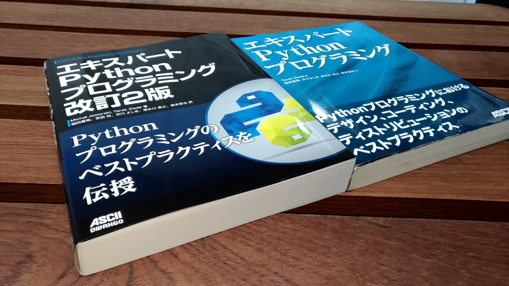

:date: 2018-02-17 17:00:00
:tags: python, expertpython

==================================================
『エキスパートPythonプログラミング 改訂2版』の紹介
==================================================

清水川が翻訳に参加した `エキスパートPythonプログラミング 改訂2版`_ (原題 `Expert Python Programming - Second Edition`_) が2018/2/26にアスキードワンゴさんより発売されます！

.. figure:: expert-python-programming-2nd-ja-cover.*

   エキスパートPythonプログラミング 改訂2版 カバー

:タイトル: `エキスパートPythonプログラミング 改訂2版`_
:原題: `Expert Python Programming - Second Edition`_
:著者: Michał Jaworski, Tarek Ziadé
:翻訳: 稲田直哉、芝田将、渋川よしき、清水川貴之、森本哲也
:出版社: KADOKAWA（アスキードワンゴ）
:Price: 3,600円+税
:ISBN-13: 978-404-8930611
:購入: Amazon_, `カドカワストア`_

.. _`エキスパートPythonプログラミング`: https://www.kadokawa.co.jp/product/301801000262/
.. _`Expert Python Programming - Second Edition`: https://www.packtpub.com/application-development/expert-python-programming-second-edition
.. _`Amazon`: http://amzn.to/2o5JRvZ
.. _カドカワストア: https://store.kadokawa.co.jp/shop/g/g301801000262/

どんな本?
==========

   (左)エキスパートPythonプログラミング 改訂2版、(右)同 1版

   見本誌が届いたので1版と並べて比較してみました

1版は、「Pythonを知っている」状態から「Pythonをマスターしている」状態に成長するための本であり、また、他の言語をある程度マスターしている人がPythonの世界でどのように活動していけばいいのかを知るのに最も適した本でした（詳しくは :doc:`../717/index` を参照）。

1版と改訂2版で、特に変わった箇所は以下:

- Pythonのバージョンは2.7->3.6に更新（原著は2.5->3.5)
- 章削除: buildoutの章
- 章追加: 6章: コードをデプロイする: Twelve-Factor、Fabric、デプロイ、モニタリング
- 章追加: 7章: 別言語で作るPython拡張: C拡張、Cython、ctypes
- 章追加: 13章: 並列実行: マルチスレッド、マルチプロセス、非同期プログラミング
- 8章: Mercurial -> Git、 buildbot -> JenkinsやCIサービス

全体的にはこんな感じ:

- めっちゃ読み応えのある実践的なネタ満載
- ドキュメントに書いてある話や、初級中級レベルの紹介はなくなった
- 高度な話題や、Pythonの場合にどうするかという話題が増加
- ページ数は100ページ増量、さらに情報の密度はアップ
- 2017年末の情報に追従（原著は2015年末）
- お値段は1版から据え置き！

目次
=====

改訂2版の目次です。

1版からの変更がない部分に **(変更無し)** 等のマークを入れてありますが、変更無しとした箇所についても、1版で誤訳していた部分や、読みづらかった部分など、翻訳自体の見直しは行っています。

.. literal-block::
   :language: rst

  * 序文

    * はじめに
    * 日本語翻訳出版によせて（初版） **(変更なし)**
    * 日本語翻訳出版によせて（改訂2版）
    * 日本語版まえがき

  * 1章 現在のPythonのステータス

    * われわれは今どこにいて、どこに行こうとしているのか？
    * Pythonはなぜ/どのように変化するのか？
    * PEP文書から最新の変更情報を得る
    * 本書執筆時点でのPython 3の浸透度合い
    * Python 3とPython 2の主な違い

      * なぜそれを気にする必要があるのか？
      * 主な構文上の違いと、よくある落とし穴
      * バージョン間の互換性を保つ時によく利用されるツールやテクニック

    * CPython以外の世界

      * なぜCPython以外も考慮すべきなのか
      * Stackless Python
      * Jython
      * IronPython
      * PyPy

    * 現代的なPython開発の手法

    * アプリケーションレベルでのPython環境の分離

      * なぜ分離が必要なのか？
      * 人気のあるソリューション
      * どのツールを選択すべきか？

    * システムレベルでの環境の分離

      * Vagrantを使った仮想的な開発環境
      * コンテナ化 VS 仮想化

    * 人気のある生産性向上ツール

      * 拡張インタラクティブセッション - IPython, bpython, ptpythonなど
      * インタラクティブ・デバッガー

    * 役に立つリソース
    * まとめ

  * 2章 構文ベストプラクティス -- クラス以外

    * Pythonの組み込み型

      * 文字列とバイト列
      * コレクション

    * 高度な文法

      * イテレータ
      * "yield"文（ジェネレータ）
      * デコレータ **(一部変更なし)**
      * コンテキストマネージャ - "with"構文 **(一部変更なし)**

    * 知っておくべきその他の文法

      * "for … else"節
      * 関数アノテーション

    * まとめ

  * 3章 構文ベストプラクティス: クラスの世界

    * 組み込みクラスのサブクラス化 **(ほぼ変更なし)**
    * スーパークラスからメソッドへのアクセス

      * 旧スタイルクラスとPython 2の "super"
      * Pythonのメソッド解決順序（MRO）を理解する **(ほぼ変更なし)**
      * "super" の落とし穴 **(ほぼ変更なし)**
      * ベストプラクティス **(ほぼ変更なし)**

    * 高度な属性アクセスのパターン

      * ディスクリプタ **(内容は削減、かなり分かりやすくなった)**
      * プロパティ **(ほぼ変更なし)**
      * スロット **(ほぼ変更なし)**

    * メタプログラミング

      * デコレータ - メタプログラミングの方法
      * クラスデコレータ
      * "__new__()" メソッドによるインスタンス作成プロセスのオーバーライド **(ほぼ変更なし)**
      * メタクラス
      * コード生成のTips

    * まとめ

  * 4章 良い名前を選ぶ

    * PEP 8と命名規則のベストプラクティス **(変更なし)**

      * どうして、いつPEP 8に従うのか **(変更なし)**
      * PEP 8 のその先へ - チーム固有のスタイルガイドライン **(変更なし)**

    * 命名規則のスタイル **(変更なし)**

      * 変数 **(変更なし)**

    * 名前付けガイド **(変更なし)**

      * ブール値の名前の前にhasかisをつける **(変更なし)**
      * コレクションの変数名は複数形にする **(変更なし)**
      * 辞書型に明示的な名前をつける **(変更なし)**
      * 汎用性の高い名前を避ける **(変更なし)**
      * 既存の名前を避ける **(変更なし)**

    * 引数のベストプラクティス **(変更なし)**

      * 反復型設計を行いながら引数を作成する **(変更なし)**
      * 引数とテストを信頼する **(変更なし)**
      * 魔法の引数である ``*args`` と ``**kwargs`` は注意して使用する **(変更なし)**

    * クラス名 **(変更なし)**
    * モジュール名とパッケージ名 **(変更なし)**
    * 役に立つツール **(変更なし)**

      * Pylint **(変更なし)**
      * pycodestyleとflake8

    * まとめ

  * 5章 パッケージを作る

    * パッケージ作成

      * 混乱するPythonパッケージングツールの状態
      * プロジェクトの設定 **(変更なし)**
      * カスタムセットアップコマンド
      * 開発時にパッケージを利用する

    * 名前空間パッケージ

      * なぜこれが便利なのか？
      * PEP 420 -  暗黙の名前空間パッケージ
      * 以前のバージョンのPythonにおける名前空間パッケージ

    * パッケージのアップロード

      * PyPI – Python Package Index
      * ソースパッケージとビルド済みパッケージ

    * スタンドアローン実行形式

      * スタンドアローンの実行形式が便利な場面
      * 人気のあるツール
      * 実行可能形式のパッケージにおけるPythonコードの難読化

    * まとめ

  * 6章 コードをデプロイする

    * The Twelve-Factor App
    * Fabricを用いたデプロイの自動化

    * 専用のパッケージインデックスやミラーを用意する

      * PyPIをミラーリングする
      * パッケージを使ったデプロイ

    * 一般的な慣習と実践

      * ファイルシステムの階層
      * 環境の分離
      * プロセス監視ツールを使う
      * アプリケーションコードはユーザー空間で実行しよう
      * リバースHTTPプロキシを使う
      * プロセスのgracefulリロード

    * 動作の追跡とモニタリング

      * エラーログ収集 - sentry/raven
      * モニタリングシステムとアプリケーションメトリクス
      * アプリケーションログの処理
      * ログを処理するツール

    * まとめ

  * 7章 他言語によるPythonの拡張

    * 他言語 = C/C++

      * C/C++ による拡張

    * 拡張を使う理由

      * コードのクリティカルな部分の性能を向上する
      * 別の言語で書かれたコードを利用する
      * サードパーティー製の動的ライブラリを利用する
      * カスタムのデータ構造を作る

    * 拡張を書く

      * ピュアC拡張
      * Cython

    * 拡張のデメリット

      * 増加する複雑さ
      * デバッグ

    * 拡張を使わずに動的ライブラリを利用する

      * ctypes
      * CFFI

    * まとめ

  * 8章 コードの管理

    * バージョン管理システム

      * 中央集中型システム **(変更なし)**
      * 分散型システム **(変更なし)**
      * 中央集中か、分散か？ **(変更なし)**
      * できればGitを使う
      * Git flow と GitHub flow

    * 継続的開発プロセス

      * 継続的インテグレーション
      * 継続的デリバリー
      * 継続的デプロイメント
      * 継続的インテグレーションを行うのに人気のあるツール
      * 適切なツール選択とよくある落とし穴

    * まとめ

  * 9章 プロジェクトのドキュメント作成

    * 技術文書を書くための7つのルール **(変更なし)**

      * 2つのステップで書く **(変更なし)**
      * 読者のターゲットを明確にする **(変更なし)**
      * シンプルなスタイルを使用する **(変更なし)**
      * 情報のスコープを絞る **(変更なし)**
      * 実在するようなコードのサンプルを使用する **(変更なし)**
      * なるべく少なく、かつ十分なドキュメント **(変更なし)**
      * テンプレートの使用 **(変更なし)**

    * reStructuredText入門 **(変更なし)**

      * セクション構造 **(変更なし)**
      * Lists **(変更なし)**
      * インラインマークアップ **(変更なし)**
      * リテラルブロック **(変更なし)**
      * リンク **(変更なし)**

    * ドキュメントの構築 **(変更なし)**

      * ポートフォリオの構築 **(変更なし)**

    * 自分自身のポートフォリオを構築する **(変更なし)**

      * ランドスケープの構築 **(ほぼ変更なし)**
      * ドキュメントのビルドと継続的インテグレーション

    * まとめ

  * 10章 テスト駆動開発

    * テストをしていない人へ **(ほぼ変更なし)**

      * テスト駆動開発の原則 **(ほぼ変更なし)**
      * どのような種類のテストがあるのか？
      * Pythonの標準テストツール

    * テストをしている人へ

      * ユニットテストの落とし穴 **(変更なし)**
      * 代替のユニットテストフレームワーク **(加筆あり)**
      * テストカバレッジ
      * スタブとモック **(ほぼ変更なし)**
      * テスト環境と依存関係の互換性
      * ドキュメント駆動開発 **(変更なし)**

    * まとめ

  * 11章 最適化 -- 一般原則とプロファイリングテクニック

    * 3つのルール

      * まず、動かす **(変更なし)**
      * ユーザー視点で考える **(変更なし)**
      * 可読性とメンテナンス性を保つ **(変更なし)**

    * 最適化戦略 **(変更なし)**

      * 外部の原因を探す **(変更なし)**
      * ハードウェアを拡張する **(変更なし)**
      * スピードテストを書く **(変更なし)**

    * ボトルネックを見つける **(変更なし)**

      * CPU使用量のプロファイル **(ほぼ変更なし)**
      * メモリー使用量のプロファイル
      * ネットワーク使用量のプロファイル

    * まとめ

  * 12章 最適化 -- いくつかの強力な解決方法

    * 複雑度を下げる **(加筆あり)**

      * 循環的複雑度 **(ほぼ変更なし)**
      * ビッグ・オー記法 **(ほぼ変更なし)**

    * シンプルにする **(変更なし)**

      * リストからの探索 **(変更なし)**
      * list の代わりに set を使う **(変更なし)**
      * 外部呼び出しを減らす **(変更なし)**

    * collections モジュールを使う **(変更なし)**

      * deque **(変更なし)**
      * defaultdict **(変更なし)**
      * namedtuple **(変更なし)**

    * トレードオフを利用する

      * ヒューリスティクスや近似アルゴリズムを使う
      * タスクキューを使って遅延処理を行う
      * 確率的データ構造を利用する

    * キャッシュ **(変更なし)**

      * 決定的キャッシュ **(変更なし)**
      * 非決定的キャッシュ **(変更なし)**
      * キャッシュサーバー **(変更なし)**

    * まとめ

  * 13章 並行処理

    * なぜ並行処理が必要なのか？
    * マルチスレッド

      * マルチスレッドとは？
      * Pythonはどのようにスレッドを扱うのか？
      * いつスレッドを使うべきか？

    * マルチプロセス

      * 組み込みの multiprocessing モジュール

    * 非同期プログラミング

      * 協調的マルチタスクと非同期I/O
      * Pythonにおける async と await
      * 以前のバージョンにおける asyncio
      * 非同期プログラミングの実践例
      * Future を利用して同期コードを結合する

    * まとめ

  * 14章 Pythonのためのデザインパターン

    * 生成に関するパターン **(変更なし)**

      * Singleton パターン **(変更なし)**

    * 構造に関するパターン **(変更なし)**

      * Adapterパターン
      * Proxyパターン **(変更なし)**
      * Facadeパターン **(変更なし)**

    * 振る舞いに関するパターン **(変更なし)**

      * Observerパターン **(変更なし)**
      * Visitorパターン **(変更なし)**
      * Templateパターン **(変更なし)**

    * まとめ

おまけ
=======

2018年2月26日（月） 発売です。

.. raw:: html

   

<a href="http://www.amazon.co.jp/exec/obidos/ASIN/4048930613/freiaweb-22/ref=nosim/" name="amazletlink" target="_blank">エキスパートPythonプログラミング改訂2版</a>
posted with <a href="http://www.amazlet.com/" title="amazlet" target="_blank">amazlet</a> at 18.02.11

Michal Jaworski Tarek Ziade  KADOKAWA (2018-02-26) 売り上げランキング: 11,344 

<a href="http://www.amazon.co.jp/exec/obidos/ASIN/4048930613/freiaweb-22/ref=nosim/" name="amazletlink" target="_blank">Amazon.co.jpで詳細を見る</a>

.. raw:: html

   <blockquote class="twitter-tweet" data-lang="ja">
エキPy 改訂2版のレビューしてるけど、3章まじ面白い（時間の都合で今まで読んでなかった）。1版より具体的で実践的で深くてだいぶ面白い。 <a href="https://t.co/HXHq8Codz8">https://t.co/HXHq8Codz8</a>
&mdash; Takayuki Shimizukawa (@shimizukawa) <a href="https://twitter.com/shimizukawa/status/957598718244433921?ref_src=twsrc%5Etfw">2018年1月28日</a></blockquote>
   

   <blockquote class="twitter-tweet" data-lang="ja">
エキPy改訂2版、C拡張関連な7章レビューdone. 前知識あって読んだのを差し引いても、すごく読みやすくて分かりやすかった。Cython便利。
&mdash; Takayuki Shimizukawa (@shimizukawa) <a href="https://twitter.com/shimizukawa/status/958262698541694976?ref_src=twsrc%5Etfw">2018年1月30日</a></blockquote>
   

   <blockquote class="twitter-tweet" data-lang="ja">
エキスパートPythonプログラミング改訂2版の見本きた！ページ数は100ページ増量、密度はアップ、2017年末の情報に追従、お値段は1版から据え置き！ <a href="https://twitter.com/hashtag/expertpython?src=hash&amp;ref_src=twsrc%5Etfw">#expertpython</a> <a href="https://t.co/6U5Gq624kn">https://t.co/6U5Gq624kn</a> <a href="https://t.co/2SauP9B1Op">pic.twitter.com/2SauP9B1Op</a>
&mdash; Takayuki Shimizukawa (@shimizukawa) <a href="https://twitter.com/shimizukawa/status/964727534427324416?ref_src=twsrc%5Etfw">2018年2月17日</a></blockquote>
   

   <blockquote class="twitter-tweet" data-lang="ja">
2冊の見本を手にご満悦の訳者近影です <a href="https://twitter.com/hashtag/pyhack?src=hash&amp;ref_src=twsrc%5Etfw">#pyhack</a> <a href="https://twitter.com/hashtag/%E7%8B%AC%E3%83%97%E3%83%AD?src=hash&amp;ref_src=twsrc%5Etfw">#独プロ</a> <a href="https://twitter.com/hashtag/expertpython?src=hash&amp;ref_src=twsrc%5Etfw">#expertpython</a> (@ 株式会社ビープラウド - <a href="https://twitter.com/beproud_jp?ref_src=twsrc%5Etfw">@beproud_jp</a> in 渋谷区, 東京都 w/ <a href="https://twitter.com/shimizukawa?ref_src=twsrc%5Etfw">@shimizukawa</a>) <a href="https://t.co/d6hdO1HUSY">https://t.co/d6hdO1HUSY</a> <a href="https://t.co/aDGC3K7rhr">pic.twitter.com/aDGC3K7rhr</a>
&mdash; Takanori Suzuki (@takanory) <a href="https://twitter.com/takanory/status/964696217224609792?ref_src=twsrc%5Etfw">2018年2月17日</a></blockquote>
   

   <blockquote class="twitter-tweet" data-lang="ja">
エキスパートPythonプログラミング改訂2版 <a href="https://t.co/4yVJDi2EEz">https://t.co/4yVJDi2EEz</a> をチラ見した。前と比べてもすごくわかりやすくなってる気がする。エキスパートと銘打ってるだけあって、実践するのに「ここどうするの？」というところにも触れられてていい感じだ。はやく発売されないかなー <a href="https://twitter.com/hashtag/expertpython?src=hash&amp;ref_src=twsrc%5Etfw">#expertpython</a> <a href="https://twitter.com/hashtag/pyhack?src=hash&amp;ref_src=twsrc%5Etfw">#pyhack</a>
&mdash; かしゅー (@kashew_nuts) <a href="https://twitter.com/kashew_nuts/status/964727054011850752?ref_src=twsrc%5Etfw">2018年2月17日</a></blockquote>
   

