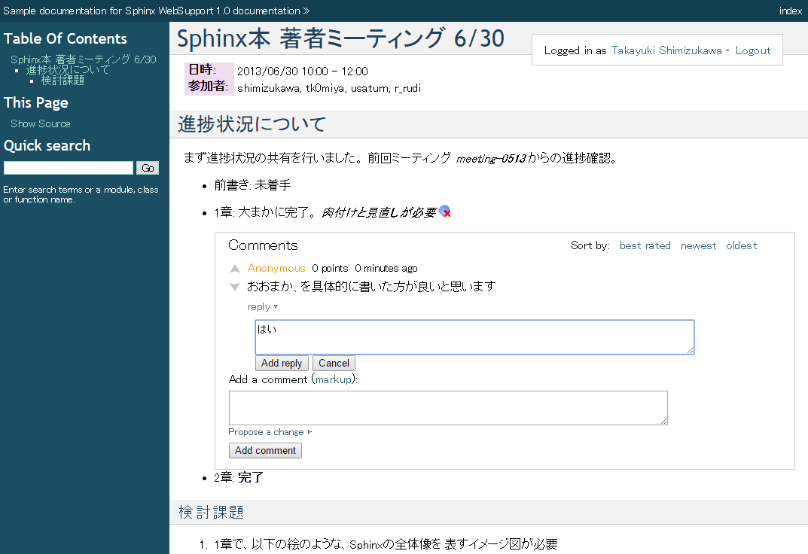
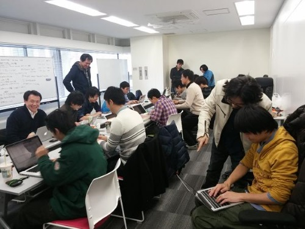

:date: 2015-02-14 14:00
:categories: ['Sphinx', 'Docker', 'fig']
:body type: text/x-rst

====================================================
2015/02/14 Docker/figでSphinxのWebSupportを起動する
====================================================

今日は `Python mini Hack-a-thon 51回目`_ でこのblogを書きました。

Sphinx WebSupportとは
=======================

SphinxにはWebSupportというAPI群があります。これを使うと、Sphinxでビルドしたドキュメントにコメントを残したり、サーバーサイドで検索できたりするWebアプリケーションを作れます。

   Sphinx WebSupport で議事録にコメントする例

しかし、WebSuportはSphinxのAPIでしかなく、実際のWeb画面として動作させるWebアプリケーションはSphinx標準では提供されていません。Flaskで実装されたサンプルアプリケーション `Sphinx demo WebApp`_ がbitbucketにあるのですが、2010年に作られたものなので最新のFlaskでは動作しませんでした。そういったこともあり、自分でWebSupportを起動するのはハードルがたくさんあってちょっとつらい感じです。

fig-sphinxwebapp-nginx
========================

ということで、Docker/figを使ってSphinxのWebSupportを起動出来るようにしてみました。Vagrant環境があれば、数コマンドでSphinx WebSupportを起動できるようにしてあります。

* https://github.com/shimizukawa/fig-sphinxwebapp-nginx

figで用意した環境はNginxが含まれています。Nginxとか不要、ということであれば、 `shimizukawa/sphinxwebapp`_ Dockerコンテナを直接使って下さい。

以下は、Dockerインストール済み環境でSphinx WebSupportを起動している様子です。

   .. raw:: html

      

これでVagrantのIPアドレスにアクセスすれば、最初に紹介したようなWebSupportの画面にアクセスできます。

今後
======

現状では、まだDocker/figで起動出来るようにしただけなので、これからいくつかの機能を載せて行ければ、執筆レビューや翻訳などに使えるかなーと思っています。

欲しい機能:

* `用語チェック拡張`_ の組み込み
* HTML自動ビルド（ビルドボタン？ ファイル変更検出？ WebHook？）
* PDF自動ビルド
* 利用者アカウントの追加・管理
* REST API (ビルドのWebHook等）
* アーカイブ機能: ボタン押下でreSTソースとビルド結果をzipアーカイブ
* コメントのexport
* Github, Bitbucket, Twitter, Facebook ソーシャル認証

.. seealso::

   * `Webサポートクイックスタート - Sphinx 1.2.3 ドキュメント`_
   * `Sphinx WebSupportを使ってみる - そこはかとなく書くよ。`_ by @r_rudi
   * `Sphinx demo WebApp`_ というサンプル実装
   * :doc:`../fig-practice/index` 自分がはじめてfigを触った話

おまけ
============

今日は `Python mini Hack-a-thon 51回目`_ でこのblogを書きました。

   参加していたPyLadiesTokyoのみなさんからチョコの差し入れ。ありがとうございます～

   会場の様子

.. _Python mini Hack-a-thon 51回目: http://pyhack.connpass.com/event/11567/
.. _shimizukawa/sphinxwebapp: https://registry.hub.docker.com/u/shimizukawa/sphinxwebapp/
.. _Webサポートクイックスタート - Sphinx 1.2.3 ドキュメント: http://docs.sphinx-users.jp/web/quickstart.html
.. _Sphinx WebSupportを使ってみる - そこはかとなく書くよ。: http://d.hatena.ne.jp/rudi/20101212/1292126107
.. _Sphinx demo WebApp: https://bitbucket.org/jacobmason/sphinx-demo-webapp/
.. _用語チェック拡張: https://bitbucket.org/shimizukawa/sphinx-term-validator

