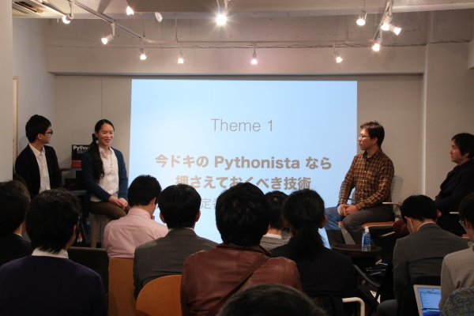
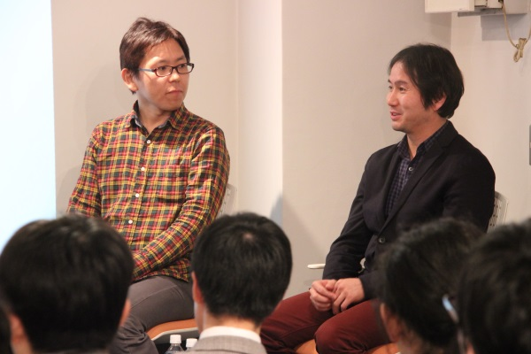
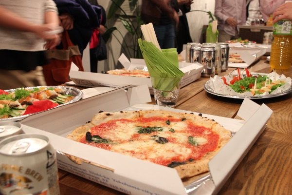

:date: 2015-03-10 23:55
:categories: ['Python', 'Forkwell', 'BePROUD']
:body type: text/x-rst

=========================================================================
2015/03/10 Forkwellキャリア談義 #2 feat. ビープラウド に登壇してきました
=========================================================================

*Category: 'Python', 'Forkwell', 'BePROUD'*

2015/3/5 木曜日開催の `Forkwellキャリア談義 #2 feat. ビープラウド「今ドキの Python 転職事情 〜Pythonista がこの先生きのこるには〜」`__ に、登壇してきました。

.. __: http://forkwell.connpass.com/event/11424/

Forkwellの大岡さんとは `Python mini hack-a-thon 第7回`__ あたりからなんどか顔を合わせていて顔見知りでしたが、今回のイベントは勤めている会社( BePROUD_ )のお仕事として行ってきました。

参加者約20名。会場いっぱい。

.. __: https://atnd.org/events/14178
.. _BePROUD: http://www.beproud.jp/

   イベントの様子

イベントで話したこと
======================

イベントの最初に、自己紹介を兼ねて、 `Pythonプロフェッショナルプログラミング第2版`_ の紹介が出来たので、登壇者としては大体満足しました。

.. _Pythonプロフェッショナルプログラミング第2版: http://www.amazon.co.jp/gp/product/479804315X?ie=UTF8&camp=1207&creative=8411&creativeASIN=479804315X&linkCode=shr&tag=freiaweb-22

イベント自体は、転職エージェント主催でしたが、話をした内容は転職を推奨するものでもないし、自分の転職経験を語るものでもありませんでした。普段オープンソースコミュニティーでどんな活動をしているか、 BePROUD_ はどんな人を採用しているのか、といった話をしていました。

今回話したポイントは以下の数点です。

* アウトプット大事。完璧でなくてもいいのでどんどん出していく
* ツッコミもらったら儲けもの。直していったらいい
* イベントに行ったらちょっとずつでも交流する
* BePROUD_ での採用はPython経験以外にも色々見ている。やるきと行動が大事
* BePROUD_ は社内に足りていないタイプの人を採用するようにしている
* 10年後にPythonで食ってけるかなんて分からない、どの言語でも同じ

もうちょっと話した気がするけど忘れた。

   清水川 ＆ 弊社社長 haru

懇親会
=======

個人事業主でPythonでやっている人や、機械学習・ビッグデータの仕事をしている人等、いろいろな人が参加されていました。

他にも何人かの人と話しましたが、Pythonを普段仕事で使っている人と話したくて来た、という人が多かったようです。そういう人は `Python mini hack-a-thon`_ とかのイベントに行くと良いんじゃないかな。たくさん話せるし、技術の交換もできるのでオススメです。PyDataなどの機械学習・データ分析系の人と出会えたり、Sphinxのコミッターの人と出会えたりするよ。

.. _Python mini hack-a-thon: http://pyhack.connpass.com/

   世界一のピザ

まとめ
========

ピザ美味しかった。

そういえば、いままでharuとイベントで同じ壇上に登壇したことなかった。

そんなBePROUDでは、Pythonエンジニアを募集しています。興味のある方はご連絡くださいー。 http://jobs.beproud.jp/

