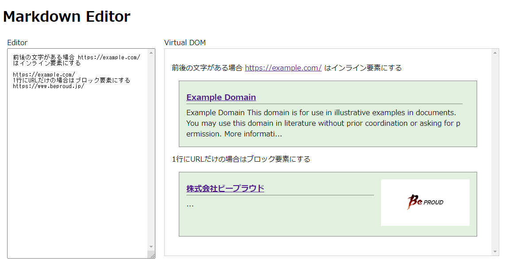

:date: 2024-03-02 12:00
:tags: Markdown, markdown-it

=============================================================
markdown-itでlinkをblock要素としてパースするプラグインを作る
=============================================================

   1行にURLだけ書くとタイトルを自動取得して表示

Markdown-itのlinkifyオプションを有効にすると、URLを直接書いた場合にそのURLをリンクとして扱ってくれます。この出力はインライン要素として扱われ、 ``<a>`` タグで出力されます。

これをMarkdown-itプラグインでカスタマイズして、1行にURLだけ書いた場合にブロック要素として出力します。そして、先日から作っている :doc:`プレビュー付きMarkdownエディタ <../vue-md-editor-vdom/index>` で画面描画を調整して、リンク先のタイトルなどを自動的に表示しようと思います。

markdown-itには、プラグインでMarkdown処理のルールをカスタマイズする仕組みがあります。しかし、カスタマイズ手順の情報はあまりありません。
私は公式の `アーキテクチャ説明`_ を見つつMarkdown-it自体のソースコードを読んで実装しました。
以下の日本語記事も参考になると思います。

- 公式 `markdown-it/docs/architecture.md at 14.0.0 · markdown-it/markdown-it`_
- 日本語記事 `Markdown-itのプラグインの作り方`_

.. _`markdown-it/docs/architecture.md at 14.0.0 · markdown-it/markdown-it`: `アーキテクチャ説明`_
.. _アーキテクチャ説明: https://github.com/markdown-it/markdown-it/blob/14.0.0/docs/architecture.md
.. _Markdown-itのプラグインの作り方: https://zenn.dev/mkizka/articles/9d4954d83b8862

前提
=======

* Node 18
* markdown-it 14.0.0
* TypeScript
* Vue 3.4.14

コードはGitHubにあります。

https://github.com/shimizukawa/vue-md-editor-vdom/tree/2024.03.02

仕様と完成形のデモ
==========================================

今回の目的は出力のカスタマイズなので、Markdownの記法は変えません。
1行にURLだけがある場合に ``
<a href="URL">TITLE</a>
`` のようにブロック要素として出力します。

入力するMarkdown

.. code-block:: markdown

   1行にURLだけの場合はブロック要素にする
   https://example.com/
   前後の文字がある場合 https://example.com/ はインライン要素にする

Markdown-itのlinkifyで出力されるHTML

.. code-block:: html

   

     1行にURLだけの場合はブロック要素にする 
     <a href="https://example.com/">https://example.com/</a> 
     前後の文字がある場合 <a href="https://example.com/">https://example.com/</a> はインライン要素にする 
   

カスタマイズ後のHTML出力

.. code-block:: html

   

     1行にURLだけの場合はブロック要素にする
   

   

     <a href="https://example.com/">https://example.com/</a>
   

   

     前後の文字がある場合 <a href="https://example.com/">https://example.com/</a> はインライン要素にする 
   

さらにカスタマイズして、リンク先のタイトルを取得して表示します。
タイトル取得をMakrdown-it内で行うのは非同期処理などが絡んできて難しいので（Markdown-itはasyncに対応しないと明言されている）、レンダラーの方で対応します。

専用のVue Component `MarkdownRendererBlockLink.vue`_ を実装し、URLの対象サイトにアクセスして、タイトル、概要文、サムネイルを取得して表示します。

.. _MarkdownRendererBlockLink.vue: https://github.com/shimizukawa/vue-md-editor-vdom/blob/2024.03.02/src/components/MarkdownRendererBlockLink.vue

.. figure:: ./20240302-demo.mp4
   :class: controls

Markdown-itプラグイン実装方針
==================================================

1行にURLだけを書いたらリンク先タイトルなどをブロック表示したい。
そのためには、Markdown-itで以下の処理をおこないます。

1. block tokenizerでURLの前後に文字がないことを判定し、div tokenに変換
2. inline tokenizerでURL文字列をlink tokenに変換
3. tokenがHTMLに変換される

公式の `アーキテクチャ説明`_ によると、block処理のあとにinline処理が行われるので、上記2のinline処理はMarkdown-itのlinkifyオプションに任せられます。
そのため、1だけ実装して、後のレンダラーで装飾するべき要素だと分かる様にクラス属性を持たせておけば良さそうです。

実装: markdown-it のblock tokenizerを追加してdiv tokenを出力
===================================================================

1行にURLだけが書かれているかどうかを判別するために、block tokenizerをmarkdown-itに登録します。
block tokenizerはmarkdown-itのデフォルトで ``table``, ``code``, ``fence`` ...といくつか登録されていて、優先順位の高い方から実行されます。

- block処理優先順位 `markdown-it/lib/parser_block.mjs at 14.0.0 · markdown-it/markdown-it <https://github.com/markdown-it/markdown-it/blob/14.0.0/lib/parser_block.mjs>`_

今回のコードでは、 ``paragraph`` block tokenizerの前に ``block-link`` という名前で処理を差し込みました。もっと先頭の方に差し込めば優先的にURLだけの行を判別できるようになりますが、特にその必要もなさそうなので後ろの方にしています。

.. code-block:: ts

   md.block.ruler.before("paragraph", "block-link", tokenize, {"alt": ["paragraph"]});

オプションの ``alt`` については後述します。

`tokenize` 関数は以下のように、実装しています。

.. code-block:: ts

    function tokenize(state: StateBlock, startLine: number, _endLine: number, silent: boolean) {
      const pos = state.bMarks[startLine]; // pos points to start of line
      const max = state.eMarks[startLine]; // max points to end of line
      const line = state.src.slice(pos, max); // text of line

      const url = state.md.normalizeLink(line);
      const parsed = mdurl.parse(url, true);
      const valid = line.trim().indexOf(' ') < 0 && RECODE_HOSTNAME_FOR.includes(parsed.protocol);

      // silient for validation
      if (silent || !valid) {
         return valid;
      }

      const token_o = state.push('link_open', 'a', 1);
      token_o.attrs = [['href', url], ['class', 'block-link']];

      const token_t = state.push('text', '', 0)
      token_t.content = state.md.normalizeLinkText(url)

      state.push('link_close', 'a', -1)
      state.line += 1;
      return true;
   }

コードの中程で、URLだけの行でなければ処理を終了しています。つまり、この関数は先頭行しかみていません。もし2行目以降にURLだけの行があった場合は、後続のパラグラフ処理に任されます。

``paragraph`` block処理は、パラグラフ内に中断条件が登場したら、そこまでをパラグラフとして処理します。そして、中断条件から先を別のブロック処理として扱うようになっています。この中断条件を設定しているのが、前述の ``alt`` オプションです。

この ``alt`` オプションによって、 ``tokenize`` 関数が ``paragraph`` 処理中に終了条件テストの目的で（ ``silent=true`` で）呼ばれます。そして ``block-link`` に適合する行が登場したら関数は ``true`` を返し、パラグラフはそこで終了します。そして、改めて ``tokenize`` 関数が ``silent=false`` で呼び出され、HTMLタグになるトークンを ``state`` にpushします。

たいした行数ではないですが、block要素の処理をどう実装するか、先頭から何文字目が開始位置なのか、 ``slient`` 引数は何のためのものなのか・・などはあまりドキュメントで解説されていないので、理解するまでコード読み込みが必要でした。

このくらい markdown-it の出力をカスタマイズできれば、色々と応用ができるようになります。

Vue Componentで装飾して表示
==================================

リンクをブロック要素で出力しましたが、ここに表示側でカスタマイズを追加していきます。画面描画をVueで調整して、リンク先のタイトルなどを自動的に表示していきます。

まず、ブロックリンク要素を専用のVueコンポーネントで描画するように仮想DOMを構築します。

`MarkdownRenderer.ts#L157-L168 <https://github.com/shimizukawa/vue-md-editor-vdom/blob/2024.03.02/src/components/MarkdownRenderer.ts#L157-L168>`_:

.. code-block:: ts

      departGeneric(node: HTMLElement, vNode: VNode): VNode {
        ...
        else if (node.classList.contains("block-link")) {
          return vmethods.departBlockLink(node, vNode);
        }
        return vNode;
      },

`MarkdownRenderer.ts#L195-L210 <https://github.com/shimizukawa/vue-md-editor-vdom/blob/2024.03.02/src/components/MarkdownRenderer.ts#L195-L210>`_:

.. code-block:: ts

      departBlockLink(node: HTMLElement, vNode: VNode): VNode {
        const url = node.getAttribute("href") as string;
        const content = node.textContent || "";
   
        const newVNode: VNode = {
          type: MarkdownRendererBlockLink,
          props: {
            url,
            content,
          },
          children: null,
        };
        return newVNode;
      },
   
``MarkdownRendererBlockLink.vue`` 内では、渡されたURLにアクセスしてOGP情報などのメタデータを取得します。ただし、JSで任意の外部URLにアクセスすることは制限されているので、メタデータを取得するサーバープロセスを別途用意しています。

また、エディタでURLを入力中に1文字変更ごとに外部URLアクセスするのは良くないので、vueuseの `useDebounceFn <https://vueuse.org/shared/useDebounceFn/>`_ で1秒でdebounceしています。vueuse、マジ便利。

最後に、取得したメタデータをテンプレートで整形表示すれば完成です。

   取得したメタデータを整形してタイトル、サムネイル、概要文を表示

まとめ
==========================

- markdown-itで行単位の解析をするには block tokenizer を使う
- block tokenizer には優先順位があり、自作のtokenizerを任意の位置に差し込める
- paragraph tokenizerは連続行の途中でlistやtableが始まったらparagraph blockを終了する
- paragraphのように一部のtokenizerはblockの終了条件判定にaltで指定しているtokenizerを呼び出している
- vueuse、まじで便利
