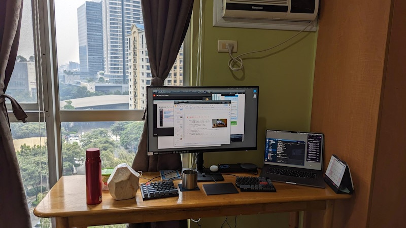

:date: 2023-12-31 20:00
:tags: Philippines

===================================================================================
フィリピン引っ越し、生活の変化
===================================================================================

2023年8月中旬に日本を離れ、フィリピンで生活しています。

   ブルゴスサークル: 近所のちょっとした緑地とラウンダバウト

フィリピンに住み始めるまでは色々心配もありましたが、4カ月経ってみると心配しすぎていたことも色々ありました。

仕事はリモートワークで、 BeProud_ の仕事を続けています（現在積極採用中です！）。
仕事以外で心配だったのは、フィリピンでのスリや傷害などの犯罪、デング熱などの病気、そして暑さです。

.. _BeProud: https://www.beproud.jp/careers/

リモートワークとフレックス
====================================

所属会社では、フルリモート勤務OKを2015年から採用 [#]_ していて、当時私がBPカイゼン [#]_ という取り組みの中で提案して運用が始まりました。さらに2022年末からはフレックス制度も導入されて、自分で働く場所、時間、ボリュームを調整しやすい仕組みになっています。このおかげで、フィリピンからでも不都合なくチーム開発に参加できています。フィリピンはGMT+8で日本との時差は1時間だけなので、これも海外リモートワークを問題なく実現できている要因だと思います。

.. [#] `BPRD2.0(BePROUD Remote Day 2.0) - ビープラウド社長のブログ <https://shacho.beproud.jp/entry/2015/05/31/203943>`__
.. [#] `会社は1日にして成らず - ビープラウド社長のブログ <https://shacho.beproud.jp/entry/company-was-not-built-in-a-day_>`__

   フィリピン自宅のデスクトップと、ココナッツの実

自分は、子育ての中で21時には寝る習慣が出来てしまったのもあって、7時間寝て朝4時くらいから活動を始めています。日本では5時で、フレックスの開始可能時間にあたるので、そこから仕事を始めてしまって、日中に私用を済ませる時間を取ったり、夕方早く終わって家のことをしたり、金曜はコアタイムがないので早めに切り上げて近所のビールバーに出かけたりと、自由な感じに仕事が出来ています。

リモートワーク制度とフレックス制度のおかげで、渡航前後のバタバタした状況でも仕事には支障なく用事を済ませることが出来ました。渡航前は区役所やらパスポートやら、渡航後はインターネットが100kbpsになってしまって業者を呼んで立ち会ったりとか、色々ありました。渡航直前の一時実家暮らしや、渡航後もPyCon APAC 2023参加のために日本に1週間くらい滞在したときも、フレックスの範囲でほぼ休まず仕事をしていたので、開発チームの同僚からは「今まだ日本？もうフィリピン？」とか言われたりしてました。

フィリピン、マニラ、BGCの危険度
====================================

外務省の `海外安全ホームページ: 危険・スポット・広域情報 <https://www.anzen.mofa.go.jp/info/pcinfectionspothazardinfo_013.html>`_ を見ると、フィリピン南部には「レベル３：渡航中止勧告」が出ている地域もありますが、マニラは「レベル１：十分注意」でフィリピンの中では比較的安全な方です。安全な方といっても、「十分注意」が必要で、日常的にスリなどへの警戒が必要です。

自分は4年ぶりの海外渡航というのもあって、 渡航直後のマニラのニノイ・アキノ国際空港では、荷物から一瞬でも目を離すとヤバそう、という感じで周りの人をかなり警戒していました。それも1ヶ月くらい住んでみるとかなり警戒が薄れ、最小限の警戒で十分かなという感じになっています。

   いまここ: Manila, Taguig, BGC

住んでいる場所はBGC（Bonifacio Global City）という、日本人などの外国人が住むなら一番安全、と言われているところです。それでも、置き引きやスリの話はちょいちょい聞くし、身近な人がスリにあったりもしているので、気を緩めすぎないようにしています。

フィリピン引っ越し直後の適応
========================================

引っ越し直後は言語の壁が大きかったかなー。引越直後は住んでいるコンドミニアムの管理の人と話す機会が何度かあったし、インターネット業者と話すこともあったけど、全然英語が分からなくて困りました。一旦ワカラナイモードに入ると、ネット業者の「please check fast.com」という言葉も聞き取れなくて、全部分からなくなってしまってました。

自分としては、リスニングもスピーキングも苦手だけど、海外のPyCon（Pythonカンファレンス）でトークを持ったこともあるし、質疑応答もなんとか出来ていたと思います。それが2016年頃で、7年たって英語力がかなり衰えたのか、フィリピンでは全然会話ができませんでした。

4ヶ月たっても英会話力は上がってませんが、英語とフィリピン語（タガログ語）の区別は付くようになって、会話に必要な単語だけ拾ってなんとかできる程度にはなりました。たぶん、技術カンファレンスで会話する内容はなんとかなっても、英語での日常会話スキルが（日本語でも元々）弱いので、海外に住むとそこが露呈したんだと思っています。

フィリピンで接した人は今のところ、コンドミニアムの管理の人やお店の人がほとんどですが、親切だし、親身に対応してくれます。BGCではセキュリティーの人がいたるところにいますが、買い物帰りに車に乗るのを手伝ってくれたりとかしてくれます。コンドミニアムのセキュリティーの人は、自転車が故障したときに部品を買って修理するところまでやってくれたりとか、親切すぎるんじゃないかな。日本だと職務外のことをやる警備の人とかあまり居ないだろう事を考えると、考え方が全然違うんだろうなという感じです。

そういえばセキュリティーも店員もみんな若い！人口ピラミッドが三角錐なので、街には若いエネルギーがあるような気がします。

蚊と病気と健康
============================

デング熱などの伝染病には、蚊には何度か刺されたけど今のところ感染してません。日本よりも蚊が少ない気もしますが、刺されないわけでもないです。普段の服装は半袖短パンで肌の露出は多め。ビアバーで1時間くらい座って飲んでて2,3箇所刺される、というのを何度もやってしまいました。そういう場所に行くときは露出少なめの服装にしてます。日本だと動き回ってても刺されるし、何なら服の上から刺されるので、日本の蚊のようなハングリーさは無さそう？

そういえば出国前に狂犬病ワクチンなどの接種で有楽町のクリニックまで通ったのは、時間的、費用的になかなか大変でした。A型肝炎は2回接種、狂犬病のワクチンは3回接種で、保険適用外なので6万円くらいかかったし、その影響か体調は崩しがちだったし。それでもワクチン接種はもしもの備えになるので、後で後悔するよりやっておいて良かったと思います。

12月になって少し涼しくなってきたけど、寒くて風邪をひくことはありません（妻の職場や幼稚園経由で風邪をもらう事はある）。1年前は子供が2ヶ月くらいずっと複数の風邪をひいてた事を考えると、一年中温かいって良いですね。

暑さ、湿度
================

暑さは程々で、気候はずっと日本の初夏くらいの感じ。8月頃は28℃～33℃で、12月の今は25℃～31℃くらい。12月になると湿度も下がって夜は涼しいくらいです。日中は湿度も気温も高いので扇風機は一年中必須だけど、エアコンを付けてた日はそれほど多くなかったかな。汗はよくかくので水を2L以上飲んでます。

フィリピンの雨季は6月～10月で、雨季の間に台風がたくさん来るので道路が冠水したり、その影響で道路が大渋滞して1時間全く動かなくなったり・・・と事前に聞いていたものの、今年は台風がほとんど来なくて過ごしやすい年だったようです。それでも、台風で学校が休校になったり、火山灰の影響で休校になったり、8月と9月で3回くらいありました。住んでいるBGCは冠水対策もされているようで、雨季の大雨やスコールは体験したものの、冠水には遭遇していません。

今日も日中は32℃くらいだったので、子供とプールに入って水に顔をつける練習とかやってました。

   今日のプール

まとめ
========

とりとめなく書きましたが、人生初の海外引っ越し、そして間もなく海外で年越しを迎えようとしています。
フィリピン引っ越しについて、Podcastでも少し紹介していますので、興味のある方はそちらもご参照ください。

- `#84 清水川さんをゲストに フィリピン移住の話からCodespacesでの開発環境、ベクター検索の話へ | terapyon channel podcast <https://podcast.terapyon.net/episodes/0093.html>`_
- `#87 清水川さんをゲストに 2023年の振り返りとフィリピン事情 | terapyon channel podcast <https://podcast.terapyon.net/episodes/0096.html>`_

それでは良いお年を～。

   近所のビアバーにて
