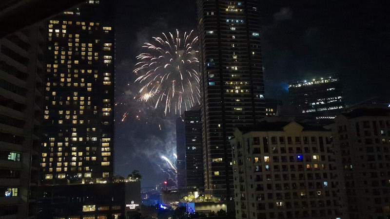

:date: 2024-01-13 9:00
:tags: kakizome, Philippines

=====================
書き初め
=====================

明けましておめでとうございます。

.. figure:: new-year-fireworks.mp4
   :class: controls

   ニューイヤーカウントダウンの花火。自宅の窓より

TL;DR
========

* 2023年は、海外引っ越しや生成AIなど、大きな変化があった
* 2024年は、個人のアウトプットを増やし、仕事の時間を減らして成果を上げる

:doc:`2019年以来 <../2019-kakizome/index>` の書き初めです。

2023年振り返り
==================

2023年は :doc:`../phiippines-202312/index` があり、引っ越しを決めた5月くらいから秋頃まで色々、ほんと色々ありました。

* 6月、引越準備
* 7月、妻が先行渡航、ワンオペ子育て
* 8月、親子で渡航
* 9月、Python PHで登壇
* 10月、PyCon APAC 2023 in Japan 参加で一時帰国

PyCon APAC 2024 と BPython
------------------------------------

PyCon APACでは、オリジナルクラフトビールのBPythonを楽しみました。
イベントスタッフ（@takanoryさん）が新潟の `t0ki brewery`_ までビールを作りに行くという流れが面白かったし、そのブルワリーもPyCon JP元スタッフの藤原さんが立ち上げていて、ここに来てイベントで繋がるのが面白かったです。
何より、ビールが美味しかった！また飲みたいです。

.. figure:: bpython.*

   PyCon APAC 2024 オリジナルビール BPython

   (Photo https://flic.kr/p/2pemThD CC BY 2.0 DEED)

- `t0ki brewery –トキブルワリー`_
- `PyCon JP Blog: PyCon APAC 2023オリジナルビールの仕込みに行ってきました！！`_

.. _t0ki brewery –トキブルワリー: `t0ki brewery`_
.. _t0ki brewery: https://t0ki.beer/
.. _`PyCon JP Blog: PyCon APAC 2023オリジナルビールの仕込みに行ってきました！！`: https://pyconjp.blogspot.com/2023/09/2023-original-beer-preparation.html

Guidoさんが来日
-----------------------

11月にはPythonの生みの親のGuidoさんが来日する！という事件がありました。GuidoさんにはPyCon JPスタッフだった頃にキーノートを何度か依頼してきましたが、これまで10年以上叶いませんでした。ついに来日！というタイミングで自分が日本に居ないのは残念でしたが、イベントは盛況だったようで、なんというかめっちゃ羨ましい..

- `Guido氏インタラクティブ記念講演会 PyCon JP枠 - connpass`_

.. _Guido氏インタラクティブ記念講演会 PyCon JP枠 - connpass: https://pyconjp.connpass.com/event/301716/

生成AIとプログラミング
----------------------------

その他の変化として、ChatGPTやCopilotなどによる支援がプログラミングを大きく変えた年だったと思います。

生成AI自体が色々な用途に使われていますが、プログラミング分野ではコード補完がかなり的確で、私自身も日々助けられています。特に2023年は慣れないTypeScriptを書いていて、補完がなかったら生産性は半分くらいだったかもしれません。

Copilotを使っていると、先に書きたいコードの目的や概要をコメントで書いておけば良い感じのコードが生成されるような気がします。そして数文字コードを書くと、書こうと思っていたコードがおおよそ補完されるので、それを元にちょっと手直しすれば十分使えることが多いし、違うコードが生成されてもそれをタタキにして書き始められるので、まずはコメントで説明、そしてプログラムを数文字書く流れに変わりました。おかげでコーディングの試行錯誤時間が圧縮され、ロジックなどのもっと本質的な部分に頭と時間を使えるようになりました。

2024年の目標
============

個人のアウトプットを増やして仕事の効率アップを狙う
---------------------------------------------------------

2023年は仕事が楽しくて仕事しすぎたので、今年は業務時間をフレックスの下限ギリギリまで減らそうと思います。

この1年は仕事中に仕事コードで試行錯誤することが多かったのですが、今後はその代わりに、個人でスクラッチで書いたコードで試行錯誤しようと思います。
その方が効率良いし、そのまま公開できるし、再利用して別の試行錯誤に使いやすいです。
実質的に技術の探索や試行錯誤、としてやっていることは変わらないですが、仕事時間が減った割りに仕事の効率は上がっていると感じています。
しかも個人のアウトプットが増えて良い事しかない感じです。

blogとscrap
------------------

アウトプットとしては、ここ数年はblogより Scrapbox_ に技術メモを書いていました。
しかしスクラップに知識の断片をダンプするだけでは無く、blogにまとめるのも必要だと感じて、昨年末から再開しました。
書くことで断片をまとめられ、知識や理解が整理されて、結果として試行錯誤時間が短縮される体験ができています。

- 清水川のScrapbox_

.. _清水川のScrapbox: Scrapbox_
.. _Scrapbox: https://scrapbox.io/shimizukawa/

blogを書こうと思ったのは、 `@tokibito`_ とPyCon APAC 2023で話したときに「スライドは検索で見られづらいのでblogにも文字として書き出した方が良い、イベント参加とかもblogに書こう、と人に伝えているので自分でも"このくらいで書いていこう"という参考になるように実践している」と言っていたのがきっかけです。

実際の所、アウトプットは大事だと思っているし、だからカンファレンスでスライドにまとめて発表する、ということを毎年やっていますが、その内容を人に紹介するときにスライドに書いたことを探して伝えるのは毎回けっこう大変でした。検索でもそんなに引っかからないので、せっかくのアウトプットが死蔵されてしまっている感じなのを `@tokibito`_ との会話で改めて認識しました。

.. _@tokibito: https://twitter.com/tokibito

英語のリスニングを鍛える
------------------------------

あとは、技術以外の英会話を聞き取れるようになりたいので、リスニングとシャドーイングを始めてみました。
フィリピンに引っ越して最初の1カ月は、スーパーの会話で数字を聞き取るのも難しく、自分の英語はリスニングが弱いというを痛感しました。
半年住んで数字は聞き取れるようになりましたが、普段買い物に必要な英会話しかしていないので、全然上達してない感じです。
2月下旬に `PyCon Philippines 2024`_ へ参加する予定なので、それまでに少しはリスニング力を上げたいと思っています。

.. _PyCon Philippines 2024: https://pycon-2024.python.ph/

それでは、今年もよろしくお願い致します。
