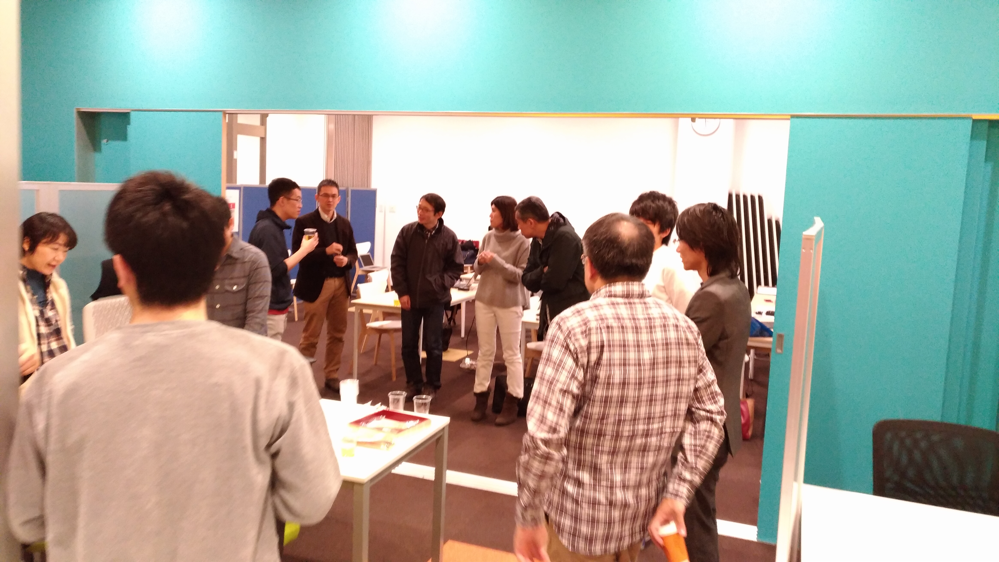

:date: 2017-11-18 23:55
:tags: Python, PyCon, PyCon JP, PyCamp

==================================================
Python Boot Camp in 静岡で講師してきました #pycamp
==================================================

`Python Boot Camp in 静岡`_ に行ってきました。

参加者12数名、TA・スタッフ・講師4名、合計16名くらいが参加しました。

.. figure:: attendees.*
   :width: 80%

   参加者のみなさん（開始時）

このblogは講師からみた参加レポートです。チュートリアル本体の様子なんかは、公式の開催レポートは別途書かれると思います。

.. todo: -> `Python Boot Camp in 静岡を開催しました`_

.. note::

   "Python Boot Camp" は、 `一般社団法人PyCon JP`_ が日本各地で開催している、 **初心者向けPythonチュートリアルイベント** です。
   今回の静岡で `15回目`_ の開催です。
   `チュートリアルのテキスト`_ は公開されていて、ライセンスに従って自由に利用できます。詳しくは `Python Boot Camp について`_ を参照してください。

   現地スタッフになってくれる人がいれば、講師に行きますので、 `申込みフォーム`_ からひご連絡ください！

参加した感想、雑感など
======================

前回の :doc:`鹿児島 <../pycamp201711-kagoshima/index>` では最後のスクレイピング章まで講義の時間中に紹介できましたが、会場のご厚意で30分延長したおかげでもありました。今回は17時でイベントを終了しないといけないので、タイムテーブルはキツ目です。自己紹介などを短めにしてがんばりました。

- 13:00-13:10 会場案内、挨拶、自己紹介
- 13:10-13:20 1. Pythonをはじめる前に
- 13:20-13:55 2. Pythonをはじめよう
- 13:55-14:00 休憩
- 14:00-14:25 3. Pythonのデータ型（基本編）
- 14:25-14:50 4. Pythonのデータ型（コレクション編）
- 14:50-15:00 休憩（おやつ）
- 15:00-15:20 5. ファイル操作とモジュール
- 15:20-15:45 6. サードパーティ製パッケージと venv
- 15:45-15:50 休憩
- 15:50-16:20 7. スクレイピング
- 16:20-16:30 8. 次のステップ
- 16:30-17:00 アンケート、質疑応答、集合写真

会場案内のところ、現地スタッフの塚本さんがけっこうテンパってて、参加者同士の自己紹介が忘れ去られてましたｗ 自分も忘れてそのまま講義入っちゃったので、まあ気にせずｗ

今日は、結果的には17時に講義を終えることが出来ました。入門ハンズオンは前半の理解が重要だと思うので、どうしても前半時間がかかってしまい、データ型は飛ばし気味になってしまいました。伝えたい事は前半の「Pythonをはじめよう(FizzBuzz)」と「スクレイピング」のところにあるので、データ型が飛ばし気味になるのはしょうがないのかなー。

今回はSlackでの質問がゼロ件でした。前回の鹿児島でも質問が少なかったけど、短かい時間のなかで疑問を質問にして書くのも難易度が高いのかな。口頭で質問があった内容については、TAの @kashew_nuts さんがSlackにまとめて書いてくれました。他の参加者やこれまでのPyCamp参加者の参考になるので、とても助かりました。質問することで他の参加者の助けになったりもするので、今日参加したみなさん後からでも疑問に思ったことがあれば、ぜひ質問を書いてみてください。

.. 懇親会で、「名古屋のときは、自己紹介に1人1分くらい、オヤツ休憩も30分くらい取ってたけど、スクレイピングで自由課題を各自やる時間があった」という話を聞いたので、やりようでもっと速くできるのかとびっくりした。

これまで、 :doc:`神戸 <../pycamp201705-kobe/index>`, :doc:`福岡 <../pycamp201709-fukuoka/index>` , :doc:`鹿児島 <../pycamp201711-kagoshima/index>` で講師をして、今回の静岡が4回目でした。今年の講師担当分はこれで終わりです。来年はどうなるかなー。

移動
=====

今回は愛知の妻の実家から移動。三河安城->浜松 で25分。近い。

新幹線の `スマートEX`_ に登録？しておけばSUICAで新幹線乗れたのかなーと後から気づきました。普通に紙のキップを往復で買っちゃった。

.. _スマートEX: https://smart-ex.jp/top.php

スタッフミーティング
=====================

10:30から会場を設営して、進行の段取りなどを話しました。スクリーンの解像度や文字サイズなどを事前に確認しておくのは重要ですね。初めて繋ぐプロジェクターでちょっと戸惑いました。スクリーンが4:3だったのにプロジェクターの設定が強制16:9になってて、なかなかサイズが合わず。設定を変えて良い感じにできました。

そういえば今回の会場はドリップコーヒーの機械があって気軽にコーヒー飲めるのが良かった。浜松駅近辺で会場に行く途中で買おうと思ったらどこも混んでて買えなかったので、大変助かりました。

.. raw:: html

   <blockquote class="twitter-tweet" data-lang="ja">
今日の <a href="https://twitter.com/hashtag/pycamp?src=hash&amp;ref_src=twsrc%5Etfw">#pycamp</a> 会場にはドリップコーヒー100円の機械があって良い。美味しい。温まる。 (@ Any in 浜松市) <a href="https://t.co/DTs6c27s8A">https://t.co/DTs6c27s8A</a> <a href="https://t.co/Oh2TXsHQ2X">pic.twitter.com/Oh2TXsHQ2X</a>
&mdash; Takayuki Shimizukawa (@shimizukawa) <a href="https://twitter.com/shimizukawa/status/931710512949350400?ref_src=twsrc%5Etfw">2017年11月18日</a></blockquote>
   

会場設営後に、スタッフランチ。すぐ隣のバーっぽいところで肉々しい感じのものを食べた。メガローストビーフ丼とポークジンジャーステーキで迷ったけど、ちょっと寒かったのでポーク。

.. raw:: html

   <blockquote class="twitter-tweet" data-lang="ja">
ポークステーキ！pycamp講師前の栄養補給 (@ AB-Z in Hamamatsu, Shizuoka) <a href="https://t.co/5eCE7z3I5c">https://t.co/5eCE7z3I5c</a> <a href="https://t.co/K8z5UHbIwH">pic.twitter.com/K8z5UHbIwH</a>
&mdash; Takayuki Shimizukawa (@shimizukawa) <a href="https://twitter.com/shimizukawa/status/931722228777078784?ref_src=twsrc%5Etfw">2017年11月18日</a></blockquote>
   

スタッフランチミーティングでは、ご飯を食べながら自己紹介したりしました。今回の現地スタッフの塚本さんはPythonを始めてまだ間がなく、今年7月のPyCamp愛知の受講生だったとのこと。懇親会で、隣に座った講師のtakanoryさんから勧められて、今回の静岡開催のスタッフになったということでした。Pythonの勉強をしながらのスタッフ業、おつかれさまです。

今回TAの三浦さんは、そのPyCamp愛知のスタッフだったということで、愛知（名古屋）と静岡（浜松）近くて交流が活発なのかと思ったら、実際はそこまで近くなかった。そういえば九州でも隣県から駆けつけて～っていうパターンは聞きました。

Python Boot Camp 本編
========================

.. figure:: attendees.*
   :width: 80%

   参加者のみなさん（開始時）

福岡・鹿児島に続いて、今回もfizzbuzzを実際に参加者と一緒にやりました。FizzBuzzゲームの1人がやることをfizzbuzz関数に実装する、というのは、よいプログラミングの練習になりますね。

.. raw:: html

   <blockquote class="twitter-tweet" data-lang="ja">
4人でFizzBuzzやってます  <a href="https://twitter.com/hashtag/pycamp?src=hash&amp;ref_src=twsrc%5Etfw">#pycamp</a> <a href="https://t.co/3Rw3rVnnsX">pic.twitter.com/3Rw3rVnnsX</a>
&mdash; みうら さとし (@mursts) <a href="https://twitter.com/mursts/status/931746401263816704?ref_src=twsrc%5Etfw">2017年11月18日</a></blockquote>
   

おやつタイム

.. raw:: html

   <blockquote class="twitter-tweet" data-lang="ja">
静岡(浜松)のおやつといえばうなぎpyですね  <a href="https://twitter.com/hashtag/pycamp?src=hash&amp;ref_src=twsrc%5Etfw">#pycamp</a> <a href="https://t.co/SGols6qG8H">pic.twitter.com/SGols6qG8H</a>
&mdash; みうら さとし (@mursts) <a href="https://twitter.com/mursts/status/931771923511394304?ref_src=twsrc%5Etfw">2017年11月18日</a></blockquote>
   

   うなぎ.pyを食べながら会話が盛り上がる

懇親会！
=============

9人で `懇親会`_ へ！

.. raw:: html

   <blockquote class="twitter-tweet" data-lang="ja">
<a href="https://twitter.com/hashtag/pycamp?src=hash&amp;ref_src=twsrc%5Etfw">#pycamp</a> 静岡、懇親会！郷土料理！ <a href="https://t.co/61JH1tWa1N">pic.twitter.com/61JH1tWa1N</a>
&mdash; Takayuki Shimizukawa (@shimizukawa) <a href="https://twitter.com/shimizukawa/status/931815473032806400?ref_src=twsrc%5Etfw">2017年11月18日</a></blockquote>
   

   <blockquote class="twitter-tweet" data-lang="ja">
<a href="https://twitter.com/hashtag/pycamp?src=hash&amp;ref_src=twsrc%5Etfw">#pycamp</a> 静岡懇親会～ <a href="https://t.co/R9oMT6Xb0a">pic.twitter.com/R9oMT6Xb0a</a>
&mdash; Takayuki Shimizukawa (@shimizukawa) <a href="https://twitter.com/shimizukawa/status/931825540553568257?ref_src=twsrc%5Etfw">2017年11月18日</a></blockquote>
   

飲み放題ビールが「のどごし生」だったので、クラフトビールを求めて二次会へ...。

.. raw:: html

   <blockquote class="twitter-tweet" data-lang="ja">
アップルホップ伊那谷産つがる  南信州ビール！ <a href="https://twitter.com/hashtag/pycamp?src=hash&amp;ref_src=twsrc%5Etfw">#pycamp</a> 懇親会2 (@ Shinnosuke.o Hamamatsu) <a href="https://t.co/cnmKhdbzpY">https://t.co/cnmKhdbzpY</a> <a href="https://t.co/NVOXbSSrW1">pic.twitter.com/NVOXbSSrW1</a>
&mdash; Takayuki Shimizukawa (@shimizukawa) <a href="https://twitter.com/shimizukawa/status/931850016171360256?ref_src=twsrc%5Etfw">2017年11月18日</a></blockquote>
   

   <blockquote class="twitter-tweet" data-lang="ja">
珈琲侍夢！ コーヒービール！？ <a href="https://twitter.com/hashtag/pycamp?src=hash&amp;ref_src=twsrc%5Etfw">#pycamp</a> (@ Shinnosuke.o Hamamatsu) <a href="https://t.co/FPgucjRzIJ">https://t.co/FPgucjRzIJ</a> <a href="https://t.co/PY5giWAhjI">pic.twitter.com/PY5giWAhjI</a>
&mdash; Takayuki Shimizukawa (@shimizukawa) <a href="https://twitter.com/shimizukawa/status/931856271090814977?ref_src=twsrc%5Etfw">2017年11月18日</a></blockquote>
   

新幹線の都合で先に帰りましたが、この後、 **unagi.py** のコミュニティー活動開始という話になったようです。これからの静岡浜松に期待ですね！

.. おまけ
.. -------

..  .. _Python Boot Camp in 静岡を開催しました: http://pyconjp.blogspot.jp/...

.. _Python Boot Camp in 静岡: https://pyconjp.connpass.com/event/67533/
.. _懇親会: https://pyconjp.connpass.com/event/67534/
.. _15回目: https://www.pycon.jp/support/bootcamp.html#id5

.. _一般社団法人PyCon JP: http://www.pycon.jp/
.. _チュートリアルのテキスト: http://pycamp.pycon.jp/
.. _Python Boot Camp について: http://pycamp.pycon.jp/organize/0_about.html
.. _申込みフォーム: https://docs.google.com/forms/d/e/1FAIpQLSedZskvqmwH_cvwOZecI10PA3KX5d-Ui-74aZro_cvCcTZLMw/viewform

