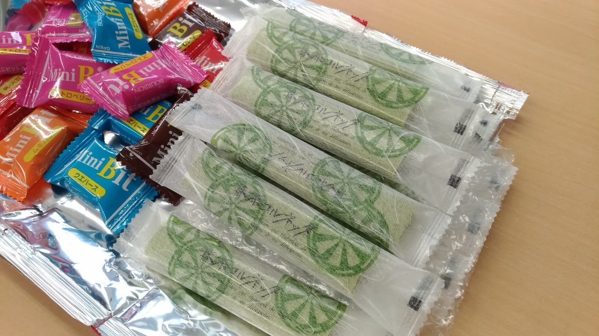

:date: 2018-08-25 23:59
:tags: Python, PyCon, PyCon JP, PyCamp

==================================================
Python Boot Camp in 京都で講師してきました #pycamp
==================================================

`Python Boot Camp in 京都`_ に行ってきました。

参加者22名、講師1・TA4・スタッフ3名、合計30名が参加しました。会場は `株式会社Hatena 京都オフィス`_ をお借りしました。

.. figure:: attendees.*
   :width: 80%

   参加者のみなさん（開始時）

.. 公式の開催レポートは `「Python Boot Camp in 京都」を開催しました！`_ を参照してください。
.. 
.. .. _「Python Boot Camp in 京都」を開催しました！: https://pyconjp.blogspot.jp/2018/08/pycamp-in-kyoto-report.html

参加した感想、雑感など
======================

自分が講師をしたのは、前回が :doc:`静岡 <../pycamp201711-shizuoka/index>` 、今回の京都が講師5回目です。

進行速度
--------

今回は、 `徳島 <https://pyconjp.connpass.com/event/87968/>`__ と同日開催だったので、進行速度の違いがよくわかりました。徳島よりだいたい30分遅れで進んでいた感じ。毎回スクレイピングが駆け足紹介になってしまうのが課題ですが、質問がたくさん出たのでしょうがないかなーという気持ちです。

講義は17時20分に終えたけど、もうちょっと前半を急ぐべきかも。毎回思って実践できてないけど。集合(set)の説明と正規表現(re)の説明を飛ばすのは定番になってきました。自学できるように講義資料には載せたままでよさそう。

時間がかかるところ
------------------

ここはやっぱり時間かかるよね、というのが、「Pythonの起動と終了」「fizzbuzz.pyを作成して実行」「venvを作ってactivate」の3つ。講師を何度かやっていて分かってきました。

起動終了は、OSのコマンドラインを起動したり、OSのプロンプトとPythonのプロンプトを見分けたりするところで時間がかかるのと、Pythonの起動で ``python`` なのか ``python3`` なのか混乱が起こる。

fizzbuzz.pyの作成は、初めてPythonファイルを作成するときに「どこに作るのか」「拡張子が見えない」「エディタで編集？」というあたりが難しい感じ。実行するときは「カレントを作ったディレクトリに移動」「python を付けずに ``fizzbuzz.py`` とだけ書いて実行しちゃう」「文法エラーが起きたけどどこが間違えているか分からない」などがある。特にtypoや閉じ括弧の数が合ってない系の間違いは講師TAも原因を見つけづらいときがあって、時間がかかります。

venvの作成とactivateは、概念を把握するのに時間がかかるのと、OSごとのコマンドの違いが大きくて、今はWindowsでcmd.exeとPowerShellの2種類の環境があるのも教えるハードルになってます。PowerShellで ``Activate.ps1`` を実行するにはポリシー変更がいるし。

このへんのハードルを事前に解消するような小さいチュートリアルを用意するといいのかなあ。

質問
-----

今回、会場からたくさんの質問がでて、多めに時間を割いたと思います。

質問された内容をSlackに書いておけばよかった。何を聞かれて何を答えたか、だいたい忘れちゃった。

おわりに
--------

イベント後に、夫婦で参加した方が「『独学プログラマー』を読んで勉強してたので今回のPyCampに参加するのが楽しみだった」と話してくれたのがとても嬉しかった。PyCon JP 2018にも参加するらしいので、楽しみ。そういえば、今回のPyCampでは PyCon JP 2018に参加するっていう人がけっこういました。PyCampやPyConをきっかけに人や何か色々なことが繋がっていけば、イベント開催してきた甲斐があるなと改めて思った。

移動
=====

今回は愛知の妻の実家から移動。三河安城->京都 で50分。まあまあ近い。名古屋で乗り換えました。

新幹線の `スマートEX`_ に登録しておけばSUICAで新幹線乗れたのにー、と :doc:`静岡 <../pycamp201711-shizuoka/index>` のときに思ったので、今回は実際にやってみました。サイトでチケット買ってSuicaで新幹線乗れた。便利。

紙が要らないし、履歴が残るのは精算の面でも楽で良い。

.. _スマートEX: https://smart-ex.jp/top.php

スタッフミーティング
=====================

.. raw:: html

   <blockquote class="twitter-tweet" data-lang="ja">
<a href="https://twitter.com/hashtag/PyCamp?src=hash&amp;ref_src=twsrc%5Etfw">#PyCamp</a> 京都に来たよー (@ 株式会社 はてな in 京都市中京区, 京都府) <a href="https://t.co/8HHiKE1wav">https://t.co/8HHiKE1wav</a> <a href="https://t.co/LQF45uApkZ">pic.twitter.com/LQF45uApkZ</a>
&mdash; Takayuki Shimizukawa (@shimizukawa) <a href="https://twitter.com/shimizukawa/status/1033164762471968769?ref_src=twsrc%5Etfw">2018年8月25日</a></blockquote>
   

10:30に会場の Hatena オフィスに集合だったけど、10分遅れで開場。
スタッフのゆーたろーが `Apple Store 京都の開店イベントに行ってきた <https://twitter.com/yutailang0119/status/1033078731961757697>`__ からなんだけど、まあしょうがない。このために前日のうちに設営だいたいやってくれてたので、準備はあんまりやることがなかった。

.. figure:: junbi.*
   :width: 80%

会場設営後に、スタッフランチ。ゆーたろー近所の美味しいお店を予約してくれてた。
どれも美味しそうな感じで、メニューとにらめっこしてた全員が親子丼を注文。

.. raw:: html

   <blockquote class="twitter-tweet" data-lang="ja">
出汁の利いた親子丼。鶏肉は唐揚げにしてある。卵とろとろ。めっちゃうまい！ <a href="https://twitter.com/hashtag/pycamp?src=hash&amp;ref_src=twsrc%5Etfw">#pycamp</a> (@ 炭火串焼き 串くら 本店 in 京都市中京区, 京都府) <a href="https://t.co/jwyX3l8Wbd">https://t.co/jwyX3l8Wbd</a> <a href="https://t.co/FHFImzThpy">pic.twitter.com/FHFImzThpy</a>
&mdash; Takayuki Shimizukawa (@shimizukawa) <a href="https://twitter.com/shimizukawa/status/1033194694044516353?ref_src=twsrc%5Etfw">2018年8月25日</a></blockquote>
   

スタッフランチミーティングでは、ご飯を食べながら自己紹介したりしました。

.. おくださん
.. 
.. さくらいさん、今日は神戸から来た
.. 
.. おかさん。学生、インターン先をさがしてる
.. 
.. がーしーさん。最近やっと仕事で機械学習やってたけど、10月から東京、Web開発する、Pythonつかえなくなる
.. 
.. おめがさん、東京でPython使ってWeb系開発。京都はめっちゃ好きで、イベントあると聞いてやってきた
.. 
.. そめださん。ハカルスでなんちゃってCTO、機械学習でPythonでやってます。京都で、はんなりPythonというイベントにいってます
.. 
.. ゆーたろーです。iOSエンジニアやってます。PyCon JP スタッフしてた関係で、今回PyCampやることになりました。社内ではPythonがだんだん増えてます。

Python Boot Camp 本編
========================

.. figure:: attendees.*
   :width: 80%

   参加者のみなさん（開始時）

おやつタイム

   `抹茶コルネッタ <http://jouvencelle.jp/chocolate/korunetta-2>`_ 、京都っぽい。

集合写真

.. figure:: gathering.*
   :width: 80%

   集合写真～～ みなさんお疲れ様！

懇親会！
=============

10人で `懇親会`_ へ！

.. figure:: kanpai.*
   :width: 80%

   カンパイ！

.. figure:: nabe.*
   :width: 80%

   鶏鍋

2次会！
---------

.. raw:: html

   <blockquote class="twitter-tweet" data-lang="ja">
<a href="https://twitter.com/hashtag/pycamp?src=hash&amp;ref_src=twsrc%5Etfw">#pycamp</a> 2件目、クラフトビール！ (@ BEFORE 9 in 京都市, 京都府) <a href="https://t.co/PPKr0MO6Yg">https://t.co/PPKr0MO6Yg</a> <a href="https://t.co/Hx3ZbzPX5w">pic.twitter.com/Hx3ZbzPX5w</a>
&mdash; Takayuki Shimizukawa (@shimizukawa) <a href="https://twitter.com/shimizukawa/status/1033332896063516678?ref_src=twsrc%5Etfw">2018年8月25日</a></blockquote>
   

おまけ
-------

.. raw:: html

   <blockquote class="twitter-tweet" data-lang="ja">
宿泊するホテル、Google Maps上で「閉業」って表示されててヤバいかと思ったけどちゃんと部屋入れたよかった
&mdash; Takayuki Shimizukawa (@shimizukawa) <a href="https://twitter.com/shimizukawa/status/1033354515808837632?ref_src=twsrc%5Etfw">2018年8月25日</a></blockquote>
   

Hotels.com で予約したけど、受け付けもなにもない、民泊っぽい感じ。見た目は10室あるマンション。事前に届いた暗証番号で入室する。チェックイン時間とか気にしなくて良いので気楽なんだけど、Google Maps に「閉業」って表示されてたときはさすがに焦った...

次回
======

次のPyCampは山形で9/8に開催、講師は寺田さんです https://pyconjp.connpass.com/event/89157/

自分は、その次の回、9月末に沖縄で講師をします。PyCamp沖縄、参加申込みはこちら！ https://pyconjp.connpass.com/event/96844/

.. note::

   "Python Boot Camp" は、 `一般社団法人PyCon JP`_ が日本各地で開催している、 **初心者向けPythonチュートリアルイベント** です。
   今回の京都で `15回目`_ の開催です。
   `チュートリアルのテキスト`_ は公開されていて、ライセンスに従って自由に利用できます。詳しくは `Python Boot Camp について`_ を参照してください。

   現地スタッフになってくれる人がいれば、講師に行きますので、 `申込みフォーム`_ からひご連絡ください！

.. _株式会社Hatena 京都オフィス: http://hatenacorp.jp/information/outline
.. _Python Boot Camp in 京都: https://pyconjp.connpass.com/event/94170/
.. _懇親会: https://pyconjp.connpass.com/event/94171/
.. _25回目: https://www.pycon.jp/support/bootcamp.html#id8

.. _一般社団法人PyCon JP: http://www.pycon.jp/
.. _チュートリアルのテキスト: http://pycamp.pycon.jp/
.. _Python Boot Camp について: http://pycamp.pycon.jp/organize/0_about.html
.. _申込みフォーム: https://docs.google.com/forms/d/e/1FAIpQLSedZskvqmwH_cvwOZecI10PA3KX5d-Ui-74aZro_cvCcTZLMw/viewform

