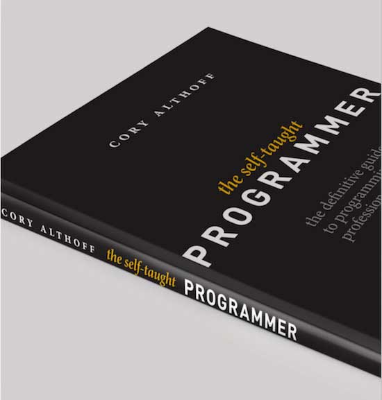

:date: 2017-07-18 12:00
:categories: ['Python', 'PyCharm', 'Interview', 'Translation']
:body type: text/x-rst

========================================================================================
2017/07/18 【PyCharm Blog 翻訳】インタビュー: “独学プログラマー” コーリー・アルソフ
========================================================================================

*Category: 'Python', 'PyCharm', 'Interview', 'Translation'*

独学でゼロからプログラミングを学んでその体験を元に本を書いた、コーリー・アルソフさんのインタビュー記事（英語）がPyCharm Blogに掲載されて、非常に良い記事だったので `和訳の許可`__ をもらって和訳しました。

.. __: https://blog.jetbrains.com/pycharm/2017/06/self-taught-programmer-interview-with-cory-althoff/#comment-308569

この記事を訳そうと思ったきっかけは、最近、公私ともに、多くのプログラミング入門者/Python入門者と接する機会が増えてきたからです。

仕事では、BeProudの `Python入門者向け研修`_ で年に数回講師をしています（先月は関西で1週間講師してきました）。その研修の中では `Pythonオンライン学習サービス PyQ`_ を使って、Pythonを学んでもらったりしてます。PyQを研修に取り入れるようになってから、入門者がどんな所で躓いてしまうのかがよく見えるようになり、講師としても教えるポイントが明確になって、研修コースが以前にも増してパワーアップした実感があります。

個人でも、 `Python入門者向けハンズオン`_ でアシスタントをしたり、 `Python Boot Camp`_ で神戸に行って講師をしたり、さらに今は、プログミング入門者向けの本の飜訳をしていたりします。

こんな感じで、入門者に必要なことは何か、について実体験を元に語られているインタビューが非常によい記事だと思って飜訳しました。

.. _Python入門者向け研修: http://www.beproud.jp/training/
.. _Pythonオンライン学習サービス PyQ: https://pyq.jp/
.. _Python入門者向けハンズオン: https://python-nyumon.connpass.com/
.. _Python Boot Camp: https://peraichi.com/landing_pages/view/pycamp

インタビュー: “独学プログラマー” コーリー・アルソフ
============================================================

.. note::

   この記事はPyCharm Blogの和訳です。著作権は原文の著者にあり、飜訳と公開の許可をいただいています。

   This article is a translation of PyCharm Blog. The copyright is in the original author of the text, and I have permission to translate and publish.

   * オリジナル記事(original article): `Self-Taught Programmer: Interview with Cory Althoff | PyCharm Blog`_

.. _`Self-Taught Programmer: Interview with Cory Althoff | PyCharm Blog`: https://blog.jetbrains.com/pycharm/2017/06/self-taught-programmer-interview-with-cory-althoff/

Posted on 2017/6/27 by `Dmitry Filippov`_

.. _Dmitry Filippov: https://blog.jetbrains.com/pycharm/author/dmitry-filippov/

プロのプログラマーになるという話題は今では非常に熱く、このトレンドはまだしばらく続きそうです。ソフトウェア開発業界は、他の多くの業界よりも急速に成長しており、ソフトウェア開発の場を他の業界にも広げているため、非常に速いペースで新しい技術者を欲しています。問題は、開発のチャンスはたくさんあっても、仕事をこなせる人の数が不十分だということです。その結果、新しい人材を育てたいという要求に応えるため、さまざまな開発コミュニティ、大小多くの企業、個人インストラクターによって、多くの教育プログラムやコースが提供されています。その対象者の多くは、コンピューターサイエンス出身ではありません。例えばPython界では、科学/データ解析分野が急速に成長していて、たった2年のうちに開発者規模がWeb業界に追いついています。このような需要に応えるため、プログラムやコースのほとんどが、プログラミング未経験の人を対象にしています。

   `The Self-Taught Programmer: The Definitive Guide to Programming Professionally`_

.. _`The Self-Taught Programmer: The Definitive Guide to Programming Professionally`: https://www.amazon.com/dp/B01M01YDQA

この記事は、政治学の学位を取得後にソフトウェア開発の世界に飛び込み、本当に独学でプログラミングを学んだ コーリー・アルソフ（Cory Althoff）氏へのインタビューです。彼は、プロの開発者になるのに非常に苦労しましたが、1年間独学でプログラミングを学び、eBayのソフトウェアエンジニアとして仕事をするのに十分なスキルを身に付けました。いま彼は新しい人生を楽しんでいます。そして、いまからちょうど半年前、彼と同様にプログラミングで仕事したい人たちに向けた本 `The Self-Taught Programmer: The Definitive Guide to Programming Professionally`_ を出版しました。この本は多くの人を引きつけ、GoodreadsやAmazonなどの複数の書籍レビュープラットフォームで多くの肯定的なレビュー投稿を得ました。彼の経験とビジョンについて紹介します。

---------

— コーリーさん、あなたの事をすこし教えてくれませんか。そして、どうやって独学でプログラマーになったんですか？

みなさんこんにちは。私の名前は コーリー・アルソフ（Cory Althoff）、28歳です。クレムソン大学で政治学を専攻していました。卒業後、シリコンバレーに住んでいましたが、なかなか仕事が見つからなかったので、プログラミングを勉強することにしました。独学で1年間学んだ後、eBayのソフトウェアエンジニアの仕事に就きました。その後、パロアルトのスタートアップでソフトウェアエンジニアとしての地位を得ました。しばらくして、私は私の彼女と一緒に会社を去り、バックパッカーとして東南アジアを回りました。その2ヶ月の旅で、タイ、マレーシア、オーストラリア、バリを巡り、そこで本のアイディアが浮かんできたんです。その本が `The Self-Taught Programmer: The Definitive Guide to Programming Professionally`_ です。

---------

— 自分で本を書こうと思った動機は何ですか？どんなアイディアがありました？

私のプログラミングを学ぶ旅と、ソフトウェアエンジニアとしての最初の仕事を得るまでの経験が、素晴らしいひらめきを与えてくれました。私がプログラミングを学んだときに直面した課題は、いったい何を学べば良いのか分からなかったことでした。プログラミング初心者向けの本はたくさんありますが、そのほとんどは、基本的なコードをPythonかRubyで書いて学ぶことを手助けしてくれるものです。しかし、プロのプログラマーになるには、もっと多くのことを学ばなければいけませんでした。例えば、OOPや関数型プログラミング、バージョンコントロール、正規表現、IDE、ベストプラクティス、コンピューターサイエンス、開発ツール、などです。私の本から引用します。”この本の各章で扱っているテーマの多くは深く、それぞれ本１冊でも足りないくらいの情報があります。私の目標は、あなたが知る必要があるすべてのテーマのすべての詳細を網羅することではなく、プロのプログラマーとして成長するために必要な、すべてのスキルの地図を提供することです。”  私がこの本を書いたのは、プロのプログラマーになるための学習に興味がある人に、何を学べばよいのかの全体像を伝えたかったからです。

---------

— Pythonは最初のプログラミング言語でしたか？どのくらいの期間プログラミングしていますか？

ええ、Pythonが最初に学んだプログラミング言語ですね。そろそろ5年くらいPythonでプログラミングしてます。今は、JavaScriptを書いたり、他のいくつかの言語も使ってますが、Pythonはまだお気に入りの言語です。

---------

— まったくのゼロからPythonを学ぶのにどのくらいかかりましたか？中級レベルのPythonプログラマーになるのにどのくらい時間がかかると思いますか？

そうですね、Pythonを習熟するのに1年かかりました。誰かがゼロから中級のPythonプログラマーになるのに、週7日間ずっとプログラミングに打ち込んだとして、それだけの時間がかかるでしょう。だけど、私はその後の5年間も、Pythonでプログラミングをする中でさらに多くのことを学び続けています。果てしない旅みたいなものですね。

---------

— 本の章1つがPyCharmのことを扱っていますよね。開発者になる旅のなか、どのあたりでPyCharmを使い始めましたか？また、それはなぜですか？

Pythonでプログラミングを始めた頃はIDLEを使っていましたが、あるとき、PyScripterに乗り換えました。eBayに入ったとき、チームの同僚がみんなPyCharmを使っていたので、私も使い始めてみたんですが、もう戻りたいとは思いません！

---------

— PyCharmの機能の中で、これが無いと仕事にならない、と言える機能はなんですか？

気に入っているPyCharmの機能は、ローカル履歴、デバッガー、コマンドライン、バージョンコントロール、データベースインターフェース、です。PyCharmのローカル履歴には何度も救われました。コードを変更するとPyCharmは自動的に保存してくれて、その時点のコードにいつでも簡単に戻れるので、素早く色々な実験ができるようになりました。デバッガーは、これ無しでプログラミングするなんて想像できないくらい重要です。デバッガーの中でも特にお気に入りなのが条件付きブレークポイントと、カーソル位置までコードを実行する機能です。コマンドライン、バージョンコントロール、データベース接続は、IDEから他のアプリに画面を切り替えずに作業できるので、時間が節約できて、よりプロダクティブになれる機能ですね。

---------

— ゼロからPyCharmを使えるようになるのにどのくらいかかりましたか？また、開発者はツールの使い方を学ぶのにどのくらい投資すればよいと思いますか？

PyCharmはすぐに使い始められました。それでも、主要な機能の使い方を身に付けるのに1日か2日はかかったかな。 `Quick Start Guide`_ を一度読み終えたら、大体分かったと思います。ツールの使い方を学ぶのは開発者という職業のとても大きな部分を占めていると思います。プログラミングを学んでいた頃はそんなことは全く考えてなかったけどね。だから、プログラミングのためのツールを学ぶ章を5つも用意したんです。初心者はプログラミングを学ぶだけじゃなく、その頃には見過ごしがちな、バージョンコントロールやIDEといったツールの使い方も学ばなければいけません。

.. _Quick Start Guide: https://www.jetbrains.com/help/pycharm/2017.1/quick-start-guide.html

---------

— Pythonは、最初に学ぶプログラミング言語としてどうですか？

最初に学ぶプログラミング言語として何が良いかは、Facebookの Self-Taught Programmers グループでいつも議論になってるんです。議論はだいたいいつも、Pythonのような高級言語を学ぶか、C言語のような低水準言語を学ぶかのどちらかで終わります。私が、Pythonが新しくプログラマーになりたい人に最適な言語だと思うのは、プログラミング学習が成功する可能性が高いからです。プログラミングを学ぶときは、面白いと思うことをプログラミングして、できるだけ早く「勝利」を掴む必要があります。それがうまくいけば、学習を続けるチャンスが大幅に増えるんです。C言語などの低水準言語で学び始めるときの問題は、最初の「勝利」を掴むまでにものすごく時間がかかって、プログラミングを身に付ける前に諦めてしまう可能性が高くなることです。PythonではなくJavaScriptやRubyを勧める人もいますが、私としては、Pythonが入門者にとって最良の選択だと思ってます。

---------

— プログラミング言語の中で、Python特有の機能はなんだと思いますか？

可読性ですね。Python以上に読みやすいプログラミング言語を使ったことがありません。もちろん、これは開発がどういうものかということに関するGuidoの洞察のおかげです。Pythonの可読性の高さは、本でPythonを教える理由の1つです。

---------

— いま何か新しいことに取り組んでいますか？

今は、 The Self-Taught Web Developer という新しい本を書いてるのと、今16,000人のメンバーをすこし上回った Self-Taught Programmers `Facebook group`_ の運営、 `Take a Class with Me`_ という新しいプロジェクトを進めてます。そのプロジェクトでは毎月、参加者がグループで参加する技術コースを選んで、毎週そのコースについて一緒に議論したりハマってしまった人を助けたりするSlackチャットを開いてます。今のコースは初心者向けですが、来月はAngularと機械学習について扱う上級者向けのコースを追加します。 参加したければ、Take a Class with Meの `ニュースレター`_ にサインアップしてください。

.. _Facebook group: https://www.facebook.com/groups/selftaughtprogrammers/
.. _Take a Class with Me: http://theselftaughtprogrammer.io/tacwm
.. _ニュースレター: http://theselftaughtprogrammer.io/tacwm

---------

— 最近読んで面白かったり重要だと思った開発関連の本を2冊紹介してください。

2冊の好きな本と言えば、アンドリュー・ハント と デビッド・トーマスの 『 `達人プログラマー`_ 』 と、Brad Miller と David Ranum の 『 `Problem Solving with Algorithms and Data Structures using Python`_ 』 ですね。『達人プログラマー』は私の胸にぐっときました。私はたくさんの事をこの本から学び、プログラマーとしての私を大きく改善しました。『Problem Solving with Algorithms and Data Structures using Python』は、今まで読んだデータ構造とアルゴリズムに関する本の中では一番です。『アルゴリズムイントロダクション（世界標準MIT教科書）』のように、よく勧められるような本よりもずっと簡単に読めます。最初の技術面談をパスできたのはその本のおかげです。

.. _達人プログラマー: https://www.amazon.co.jp/%E6%96%B0%E8%A3%85%E7%89%88-%E9%81%94%E4%BA%BA%E3%83%97%E3%83%AD%E3%82%B0%E3%83%A9%E3%83%9E%E3%83%BC-%E8%81%B7%E4%BA%BA%E3%81%8B%E3%82%89%E5%90%8D%E5%8C%A0%E3%81%B8%E3%81%AE%E9%81%93-Andrew-Hunt/dp/427421933X/ref=as_li_ss_tl?_encoding=UTF8&psc=1&refRID=SF6X6NMEKBZAYN1MBVTC&linkCode=sl1&tag=freiaweb-22&linkId=e289f934b9e94b42e4339ae8bd9eae29
.. _Problem Solving with Algorithms and Data Structures using Python: http://interactivepython.org/runestone/static/pythonds/index.html

---------

— レビューに来てくれてありがとう、コーリー！

こちらこそありがとう！

.. figure:: img-cory-althoff.*

   コーリー・アルソフ（Cory Althoff）

   コーリー・アルソフ（Cory Althoff）は独学で学んだプログラマーで、本の著者です。彼はクレムソン大学で政治学を学んでいたにも関わらず、eBayでソフトウェアエンジニアの職を得て、そしてシリコンバレーのいくつかのスタートアップに参加しました。プログラミングを休んでの旅行中、バリのタクシーに乗っているときに “The Self-Taught Programmer” のアイディアを思いつきました。現在、オレゴン州ポートランドに住んでいます。

.. figure:: author.*

   About Dmitry Filippov

   JetBrains の製品マーケティングマネージャー

