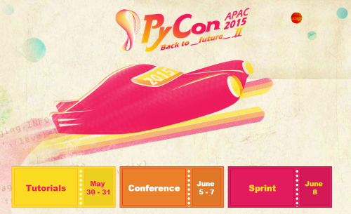

:date: 2015-6-10 23:00
:categories: ['Python', 'PyCon', 'Sphinx']
:body type: text/x-rst

================================================================
2015/06/10 PyCon APAC 2015 in Taiwan でSphinxを紹介してきました
================================================================

*Category: 'Python', 'PyCon', 'Sphinx'*

.. note::

   PyCon APAC 参加レポートのより詳細な内容を "海外PyCon発表修行レポート2015" として `第1回　PyCon APAC 2015 in TaiwanでのSphinxに関する発表`_ レポートをgihyo.jpにて掲載しています。

.. _第1回　PyCon APAC 2015 in TaiwanでのSphinxに関する発表: http://gihyo.jp/news/report/01/overseas-pycon-presentation-training-2015/0001

   PyCon APAC 2015 - back to the future II -

2015/6/5(金)～6/7(日)にかけて台北で行われた `PyCon APAC 2015`_ で、Sphinxの機能を紹介する2つの発表を行ってきました。 :doc:`../pycon2015-challenge/index` で書いた、海外PyCon参加5連発の1つめです。

今回、2つの発表を持たせてもらいました。
また、ナイトマーケット（インクルードのパーティ、兼、コミュニティーブース）にもSphinxのブースを出して、多くの人にSphinxを紹介できたと思います。

.. _PyCon APAC 2015: https://tw.pycon.org/2015apac/en/
.. _Easy contributable internationalization process with Sphinx: https://tw.pycon.org/2015apac/en/program/50
.. _`Sphinx autodoc: automated API documentation`: https://tw.pycon.org/2015apac/en/program/69
.. _Night market: https://tw.pycon.org/2015apac/en/program/night-party/

Talk1: Easy contributable internationalization process with Sphinx
===================================================================

:日時: 6/6(土) 11:50 - 12:30
:Program: `Easy contributable internationalization process with Sphinx`_

スライド:

.. raw:: html

   <iframe src="//www.slideshare.net/slideshow/embed_code/key/ALZe4d4PzPi7AA" width="510" height="420" frameborder="0" marginwidth="0" marginheight="0" scrolling="no" style="border:1px solid #CCC; border-width:1px; margin-bottom:5px; max-width: 100%;" allowfullscreen> </iframe> 
 <strong> <a href="//www.slideshare.net/shimizukawa/easy-contributable-internationalization-process-with-sphinx-pycon-apac-2015-in-taiwan-49057754" title="Easy contributable internationalization process with Sphinx (PyCon APAC 2015 in Taiwan)" target="_blank">Easy contributable internationalization process with Sphinx (PyCon APAC 2015 in Taiwan)</a> </strong> from <strong><a href="//www.slideshare.net/shimizukawa" target="_blank">Takayuki Shimizukawa</a></strong> 

Night Market: Sphinx Booth
============================

* 6/6(土) 17:30 - 20:00
* `Night market`_

.. figure:: nightmarket-sphinx-booth2.*

   ブースでSphinxの紹介中

Talk2: Sphinx autodoc: automated API documentation
===================================================

:日時: 6/7(日) 14:20 - 15:00
:Program: `Sphinx autodoc: automated API documentation`_

スライド:

.. raw:: html

   <iframe src="//www.slideshare.net/slideshow/embed_code/key/4fQTR2OuUyJMNs" width="510" height="420" frameborder="0" marginwidth="0" marginheight="0" scrolling="no" style="border:1px solid #CCC; border-width:1px; margin-bottom:5px; max-width: 100%;" allowfullscreen> </iframe> 
 <strong> <a href="//www.slideshare.net/shimizukawa/sphinx-autodoc-automated-api-documentation-pyconapac2015" title="Sphinx autodoc­ automated API documentation (PyCon APAC 2015 in Taiwan)" target="_blank">Sphinx autodoc­ automated API documentation (PyCon APAC 2015 in Taiwan)</a> </strong> from <strong><a href="//www.slideshare.net/shimizukawa" target="_blank">Takayuki Shimizukawa</a></strong> 

Next
=======

次は、来週水曜日から開催される `PyCon Singapore 2015`_ に行ってきます。

.. _PyCon Singapore 2015: https://pycon.sg/

