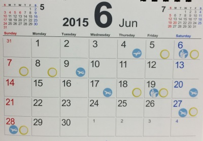
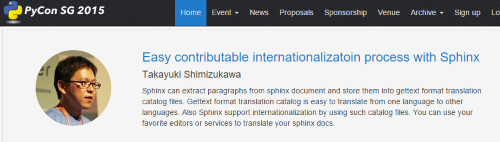
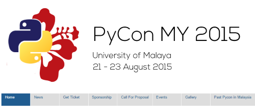

:date: 2015-5-22 08:30
:categories: ['Python', 'PyCon', 'Sphinx']
:body type: text/x-rst

=====================================
2015/05/22 海外PyConで修行する
=====================================

*Category: 'Python', 'PyCon', 'Sphinx'*

清水川です。今日で40歳になりました。 wishlist置いておきますね http://amzn.to/1Ld4I33

毎年、PyCon JP のスタッフをしつつスピーカーとしても発表していましたが、今年はスタッフをお休みして、別のことに時間を使うことにしました。

ということで、 :doc:`../2015-kakizome/index` で今年の目標に「海外のイベントでSphinxの発表を3回以上行う」と書いたとおり、いくつかの海外PyConでスピーカー発表してくる予定です。2010年頃には海外のカンファレンスとかまったく興味なかったんですが、PyConJPのスタッフをやったり、Sphinxのコミッターになったりしたことで **海外** というハードルが下がってきたのかもしれません。

参考: PyCon開催状況を調べたときのSpreadsheet `世界のPyCon2015`_ 

余談ですが、10月に開催される `PyCon JP 2015もスピーカー募集中`_ で、そちらにも応募しておきました。今年は応募されたら即公開される仕組みになっているようです(`プロポーザル一覧`_)。

.. _PyCon JP 2015もスピーカー募集中: http://pyconjp.blogspot.jp/2015/05/call-for-proposals.html
.. _プロポーザル一覧: https://pycon.jp/2015/ja/proposals/vote_list/
.. _世界のPyCon2015: http://goo.gl/cWj6Lj

   6月の行動予定、詰め込みすぎた

.. contents::
   :local:

PyCon APAC 2015
=================

PyCon APAC 2015 は、6/5(木)～6/8(月)に台湾の台北近くにある中央研究院で開催されます。チュートリアルデイはその1週間前、5/30, 31 に開催されるそうです。前泊・後泊込みで、6日間、出発日は朝4時起きで成田までいくのが辛そうな日程で行ってきます。

PyCon Taiwan には2012年、2013年にも参加し、2013年に1度スピーカーをしてきました。

   PyCon APAC 2015 - back to the future II -

Talk 1:

* 6/6(土) 11:50 - 12:30
* `Easy contributable internationalizatoin process with Sphinx`__

.. __: https://tw.pycon.org/2015apac/en/program/50

Talk 2:

* 6/7(日) 14:20 - 15:00
* `Sphinx autodoc: automated API documentation`__

.. __: https://tw.pycon.org/2015apac/en/program/69

CfPに2つ応募したところ、autodocの方が審査を通ったのですが、その後「2つ目もやらない？」という連絡が来たので、OKの返事をしました。ということで、2つ発表します。

ところで今回はナイトマーケット（インクルードのパーティ、兼、コミュニティーブース）にもSphinxのブースを出すので、3枠やるような、そんな感じです。

* 6/6(土) 17:30 - 22:00
* `Night market`__

.. __: https://tw.pycon.org/2015apac/en/program/night-party/

さらに6/8(月)のスプリントにも参加してきます。
スプリントは人数上限があり事前申し込み制（無料）なのですが、気がついたときには50枚のチケットが終了しいました。追加20枚のチケットのアナウンスに気付いてなんとか参加できることになりました。Sphinxやる人がいるといいなあ。

PyCon Singapore 2015
=====================

PyCon Singapore 2015 は、6/17(水)～6/19(金)にシンガポールの `Singapore Polytechnic`_ （大学）で開催されます。初日はチュートリアルデイなので、2日目から参加する予定です。

シンガポールに行くのは初めてなので、まったく勝手が分からず、 `PyCon Singapore 2013レポート　～イベント前日：CodeZine`_ を読んで勉強しているところです。

.. _PyCon Singapore 2013レポート　～イベント前日：CodeZine: http://codezine.jp/article/detail/7269

.. figure:: pyconsg2015.png
   :target: https://pycon.sg/

   PyCon Singapore 2015

Talk:

   `Easy contributable internationalizatoin process with Sphinx`__

   * 日時未定？

.. __: https://pycon.sg/schedule/presentation/49/
.. _Singapore Polytechnic: http://www.sp.edu.sg/

PyCon Korea 2015
=================

PyCon Korea 2015 は、6/27(土)～6/28(日)に韓国ソウルのNuri Dream Squareで開催されます。今年2回目のPyCon開催だそうです。

韓国も初めて行く国なので、色々と心配です。しかも、6/27(土)の朝出発して、6/28(日)の深夜に帰ってくるという、会社を休まずに丸2日間 PyCon を堪能できるスペシャルスケジュール！・・・色々と心配です。

   PyCon Korea 2015 - Python Together, Successful. -

Talk:

* `Sphinx autodoc: automated API documentation`__

.. __: http://www.pycon.kr/2015/program/33

EuroPython 2015
================

EuroPython 2015 は、7/20(月)～7/26(日)にスペインのビルバオにある `Euskalduna Conference Center (ECC)`_ で行われます。

スペインに行くのは初めてなので色々心配なのですが、今年行く国は台湾以外全部初めて行くところなので、心配することが多すぎてもう心配してません。

.. _Euskalduna Conference Center (ECC): https://ep2015.europython.eu/en/venue/

.. figure:: europython2015.png
   :target: https://ep2015.europython.eu/en/

   EuroPython 2015

去年、ドイツのベルリンで行われたEuroPython2014に一般参加しましたが、今年はスペイン開催ということでちょっと残念な気持ちもありつつ。ドイツにはSphinxの開発者が多く、スプリントではまる1日Sphinxの今後の機能について議論していました。今年はどうなるかな。今年は初日から最後のスプリントまで参加する予定です。 `キーノートはPythonのお父さん、Guidoだそうです`_ 。

.. _キーノートはPythonのお父さん、Guidoだそうです: https://mail.python.org/pipermail/python-announce-list/2015-February/010629.html

EuroPython2015にも2つスピーカー応募しましたが、採択は5月末の予定です。通るといいなあ。宿泊は `Colegio Mayor Deusto (social hub)`_ というResidence（大学寮）を予約しています。一泊31ユーロ。ホテルだと80ユーロくらいするっぽいですね。

.. _Colegio Mayor Deusto (social hub): https://ep2015.europython.eu/en/venue/accommodation/

PyCon Malaysia
================

PyCon Malaysia 2015 は今年初実施のPyConで、8/21(金)～8/23(日)にマレーシアの Faculty of Computer Science and Information Technology in University of Malaya で開催されます。

   PyCon Malaysia 2015

マレーシアに行くのは初めてです。CfPに応募しましたが、7/24まで募集中なのでまだ色々未確定な感じです。海外から参加することを考えると旅行の手配などは1か月以上前には済ませてしまいたいところですが・・・初開催のPyConで海外スピーカーまでは考えてないだろうなあ。自分たちが2011年に `PyCon mini JP`_ や `PyCon JP 2011`_ を開催したときを思い出しつつ。

.. _PyCon mini JP: https://sites.google.com/site/pyconminijp/
.. _PyCon JP 2011: http://2011.pycon.jp/

応募内容
=============

おまけで、応募した内容をのせておきます。

Easy contributable internationalizatoin process with Sphinx
-------------------------------------------------------------

* Title: Easy contributable internationalizatoin process with Sphinx
* Documentation
* English
* 40min
* Target:

  - Who want to translate documentation written by sphinx into local language
  - Who want to forcus to translation
  - Who need translation contributors and manage them easily

* Python Level: newbie

* Abstract:

  Sphinx can extract paragraphs from sphinx document and store them into gettext format translation catalog files.
  Gettext format translation catalog is easy to translate from one language to other languages.
  Also Sphinx support internationalization by using such catalog files.
  You can use your favorite editors or services to translate your sphinx docs.
  In this session, I'll explain 3 things; (1) entire process to translate sphinx docs. (2) automation mechanism for the process. (3) tips, tricks and traps for writing docs and translating.

* Description:

  Sphinx provides a internationalization (i18n) feature.
  If you translate some sphinx document without using the i18n feature, you need to rewrite original document source files. But this approach has three problems:

  1. You must be careful to maintain reStructuredText structure.
  2. It's hard to divide translation tasks for a number of volunteer translators.
  3. It's hard to pursue the upstream document source that is frequently updated.

  And so, sphinx i18n feature will support our translation.
  Since Sphinx supports extracting/injecting gettext format translation catalog, you can use helpful tools/services easily that provide translation support features like a translation memory, recommending similar translation, glossary and auto-translation.
  By using such translation support services, document translation with Sphinx can be carried out as follows:

  1. You can translate for each paragraphs (Sphinx will output gettext msgid for paragraphs).
  2. You can translate more than one person at the same time.
  3. You can use helpful translation support features.

  If you use such a service, volunteers are more likely to participate in the translation.
  Sphinx-users.jp team built a translation flow with using sphinx and the transifex service.
  In addition, we have automated the entire process using the drone.io service.

  As a result of this,
  (A) translation source entries on the transifex will be updated automatically when original documentation is changed.
  (B) translated document page will be updated when each entries is translated on the transifex.
  In this session, I'll explain 3 things; (1) entier process to translate sphinx docs. (2) automation mechanism for the process. (3) tips, tricks and traps for wrinting docs and translating.

* Outline:

  * Self introduction (2 min)

  * Sphinx introduction (2 min)

    * What is Sphinx?
    * Sphinx examples

  * How do you translate Sphinx documentation? (5 min)

    * Rewriting source files
    * ...

  * Sphinx i18n feature (5 min)

    * make pot files by using "make gettext"
    * translate pot files into po files
    * build a translated document by using translated gettext catalogs

  * Automated translation process with several services (10 min)

    * github push web hook invoke drone.io
    * drone.io executes "make gettext" and uploads pot files to transifex
    * transifex translation
    * transifex invoke web hook drone.io
    * drone.io executes "make html" with using po files and deploy html files

  * tips, tricks, traps (10 min)

Sphinx autodoc: automated API documentation
-----------------------------------------------

* Title: Sphinx autodoc: automated API documentation
* Documentation
* English
* 40min
* Target:

  - Python programmer who is struggling with documentation.
  - Python library author who want to generate API docs automatically.
  - Python library author who want to create a clear documentation which contains python snippets.

* Python Level: intermediate

* Abstract:

  Using the automated documentation feature of Sphinx, you can make with ease the extensive documentation of Python program.
  You just write python function documents (docstrings), Sphinx organizes them into the document, can be converted to a variety of formats.
  In this session, I'll explain a documentation procedure that uses with sphinx autodoc and autosummary extensions.

* Description:

  Sphinx provides autodoc feature that generate document from docstring in your python sources.
  The docstring that contains description and example of the use of function written near the program, makes doc easy to update.
  In addition, the output of the Sphinx will make you understand what to write in docstring. As a result, this will improve your motivation of doc writing.

  To use the autodoc, you must specify python modules to automodule directive one by one. This is a tedious task, hoswever autosummary extension automate this task.
  In most cases, once developers have developed the API, you only need to run the make html of Sphinx, you get a nicely formatted document.

  Sphinx also has coverage and doctest extentions.
  These support writing the documentation to work with autodoc.
  This allow you to check the APIs that have not been documented or you can verify each doctest part is correct or not.

  If you use such autodoc-related extensions, you can create a Sphinx API documentation in the following procedure.

  1. make coverage; you can get the APIs that have not been documented.
  2. Write docstrings that includes the doctest format how to use the API.
  3. make doctest; you can verify each doctest part is correct or not.
  4. make html; you can generate the HTML or your favorite format.

  In this session, I'll explain a documentation procedure that uses with sphinx autodoc, autosummary, coverage and doctest extensions.

* Outline:

  * Self introduction (2 min)

  * Sphinx introduction (2 min)

    * What is Sphinx?
    * Sphinx examples

  * Have you written API docs for your code? (2 min)

    * I don't know what/where should I write.
    * Docstrings is needed? Are there some specific format?

  * Getting start Sphinx (2 min)

    * How to install Sphinx
    * How to start a Sphinx project

  * Generate API docs from your python code (5 min)

    * setup autodoc extension
    * write docstrings for yuor python module
    * "automodule & make html" will generate API docs from python code
    * autodoc pros & cons: docs for many modules

  * Listing APIs automatically (5 mins)

    * setup autosummary extension
    * how to use autosummary directive
    * no more autodoc directive

  * Discovering undocumented APIs (5 min)

    * setup coverage extension
    * make coverage

  * Detect deviations of the impl and doc (5 min)

    * setup doctest extension
    * make doctest

  * Overall picture, tips, Q&A (10 min)

    * Overall picture of the process
    * Options for autodoc
    * translate them into other langs

